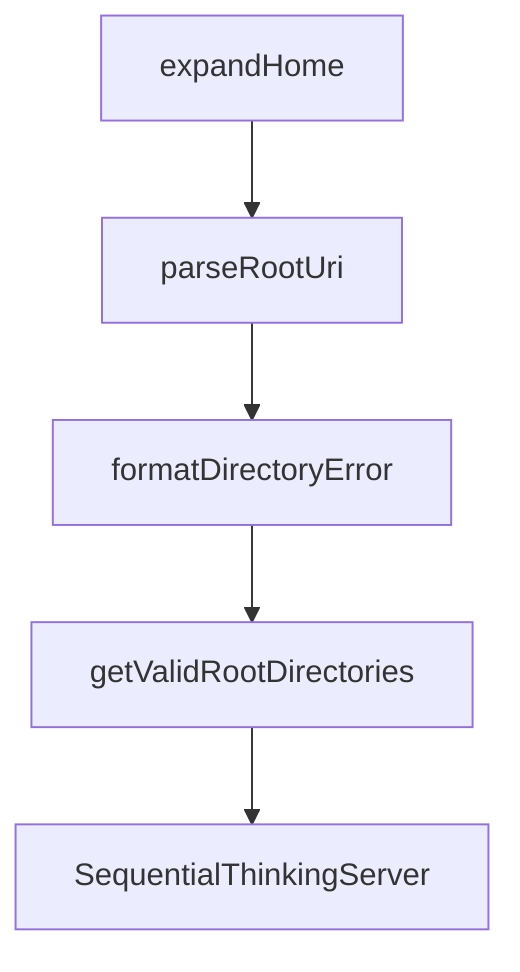

# Chapter 7: Security Considerations

Welcome to **Chapter 7: Security Considerations**. In this part of **MCP Servers Tutorial: Reference Implementations and Patterns**, you will build an intuitive mental model first, then move into concrete implementation details and practical production tradeoffs.


Security is the largest gap between reference servers and production deployment.

## Start with a Threat Model

At minimum, answer:

- What can this server read?
- What can it mutate?
- What trust boundary separates model output from side effects?
- What happens if tool arguments are malicious or malformed?

## Control Layers

| Layer | Control |
|:------|:--------|
| Input validation | Strict schema + semantic checks |
| Authorization | Allowlists for paths/resources/actions |
| Execution boundary | Sandboxing and least privilege runtime |
| Change protection | Confirmation gates for destructive operations |
| Auditing | Immutable logs with actor, inputs, outputs, and outcome |

## High-Risk Patterns to Block

- unrestricted filesystem roots
- unconstrained shell/network execution behind tools
- silent mutation without user/system confirmation
- missing source-of-truth identity for requests

## Practical Security Enhancements

- classify tools by read/write/destructive and route policies accordingly
- require explicit approval for destructive or non-idempotent operations
- redact sensitive payloads in logs while preserving traceability
- enforce policy checks before tool execution, not after

## Incident Readiness

Have a runbook with:

- emergency disable switch for tool classes
- rollback strategy for unintended mutations
- artifact and log retention windows
- owner escalation path

## Summary

You now have a concrete security baseline for adapting MCP server patterns responsibly.

Next: [Chapter 8: Production Adaptation](08-production-adaptation.md)

## What Problem Does This Solve?

Most teams struggle here because the hard part is not writing more code, but deciding clear boundaries for core abstractions in this chapter so behavior stays predictable as complexity grows.

In practical terms, this chapter helps you avoid three common failures:

- coupling core logic too tightly to one implementation path
- missing the handoff boundaries between setup, execution, and validation
- shipping changes without clear rollback or observability strategy

After working through this chapter, you should be able to reason about `Chapter 7: Security Considerations` as an operating subsystem inside **MCP Servers Tutorial: Reference Implementations and Patterns**, with explicit contracts for inputs, state transitions, and outputs.

Use the implementation notes around execution and reliability details as your checklist when adapting these patterns to your own repository.

## How it Works Under the Hood

Under the hood, `Chapter 7: Security Considerations` usually follows a repeatable control path:

1. **Context bootstrap**: initialize runtime config and prerequisites for `core component`.
2. **Input normalization**: shape incoming data so `execution layer` receives stable contracts.
3. **Core execution**: run the main logic branch and propagate intermediate state through `state model`.
4. **Policy and safety checks**: enforce limits, auth scopes, and failure boundaries.
5. **Output composition**: return canonical result payloads for downstream consumers.
6. **Operational telemetry**: emit logs/metrics needed for debugging and performance tuning.

When debugging, walk this sequence in order and confirm each stage has explicit success/failure conditions.

## Source Walkthrough

Use the following upstream sources to verify implementation details while reading this chapter:

- [MCP servers repository](https://github.com/modelcontextprotocol/servers)
  Why it matters: authoritative reference on `MCP servers repository` (github.com).

Suggested trace strategy:
- search upstream code for `Security` and `Considerations` to map concrete implementation paths
- compare docs claims against actual runtime/config code before reusing patterns in production

## Chapter Connections

- [Tutorial Index](README.md)
- [Previous Chapter: Chapter 6: Custom Server Development](06-custom-server-development.md)
- [Next Chapter: Chapter 8: Production Adaptation](08-production-adaptation.md)
- [Main Catalog](../../README.md#-tutorial-catalog)
- [A-Z Tutorial Directory](../../discoverability/tutorial-directory.md)

## Source Code Walkthrough

### `src/filesystem/path-utils.ts`

The `expandHome` function in [`src/filesystem/path-utils.ts`](https://github.com/modelcontextprotocol/servers/blob/HEAD/src/filesystem/path-utils.ts) handles a key part of this chapter's functionality:

```ts
 * @returns Expanded path
 */
export function expandHome(filepath: string): string {
  if (filepath.startsWith('~/') || filepath === '~') {
    return path.join(os.homedir(), filepath.slice(1));
  }
  return filepath;
}


```

This function is important because it defines how MCP Servers Tutorial: Reference Implementations and Patterns implements the patterns covered in this chapter.

### `src/filesystem/roots-utils.ts`

The `parseRootUri` function in [`src/filesystem/roots-utils.ts`](https://github.com/modelcontextprotocol/servers/blob/HEAD/src/filesystem/roots-utils.ts) handles a key part of this chapter's functionality:

```ts
 * @returns Promise resolving to validated path or null if invalid
 */
async function parseRootUri(rootUri: string): Promise<string | null> {
  try {
    const rawPath = rootUri.startsWith('file://') ? fileURLToPath(rootUri) : rootUri;
    const expandedPath = rawPath.startsWith('~/') || rawPath === '~' 
      ? path.join(os.homedir(), rawPath.slice(1)) 
      : rawPath;
    const absolutePath = path.resolve(expandedPath);
    const resolvedPath = await fs.realpath(absolutePath);
    return normalizePath(resolvedPath);
  } catch {
    return null; // Path doesn't exist or other error
  }
}

/**
 * Formats error message for directory validation failures.
 * @param dir - Directory path that failed validation
 * @param error - Error that occurred during validation
 * @param reason - Specific reason for failure
 * @returns Formatted error message
 */
function formatDirectoryError(dir: string, error?: unknown, reason?: string): string {
  if (reason) {
    return `Skipping ${reason}: ${dir}`;
  }
  const message = error instanceof Error ? error.message : String(error);
  return `Skipping invalid directory: ${dir} due to error: ${message}`;
}

/**
```

This function is important because it defines how MCP Servers Tutorial: Reference Implementations and Patterns implements the patterns covered in this chapter.

### `src/filesystem/roots-utils.ts`

The `formatDirectoryError` function in [`src/filesystem/roots-utils.ts`](https://github.com/modelcontextprotocol/servers/blob/HEAD/src/filesystem/roots-utils.ts) handles a key part of this chapter's functionality:

```ts
 * @returns Formatted error message
 */
function formatDirectoryError(dir: string, error?: unknown, reason?: string): string {
  if (reason) {
    return `Skipping ${reason}: ${dir}`;
  }
  const message = error instanceof Error ? error.message : String(error);
  return `Skipping invalid directory: ${dir} due to error: ${message}`;
}

/**
 * Resolves requested root directories from MCP root specifications.
 * 
 * Converts root URI specifications (file:// URIs or plain paths) into normalized
 * directory paths, validating that each path exists and is a directory.
 * Includes symlink resolution for security.
 * 
 * @param requestedRoots - Array of root specifications with URI and optional name
 * @returns Promise resolving to array of validated directory paths
 */
export async function getValidRootDirectories(
  requestedRoots: readonly Root[]
): Promise<string[]> {
  const validatedDirectories: string[] = [];
  
  for (const requestedRoot of requestedRoots) {
    const resolvedPath = await parseRootUri(requestedRoot.uri);
    if (!resolvedPath) {
      console.error(formatDirectoryError(requestedRoot.uri, undefined, 'invalid path or inaccessible'));
      continue;
    }
    
```

This function is important because it defines how MCP Servers Tutorial: Reference Implementations and Patterns implements the patterns covered in this chapter.

### `src/filesystem/roots-utils.ts`

The `getValidRootDirectories` function in [`src/filesystem/roots-utils.ts`](https://github.com/modelcontextprotocol/servers/blob/HEAD/src/filesystem/roots-utils.ts) handles a key part of this chapter's functionality:

```ts
 * @returns Promise resolving to array of validated directory paths
 */
export async function getValidRootDirectories(
  requestedRoots: readonly Root[]
): Promise<string[]> {
  const validatedDirectories: string[] = [];
  
  for (const requestedRoot of requestedRoots) {
    const resolvedPath = await parseRootUri(requestedRoot.uri);
    if (!resolvedPath) {
      console.error(formatDirectoryError(requestedRoot.uri, undefined, 'invalid path or inaccessible'));
      continue;
    }
    
    try {
      const stats: Stats = await fs.stat(resolvedPath);
      if (stats.isDirectory()) {
        validatedDirectories.push(resolvedPath);
      } else {
        console.error(formatDirectoryError(resolvedPath, undefined, 'non-directory root'));
      }
    } catch (error) {
      console.error(formatDirectoryError(resolvedPath, error));
    }
  }
  
  return validatedDirectories;
}
```

This function is important because it defines how MCP Servers Tutorial: Reference Implementations and Patterns implements the patterns covered in this chapter.


## How These Components Connect


