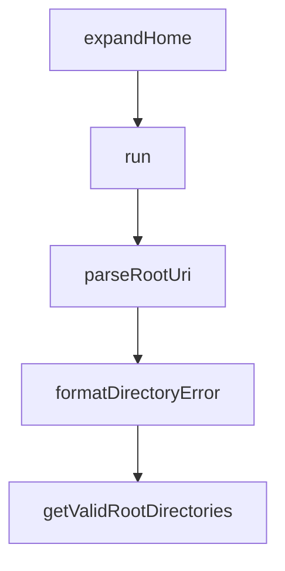

# Chapter 8: Production Adaptation

Welcome to **Chapter 8: Production Adaptation**. In this part of **MCP Servers Tutorial: Reference Implementations and Patterns**, you will build an intuitive mental model first, then move into concrete implementation details and practical production tradeoffs.


This chapter translates reference-server learning into a production operating model.

## Production Readiness Layers

1. **Contract stability**: versioned tool schemas and backward compatibility policy
2. **Reliability**: retries, timeouts, circuit breakers, degradation modes
3. **Observability**: request tracing, latency/error dashboards, audit logs
4. **Security**: policy enforcement, least privilege, secret handling
5. **Operations**: deployment automation, rollback paths, on-call ownership

## Deployment Patterns

Common patterns:

- sidecar-style local tooling for developer workflows
- centralized service deployment for shared enterprise tools
- isolated tenant-scoped instances for strict data boundaries

Choose based on blast radius and compliance requirements, not convenience.

## SLO and Error Budget Thinking

Define measurable targets early:

- tool success rate
- p95/p99 latency by tool class
- mutation error rate
- policy-denied request rate

These metrics reveal whether the server is reliable and safe in real usage.

## Change Management

Treat tool changes as API changes.

- publish versioned contracts
- stage rollouts with canary traffic
- maintain migration notes for clients
- deprecate old behavior with explicit timelines

## Final Checklist Before Launch

- Threat model reviewed
- Tool schemas and validations complete
- Destructive-action controls enforced
- Audit logging verified
- On-call owner assigned

## Final Summary

You now have a full path from MCP reference examples to production-grade, governable server deployments.

Related:
- [MCP Python SDK Tutorial](../mcp-python-sdk-tutorial/)
- [Anthropic Skills Tutorial](../anthropic-skills-tutorial/)
- [Claude Code Tutorial](../claude-code-tutorial/)

## What Problem Does This Solve?

Most teams struggle here because the hard part is not writing more code, but deciding clear boundaries for core abstractions in this chapter so behavior stays predictable as complexity grows.

In practical terms, this chapter helps you avoid three common failures:

- coupling core logic too tightly to one implementation path
- missing the handoff boundaries between setup, execution, and validation
- shipping changes without clear rollback or observability strategy

After working through this chapter, you should be able to reason about `Chapter 8: Production Adaptation` as an operating subsystem inside **MCP Servers Tutorial: Reference Implementations and Patterns**, with explicit contracts for inputs, state transitions, and outputs.

Use the implementation notes around execution and reliability details as your checklist when adapting these patterns to your own repository.

## How it Works Under the Hood

Under the hood, `Chapter 8: Production Adaptation` usually follows a repeatable control path:

1. **Context bootstrap**: initialize runtime config and prerequisites for `core component`.
2. **Input normalization**: shape incoming data so `execution layer` receives stable contracts.
3. **Core execution**: run the main logic branch and propagate intermediate state through `state model`.
4. **Policy and safety checks**: enforce limits, auth scopes, and failure boundaries.
5. **Output composition**: return canonical result payloads for downstream consumers.
6. **Operational telemetry**: emit logs/metrics needed for debugging and performance tuning.

When debugging, walk this sequence in order and confirm each stage has explicit success/failure conditions.

## Source Walkthrough

Use the following upstream sources to verify implementation details while reading this chapter:

- [MCP servers repository](https://github.com/modelcontextprotocol/servers)
  Why it matters: authoritative reference on `MCP servers repository` (github.com).

Suggested trace strategy:
- search upstream code for `Production` and `Adaptation` to map concrete implementation paths
- compare docs claims against actual runtime/config code before reusing patterns in production

## Chapter Connections

- [Tutorial Index](README.md)
- [Previous Chapter: Chapter 7: Security Considerations](07-security-considerations.md)
- [Main Catalog](../../README.md#-tutorial-catalog)
- [A-Z Tutorial Directory](../../discoverability/tutorial-directory.md)

## Depth Expansion Playbook

## Source Code Walkthrough

### `src/filesystem/path-utils.ts`

The `expandHome` function in [`src/filesystem/path-utils.ts`](https://github.com/modelcontextprotocol/servers/blob/HEAD/src/filesystem/path-utils.ts) handles a key part of this chapter's functionality:

```ts
 * @returns Expanded path
 */
export function expandHome(filepath: string): string {
  if (filepath.startsWith('~/') || filepath === '~') {
    return path.join(os.homedir(), filepath.slice(1));
  }
  return filepath;
}


```

This function is important because it defines how MCP Servers Tutorial: Reference Implementations and Patterns implements the patterns covered in this chapter.

### `src/everything/index.ts`

The `run` function in [`src/everything/index.ts`](https://github.com/modelcontextprotocol/servers/blob/HEAD/src/everything/index.ts) handles a key part of this chapter's functionality:

```ts
const scriptName = args[0] || "stdio";

async function run() {
  try {
    // Dynamically import only the requested module to prevent all modules from initializing
    switch (scriptName) {
      case "stdio":
        // Import and run the default server
        await import("./transports/stdio.js");
        break;
      case "sse":
        // Import and run the SSE server
        await import("./transports/sse.js");
        break;
      case "streamableHttp":
        // Import and run the streamable HTTP server
        await import("./transports/streamableHttp.js");
        break;
      default:
        console.error(`-`.repeat(53));
        console.error(`  Everything Server Launcher`);
        console.error(`  Usage: node ./index.js [stdio|sse|streamableHttp]`);
        console.error(`  Default transport: stdio`);
        console.error(`-`.repeat(53));
        console.error(`Unknown transport: ${scriptName}`);
        console.log("Available transports:");
        console.log("- stdio");
        console.log("- sse");
        console.log("- streamableHttp");
        process.exit(1);
    }
  } catch (error) {
```

This function is important because it defines how MCP Servers Tutorial: Reference Implementations and Patterns implements the patterns covered in this chapter.

### `src/filesystem/roots-utils.ts`

The `parseRootUri` function in [`src/filesystem/roots-utils.ts`](https://github.com/modelcontextprotocol/servers/blob/HEAD/src/filesystem/roots-utils.ts) handles a key part of this chapter's functionality:

```ts
 * @returns Promise resolving to validated path or null if invalid
 */
async function parseRootUri(rootUri: string): Promise<string | null> {
  try {
    const rawPath = rootUri.startsWith('file://') ? fileURLToPath(rootUri) : rootUri;
    const expandedPath = rawPath.startsWith('~/') || rawPath === '~' 
      ? path.join(os.homedir(), rawPath.slice(1)) 
      : rawPath;
    const absolutePath = path.resolve(expandedPath);
    const resolvedPath = await fs.realpath(absolutePath);
    return normalizePath(resolvedPath);
  } catch {
    return null; // Path doesn't exist or other error
  }
}

/**
 * Formats error message for directory validation failures.
 * @param dir - Directory path that failed validation
 * @param error - Error that occurred during validation
 * @param reason - Specific reason for failure
 * @returns Formatted error message
 */
function formatDirectoryError(dir: string, error?: unknown, reason?: string): string {
  if (reason) {
    return `Skipping ${reason}: ${dir}`;
  }
  const message = error instanceof Error ? error.message : String(error);
  return `Skipping invalid directory: ${dir} due to error: ${message}`;
}

/**
```

This function is important because it defines how MCP Servers Tutorial: Reference Implementations and Patterns implements the patterns covered in this chapter.

### `src/filesystem/roots-utils.ts`

The `formatDirectoryError` function in [`src/filesystem/roots-utils.ts`](https://github.com/modelcontextprotocol/servers/blob/HEAD/src/filesystem/roots-utils.ts) handles a key part of this chapter's functionality:

```ts
 * @returns Formatted error message
 */
function formatDirectoryError(dir: string, error?: unknown, reason?: string): string {
  if (reason) {
    return `Skipping ${reason}: ${dir}`;
  }
  const message = error instanceof Error ? error.message : String(error);
  return `Skipping invalid directory: ${dir} due to error: ${message}`;
}

/**
 * Resolves requested root directories from MCP root specifications.
 * 
 * Converts root URI specifications (file:// URIs or plain paths) into normalized
 * directory paths, validating that each path exists and is a directory.
 * Includes symlink resolution for security.
 * 
 * @param requestedRoots - Array of root specifications with URI and optional name
 * @returns Promise resolving to array of validated directory paths
 */
export async function getValidRootDirectories(
  requestedRoots: readonly Root[]
): Promise<string[]> {
  const validatedDirectories: string[] = [];
  
  for (const requestedRoot of requestedRoots) {
    const resolvedPath = await parseRootUri(requestedRoot.uri);
    if (!resolvedPath) {
      console.error(formatDirectoryError(requestedRoot.uri, undefined, 'invalid path or inaccessible'));
      continue;
    }
    
```

This function is important because it defines how MCP Servers Tutorial: Reference Implementations and Patterns implements the patterns covered in this chapter.


## How These Components Connect


