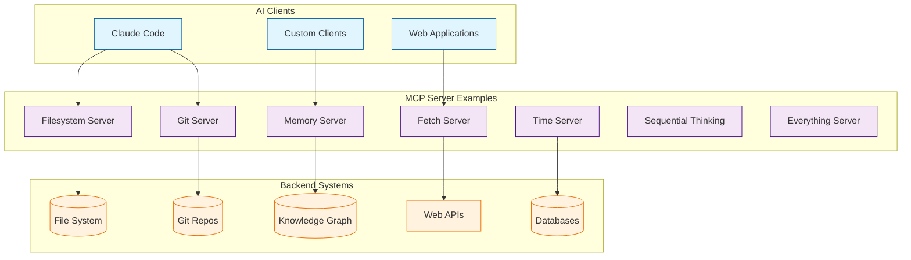

# MCP Servers Tutorial: Reference Implementations & Patterns

> Learn from official MCP server reference implementations across multiple languages to build production-grade tool integrations.

## 🎯 What are MCP Servers?

**MCP Servers** is the official repository of reference implementations for the Model Context Protocol. It contains production-quality servers demonstrating best practices for file operations, database access, Git integration, web scraping, and more - across multiple programming languages.

### Key Features

| Feature | Description |
|:--------|:------------|
| **Reference Implementations** | Official examples from the MCP maintainers |
| **Multi-Language** | Python, TypeScript, Rust, Go, Java, Kotlin, C#, PHP, Ruby, Swift |
| **Production Patterns** | Security, error handling, resource management |
| **Diverse Integrations** | Filesystem, Git, databases, web APIs, cloud services |
| **Educational** | Designed for learning MCP architecture and patterns |
| **Active Servers** | 7 core servers maintained by steering group |

## Architecture Overview

## Tutorial Structure

| Chapter | Topic | What You'll Learn |
|:--------|:------|:------------------|
| [1. Getting Started](01-getting-started.md) | Overview | Repository structure, installation, testing servers |
| [2. Filesystem Server](02-filesystem-server.md) | File Ops | Secure file operations, directory browsing, search |
| [3. Git Server](03-git-server.md) | Version Control | Repository tools, commit history, diff analysis |
| [4. Memory Server](04-memory-server.md) | Knowledge Graph | Entity storage, relationship management, RAG patterns |
| [5. Multi-Language Servers](05-multi-language-servers.md) | Implementations | Python, TypeScript, Rust patterns comparison |
| [6. Custom Server Development](06-custom-server-development.md) | Building | Using reference servers as templates |
| [7. Security Considerations](07-security-considerations.md) | Safety | Sandboxing, authentication, input validation |
| [8. Production Adaptation](08-production-adaptation.md) | Deployment | Hardening reference servers for production use |

## Tech Stack

| Component | Technology |
|:----------|:-----------|
| **Languages** | Python, TypeScript (primary), Rust, Go, Java, Kotlin, C#, PHP, Ruby, Swift |
| **Python Stack** | asyncio, Pydantic, aiofiles, httpx |
| **TypeScript Stack** | Node.js, Zod validation, Express |
| **Transports** | stdio, SSE, HTTP |
| **Testing** | pytest (Python), Jest (TypeScript) |
| **Deployment** | Docker, systemd, cloud platforms |

## Active Reference Servers

### Core Servers (Maintained by Steering Group)

| Server | Purpose | Language | Use Case |
|:-------|:--------|:---------|:---------|
| **Everything** | Comprehensive test/demo server | TypeScript | Testing all MCP features |
| **Filesystem** | Secure file operations | Python/TS | File management, search |
| **Git** | Repository integration | Python/TS | Version control, commits |
| **Memory** | Knowledge graph storage | Python/TS | Entity relationships, RAG |
| **Fetch** | Web content retrieval | TypeScript | HTTP requests, scraping |
| **Time** | Timezone conversions | Python/TS | Time operations |
| **Sequential Thinking** | Problem-solving patterns | Python/TS | Chain-of-thought reasoning |

### Archived Servers (Educational Reference)

GitHub, GitLab, Google Drive, PostgreSQL, SQLite, Brave Search, Google Maps, Sentry, Slack, Puppeteer

## What You'll Learn

By the end of this tutorial, you'll be able to:

- **Understand MCP Patterns** from official reference implementations
- **Build Custom Servers** using proven templates
- **Implement Security** following best practices from the steering group
- **Support Multiple Languages** by understanding pattern translation
- **Deploy Production Servers** with proper hardening and monitoring
- **Integrate Complex Systems** like databases, APIs, and version control
- **Test MCP Servers** effectively with proper tooling
- **Contribute Back** to the MCP ecosystem

## Prerequisites

- **MCP Python SDK Tutorial** (recommended) - Understanding core concepts
- **Programming experience** in Python or TypeScript
- **Basic understanding** of servers, APIs, and protocols
- **Command-line** proficiency for testing

## Related Tutorials

**Prerequisites:**
- [MCP Python SDK Tutorial](../mcp-python-sdk-tutorial/) - Core MCP concepts (strongly recommended)

**Complementary:**
- [n8n MCP Tutorial](../n8n-mcp-tutorial/) - Production MCP deployment patterns
- [Anthropic Skills Tutorial](../anthropic-skills-tutorial/) - Building skills with MCP integration

**Next Steps:**
- [Claude Code Tutorial - Chapter 7](../claude-code-tutorial/07-mcp.md) - Using MCP servers with Claude

## MCP SDK vs. MCP Servers

| Aspect | MCP Python SDK | MCP Servers (This Tutorial) |
|:-------|:---------------|:----------------------------|
| **Focus** | SDK library for building | Reference implementations & patterns |
| **Scope** | General-purpose development | Specific server examples |
| **Languages** | Python only | 10+ languages |
| **Level** | Framework/library | Production examples |
| **Best For** | Learning to build from scratch | Learning by example, quick starts |
| **Use Case** | Custom server development | Template-based development |

**Recommended Learning Path:** MCP Python SDK (concepts) → MCP Servers (patterns) → Custom implementation

---

Ready to begin? Start with [Chapter 1: Getting Started](01-getting-started.md).

---

*Built with insights from the [MCP Servers repository](https://github.com/modelcontextprotocol/servers) and MCP community contributions.*

**⚠️ Important Note:** These servers are **reference implementations** and **educational examples**. The repository explicitly states they are "not as production-ready solutions." Always evaluate security, performance, and reliability requirements before deploying in production environments.
