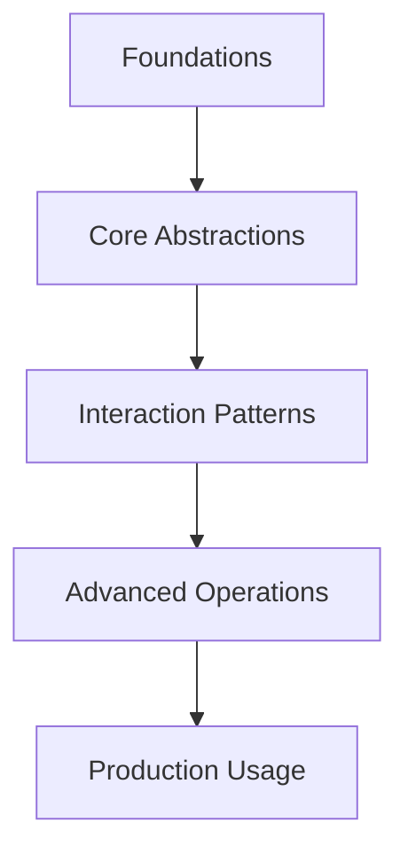

# MCP Servers Tutorial: Reference Implementations and Patterns

> Learn how to use the official MCP reference servers as implementation blueprints, not drop-in production services.

## Why This Track Matters

The official MCP reference servers are the canonical blueprints for understanding how to implement safe, reliable Model Context Protocol integrations — essential reading before building your own production servers.

This track focuses on:
- understanding MCP protocol patterns through official reference implementations
- building safe file, git, memory, and web retrieval integrations
- applying security controls and least-privilege design to MCP servers
- hardening reference patterns for production reliability and observability

## What this repository is for

The official `modelcontextprotocol/servers` repository contains a small set of **reference implementations** maintained by the MCP steering group. These servers demonstrate protocol usage and design patterns.

Important distinction:

- reference servers are educational and pattern-oriented
- production systems must add security controls, reliability engineering, and operational hardening

## Core Reference Servers

| Server | Focus |
|:-------|:------|
| Everything | Comprehensive demo/test surface for MCP features |
| Filesystem | Controlled file operations with allowlisted roots |
| Git | Repository inspection and mutation workflows |
| Memory | Knowledge graph persistence for entity-level memory |
| Fetch | Web retrieval and transformation patterns |
| Sequential Thinking | Structured iterative reasoning tool interface |
| Time | Timezone-aware utilities and conversion |

## Chapter Guide

| Chapter | Topic | What You Will Learn |
|:--------|:------|:--------------------|
| [1. Getting Started](01-getting-started.md) | Orientation | Repository structure, install/runtime options, testing workflow |
| [2. Filesystem Server](02-filesystem-server.md) | Safe File Ops | Allowlists, roots protocol, path safety, tool semantics |
| [3. Git Server](03-git-server.md) | Repo Automation | Read/write git workflows, safer mutation patterns |
| [4. Memory Server](04-memory-server.md) | Graph Memory | Entity/relation/observation model for persistent memory |
| [5. Multi-Language Servers](05-multi-language-servers.md) | Portability | How patterns transfer across MCP SDK implementations |
| [6. Custom Server Development](06-custom-server-development.md) | Build | Starting from reference patterns to create your own server |
| [7. Security Considerations](07-security-considerations.md) | Risk Control | Threat models, least privilege, tool-safety boundaries |
| [8. Production Adaptation](08-production-adaptation.md) | Hardening | Reliability, observability, deployment, and lifecycle operations |

## Current Ecosystem Notes (February 11, 2026)

- The README points developers to the MCP Registry for broad server discovery.
- The reference repository itself intentionally focuses on a small maintained core set.
- The project explicitly warns that these servers should not be treated as production-ready by default.

## Prerequisites

- Familiarity with MCP concepts (tools, resources, transports)
- Comfortable working in Python and/or TypeScript
- Basic CLI and container usage

## Related Tutorials

**Prerequisites:**
- [MCP Python SDK Tutorial](../mcp-python-sdk-tutorial/) - Build-first SDK fundamentals

**Complementary:**
- [Anthropic Skills Tutorial](../anthropic-skills-tutorial/) - Reusable capability packaging
- [n8n MCP Tutorial](../n8n-mcp-tutorial/) - Workflow platform integration

**Next Steps:**
- [Claude Code Tutorial - MCP chapter](../claude-code-tutorial/07-mcp.md)

---

Ready to begin? Start with [Chapter 1: Getting Started](01-getting-started.md).

---

*Built with references from the official [MCP servers repository](https://github.com/modelcontextprotocol/servers), server-specific READMEs, and MCP documentation links embedded in those references.*

## Navigation & Backlinks

- [Start Here: Chapter 1: Getting Started](01-getting-started.md)
- [Back to Main Catalog](../../README.md#-tutorial-catalog)
- [Browse A-Z Tutorial Directory](../../discoverability/tutorial-directory.md)
- [Search by Intent](../../discoverability/query-hub.md)
- [Explore Category Hubs](../../README.md#category-hubs)

## Full Chapter Map

1. [Chapter 1: Getting Started](01-getting-started.md)
2. [Chapter 2: Filesystem Server](02-filesystem-server.md)
3. [Chapter 3: Git Server](03-git-server.md)
4. [Chapter 4: Memory Server](04-memory-server.md)
5. [Chapter 5: Multi-Language Servers](05-multi-language-servers.md)
6. [Chapter 6: Custom Server Development](06-custom-server-development.md)
7. [Chapter 7: Security Considerations](07-security-considerations.md)
8. [Chapter 8: Production Adaptation](08-production-adaptation.md)

## Current Snapshot (auto-updated)

- repository: [modelcontextprotocol/servers](https://github.com/modelcontextprotocol/servers)
- stars: about **13K**
- project positioning: official MCP reference server implementations maintained by the MCP steering group

## What You Will Learn

- how each official reference server demonstrates core MCP protocol patterns
- how to implement safe file operations with allowlisted roots and path validation
- how to apply security threat models and least-privilege principles to MCP servers
- how to adapt reference patterns for production reliability and operational hardening

## Source References

- [MCP servers repository](https://github.com/modelcontextprotocol/servers)

## Mental Model

*Generated by [AI Codebase Knowledge Builder](https://github.com/The-Pocket/Tutorial-Codebase-Knowledge)*
