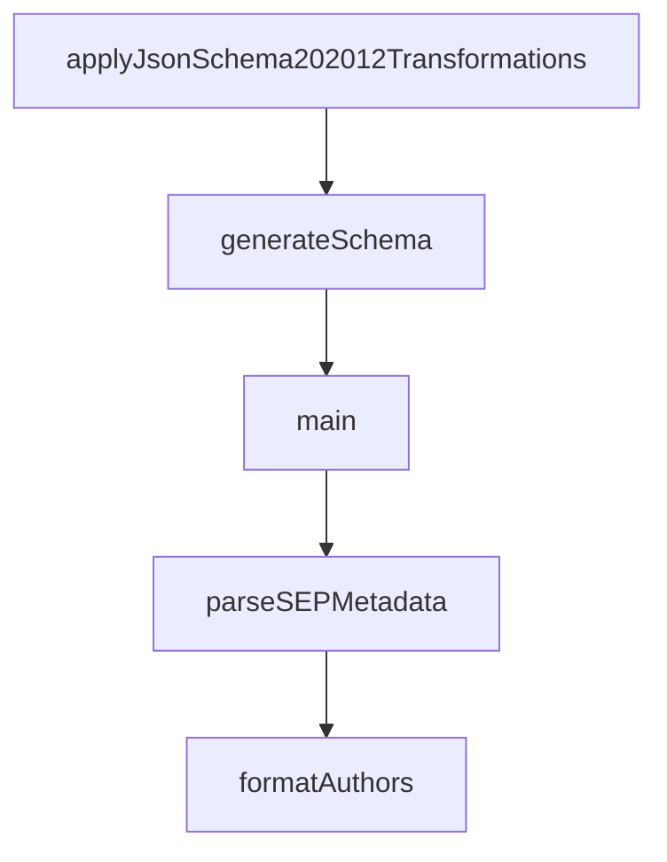

# Chapter 1: Getting Started and Version Navigation

Welcome to **Chapter 1: Getting Started and Version Navigation**. In this part of **MCP Specification Tutorial: Designing Production-Grade MCP Clients and Servers From the Source of Truth**, you will build an intuitive mental model first, then move into concrete implementation details and practical production tradeoffs.


This chapter defines a reliable way to choose and track MCP protocol revisions.

## Learning Goals

- identify the canonical source of protocol requirements
- select a versioning strategy for client/server compatibility
- map spec revision docs to implementation backlog tasks
- avoid mixing stale transport or auth behavior from older revisions

## Practical Versioning Workflow

1. lock your implementation baseline to a specific protocol revision (for example `2025-11-25`)
2. document which revision each SDK in your stack currently targets
3. check the spec changelog before adding new capabilities (tasks, elicitation modes, scope flows)
4. treat revision upgrades as planned change windows, not ad-hoc refactors

## Minimum Source Map

- `docs/specification/<revision>/index.mdx` for authoritative behavior
- `schema/<revision>/schema.ts` and generated schema for machine validation
- `docs/specification/<revision>/changelog.mdx` for delta review
- `docs/development/roadmap.mdx` for upcoming protocol priorities

## Source References

- [Specification 2025-11-25 Index](https://github.com/modelcontextprotocol/modelcontextprotocol/blob/main/docs/specification/2025-11-25/index.mdx)
- [Schema 2025-11-25 (TypeScript)](https://github.com/modelcontextprotocol/modelcontextprotocol/blob/main/schema/2025-11-25/schema.ts)
- [Key Changes vs 2025-06-18](https://github.com/modelcontextprotocol/modelcontextprotocol/blob/main/docs/specification/2025-11-25/changelog.mdx)
- [Development Roadmap](https://github.com/modelcontextprotocol/modelcontextprotocol/blob/main/docs/development/roadmap.mdx)

## Summary

You now have a revision-first process that keeps implementation decisions aligned with the protocol source of truth.

Next: [Chapter 2: Architecture and Capability Negotiation](02-architecture-and-capability-negotiation.md)

## Depth Expansion Playbook

## Source Code Walkthrough

### `scripts/generate-schemas.ts`

The `applyJsonSchema202012Transformations` function in [`scripts/generate-schemas.ts`](https://github.com/modelcontextprotocol/modelcontextprotocol/blob/HEAD/scripts/generate-schemas.ts) handles a key part of this chapter's functionality:

```ts
 * Apply JSON Schema 2020-12 transformations to a schema file
 */
function applyJsonSchema202012Transformations(schemaPath: string): void {
  let content = readFileSync(schemaPath, 'utf-8');

  // Replace $schema URL
  content = content.replace(
    /http:\/\/json-schema\.org\/draft-07\/schema#/g,
    'https://json-schema.org/draft/2020-12/schema'
  );

  // Replace "definitions": with "$defs":
  content = content.replace(
    /"definitions":/g,
    '"$defs":'
  );

  // Replace #/definitions/ with #/$defs/
  content = content.replace(
    /#\/definitions\//g,
    '#/$defs/'
  );

  writeFileSync(schemaPath, content, 'utf-8');
}

/**
 * Generate JSON schema for a specific version
 */
async function generateSchema(version: string, check: boolean = false): Promise<boolean> {
  const schemaDir = join('schema', version);
  const schemaTs = join(schemaDir, 'schema.ts');
```

This function is important because it defines how MCP Specification Tutorial: Designing Production-Grade MCP Clients and Servers From the Source of Truth implements the patterns covered in this chapter.

### `scripts/generate-schemas.ts`

The `generateSchema` function in [`scripts/generate-schemas.ts`](https://github.com/modelcontextprotocol/modelcontextprotocol/blob/HEAD/scripts/generate-schemas.ts) handles a key part of this chapter's functionality:

```ts
 * Generate JSON schema for a specific version
 */
async function generateSchema(version: string, check: boolean = false): Promise<boolean> {
  const schemaDir = join('schema', version);
  const schemaTs = join(schemaDir, 'schema.ts');
  const schemaJson = join(schemaDir, 'schema.json');

  if (check) {
    // Read existing schema
    const existingSchema = readFileSync(schemaJson, 'utf-8');

    // Generate schema to stdout and capture it
    try {
      const { stdout: generated } = await execAsync(
        `npx typescript-json-schema --defaultNumberType integer --required --skipLibCheck "${schemaTs}" "*"`
      );

      let expectedSchema = generated;

      // Apply transformations for non-legacy schemas
      if (!LEGACY_SCHEMAS.includes(version)) {
        expectedSchema = expectedSchema.replace(
          /http:\/\/json-schema\.org\/draft-07\/schema#/g,
          'https://json-schema.org/draft/2020-12/schema'
        );
        expectedSchema = expectedSchema.replace(/"definitions":/g, '"$defs":');
        expectedSchema = expectedSchema.replace(/#\/definitions\//g, '#/$defs/');
      }

      // Compare
      if (existingSchema.trim() !== expectedSchema.trim()) {
        console.error(`  ✗ Schema ${version} is out of date!`);
```

This function is important because it defines how MCP Specification Tutorial: Designing Production-Grade MCP Clients and Servers From the Source of Truth implements the patterns covered in this chapter.

### `scripts/generate-schemas.ts`

The `main` function in [`scripts/generate-schemas.ts`](https://github.com/modelcontextprotocol/modelcontextprotocol/blob/HEAD/scripts/generate-schemas.ts) handles a key part of this chapter's functionality:

```ts
const execAsync = promisify(exec);

// Legacy schema versions that should remain as JSON Schema draft-07
const LEGACY_SCHEMAS = ['2024-11-05', '2025-03-26', '2025-06-18'];

// Modern schema versions that use JSON Schema 2020-12
const MODERN_SCHEMAS = ['2025-11-25', 'draft'];

// All schema versions to generate
const ALL_SCHEMAS = [...LEGACY_SCHEMAS, ...MODERN_SCHEMAS];

// Check if we're in check mode (validate existing schemas match generated ones)
const CHECK_MODE = process.argv.includes('--check');

/**
 * Apply JSON Schema 2020-12 transformations to a schema file
 */
function applyJsonSchema202012Transformations(schemaPath: string): void {
  let content = readFileSync(schemaPath, 'utf-8');

  // Replace $schema URL
  content = content.replace(
    /http:\/\/json-schema\.org\/draft-07\/schema#/g,
    'https://json-schema.org/draft/2020-12/schema'
  );

  // Replace "definitions": with "$defs":
  content = content.replace(
    /"definitions":/g,
    '"$defs":'
  );

```

This function is important because it defines how MCP Specification Tutorial: Designing Production-Grade MCP Clients and Servers From the Source of Truth implements the patterns covered in this chapter.

### `scripts/render-seps.ts`

The `parseSEPMetadata` function in [`scripts/render-seps.ts`](https://github.com/modelcontextprotocol/modelcontextprotocol/blob/HEAD/scripts/render-seps.ts) handles a key part of this chapter's functionality:

```ts
 * Parse SEP metadata from markdown content
 */
function parseSEPMetadata(content: string, filename: string): SEPMetadata | null {
  // Skip template and README files
  if (filename === "TEMPLATE.md" || filename === "README.md") {
    return null;
  }

  // Extract SEP number and slug from filename (e.g., "1850-pr-based-sep-workflow.md")
  const filenameMatch = filename.match(/^(\d+)-(.+)\.md$/);
  if (!filenameMatch) {
    // Skip files that don't match SEP naming convention (like 0000-*.md drafts)
    if (filename.match(/^0000-/)) {
      return null;
    }
    console.warn(`Warning: Skipping ${filename} - doesn't match SEP naming convention`);
    return null;
  }

  const [, number, slug] = filenameMatch;

  // Parse title from first heading
  const titleMatch = content.match(/^#\s+SEP-\d+:\s+(.+)$/m);
  const title = titleMatch ? titleMatch[1].trim() : "Untitled";

  // Parse metadata fields using regex
  const statusMatch = content.match(/^\s*-\s*\*\*Status\*\*:\s*(.+)$/m);
  const typeMatch = content.match(/^\s*-\s*\*\*Type\*\*:\s*(.+)$/m);
  const createdMatch = content.match(/^\s*-\s*\*\*Created\*\*:\s*(.+)$/m);
  const acceptedMatch = content.match(/^\s*-\s*\*\*Accepted\*\*:\s*(.+)$/m);
  const authorsMatch = content.match(/^\s*-\s*\*\*Author\(s\)\*\*:\s*(.+)$/m);
  const sponsorMatch = content.match(/^\s*-\s*\*\*Sponsor\*\*:\s*(.+)$/m);
```

This function is important because it defines how MCP Specification Tutorial: Designing Production-Grade MCP Clients and Servers From the Source of Truth implements the patterns covered in this chapter.


## How These Components Connect


