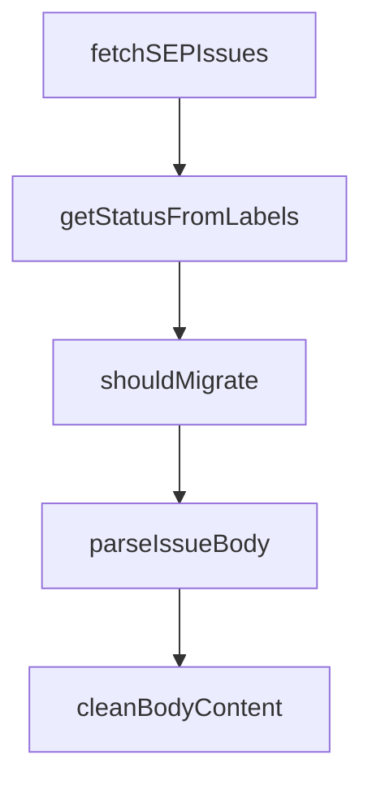

# Chapter 1: Getting Started and Version Navigation

Welcome to **Chapter 1: Getting Started and Version Navigation**. In this part of **MCP Specification Tutorial: Designing Production-Grade MCP Clients and Servers From the Source of Truth**, you will build an intuitive mental model first, then move into concrete implementation details and practical production tradeoffs.


This chapter defines a reliable way to choose and track MCP protocol revisions.

## Learning Goals

- identify the canonical source of protocol requirements
- select a versioning strategy for client/server compatibility
- map spec revision docs to implementation backlog tasks
- avoid mixing stale transport or auth behavior from older revisions

## Practical Versioning Workflow

1. lock your implementation baseline to a specific protocol revision (for example `2025-11-25`)
2. document which revision each SDK in your stack currently targets
3. check the spec changelog before adding new capabilities (tasks, elicitation modes, scope flows)
4. treat revision upgrades as planned change windows, not ad-hoc refactors

## Minimum Source Map

- `docs/specification/<revision>/index.mdx` for authoritative behavior
- `schema/<revision>/schema.ts` and generated schema for machine validation
- `docs/specification/<revision>/changelog.mdx` for delta review
- `docs/development/roadmap.mdx` for upcoming protocol priorities

## Source References

- [Specification 2025-11-25 Index](https://github.com/modelcontextprotocol/modelcontextprotocol/blob/main/docs/specification/2025-11-25/index.mdx)
- [Schema 2025-11-25 (TypeScript)](https://github.com/modelcontextprotocol/modelcontextprotocol/blob/main/schema/2025-11-25/schema.ts)
- [Key Changes vs 2025-06-18](https://github.com/modelcontextprotocol/modelcontextprotocol/blob/main/docs/specification/2025-11-25/changelog.mdx)
- [Development Roadmap](https://github.com/modelcontextprotocol/modelcontextprotocol/blob/main/docs/development/roadmap.mdx)

## Summary

You now have a revision-first process that keeps implementation decisions aligned with the protocol source of truth.

Next: [Chapter 2: Architecture and Capability Negotiation](02-architecture-and-capability-negotiation.md)

## Source Code Walkthrough

### `migrate_seps.js`

The `fetchSEPIssues` function in [`migrate_seps.js`](https://github.com/modelcontextprotocol/modelcontextprotocol/blob/HEAD/migrate_seps.js) handles a key part of this chapter's functionality:

```js

// Fetch all SEP issues from GitHub
function fetchSEPIssues() {
  console.log('Fetching SEP issues from GitHub...');

  const result = execSync(
    'gh issue list --label SEP --state all --limit 500 --json number,title,state,labels,body,createdAt,closedAt,author',
    { encoding: 'utf-8' }
  );

  return JSON.parse(result);
}

// Determine SEP status from labels
function getStatusFromLabels(labels) {
  const labelNames = labels.map(l => l.name.toLowerCase());

  // Check for status labels in priority order
  if (labelNames.includes('final')) return 'Final';
  if (labelNames.includes('accepted-with-changes')) return 'Accepted';
  if (labelNames.includes('accepted')) return 'Accepted';
  if (labelNames.includes('in-review')) return 'In-Review';
  if (labelNames.includes('draft')) return 'Draft';
  if (labelNames.includes('proposal')) return 'Draft';

  return null;
}

// Check if issue should be migrated (has accepted, accepted-with-changes, or final status)
function shouldMigrate(issue) {
  const status = getStatusFromLabels(issue.labels);
  return status && ['Accepted', 'Final'].includes(status);
```

This function is important because it defines how MCP Specification Tutorial: Designing Production-Grade MCP Clients and Servers From the Source of Truth implements the patterns covered in this chapter.

### `migrate_seps.js`

The `getStatusFromLabels` function in [`migrate_seps.js`](https://github.com/modelcontextprotocol/modelcontextprotocol/blob/HEAD/migrate_seps.js) handles a key part of this chapter's functionality:

```js

// Determine SEP status from labels
function getStatusFromLabels(labels) {
  const labelNames = labels.map(l => l.name.toLowerCase());

  // Check for status labels in priority order
  if (labelNames.includes('final')) return 'Final';
  if (labelNames.includes('accepted-with-changes')) return 'Accepted';
  if (labelNames.includes('accepted')) return 'Accepted';
  if (labelNames.includes('in-review')) return 'In-Review';
  if (labelNames.includes('draft')) return 'Draft';
  if (labelNames.includes('proposal')) return 'Draft';

  return null;
}

// Check if issue should be migrated (has accepted, accepted-with-changes, or final status)
function shouldMigrate(issue) {
  const status = getStatusFromLabels(issue.labels);
  return status && ['Accepted', 'Final'].includes(status);
}

// Extract metadata from issue body
function parseIssueBody(body, issue) {
  if (!body) return null;

  const metadata = {
    title: issue.title.replace(/^\[?SEP-\d+\]?:?\s*/i, ''),
    status: getStatusFromLabels(issue.labels),
    type: 'Standards Track',
    created: issue.createdAt ? issue.createdAt.split('T')[0] : new Date().toISOString().split('T')[0],
    author: issue.author ? issue.author.login : 'Unknown',
```

This function is important because it defines how MCP Specification Tutorial: Designing Production-Grade MCP Clients and Servers From the Source of Truth implements the patterns covered in this chapter.

### `migrate_seps.js`

The `shouldMigrate` function in [`migrate_seps.js`](https://github.com/modelcontextprotocol/modelcontextprotocol/blob/HEAD/migrate_seps.js) handles a key part of this chapter's functionality:

```js

// Check if issue should be migrated (has accepted, accepted-with-changes, or final status)
function shouldMigrate(issue) {
  const status = getStatusFromLabels(issue.labels);
  return status && ['Accepted', 'Final'].includes(status);
}

// Extract metadata from issue body
function parseIssueBody(body, issue) {
  if (!body) return null;

  const metadata = {
    title: issue.title.replace(/^\[?SEP-\d+\]?:?\s*/i, ''),
    status: getStatusFromLabels(issue.labels),
    type: 'Standards Track',
    created: issue.createdAt ? issue.createdAt.split('T')[0] : new Date().toISOString().split('T')[0],
    author: issue.author ? issue.author.login : 'Unknown',
    sponsor: null,
    pr: null
  };

  // Try to extract metadata from the body
  const lines = body.split('\n');

  for (const line of lines) {
    const trimmed = line.trim();

    // Extract type
    if (trimmed.match(/\*?\*?Type\*?\*?:/i)) {
      const match = trimmed.match(/Type\*?\*?:\s*(.+)/i);
      if (match) metadata.type = match[1].trim();
    }
```

This function is important because it defines how MCP Specification Tutorial: Designing Production-Grade MCP Clients and Servers From the Source of Truth implements the patterns covered in this chapter.

### `migrate_seps.js`

The `parseIssueBody` function in [`migrate_seps.js`](https://github.com/modelcontextprotocol/modelcontextprotocol/blob/HEAD/migrate_seps.js) handles a key part of this chapter's functionality:

```js

// Extract metadata from issue body
function parseIssueBody(body, issue) {
  if (!body) return null;

  const metadata = {
    title: issue.title.replace(/^\[?SEP-\d+\]?:?\s*/i, ''),
    status: getStatusFromLabels(issue.labels),
    type: 'Standards Track',
    created: issue.createdAt ? issue.createdAt.split('T')[0] : new Date().toISOString().split('T')[0],
    author: issue.author ? issue.author.login : 'Unknown',
    sponsor: null,
    pr: null
  };

  // Try to extract metadata from the body
  const lines = body.split('\n');

  for (const line of lines) {
    const trimmed = line.trim();

    // Extract type
    if (trimmed.match(/\*?\*?Type\*?\*?:/i)) {
      const match = trimmed.match(/Type\*?\*?:\s*(.+)/i);
      if (match) metadata.type = match[1].trim();
    }

    // Extract author(s)
    if (trimmed.match(/\*?\*?Authors?\*?\*?:/i)) {
      const match = trimmed.match(/Authors?\*?\*?:\s*(.+)/i);
      if (match) metadata.author = match[1].trim();
    }
```

This function is important because it defines how MCP Specification Tutorial: Designing Production-Grade MCP Clients and Servers From the Source of Truth implements the patterns covered in this chapter.


## How These Components Connect


