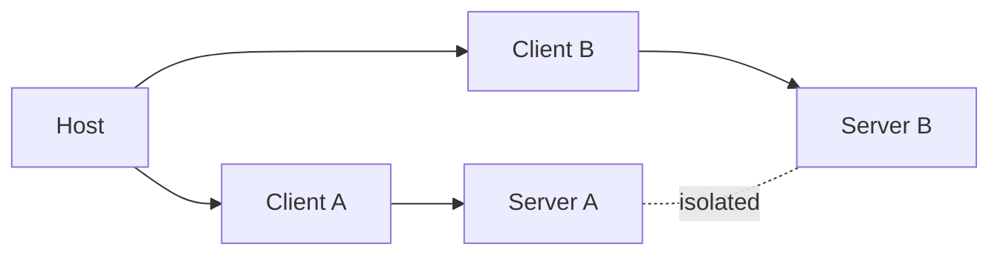

# Chapter 2: Architecture and Capability Negotiation

MCP architecture quality depends on keeping host, client, and server responsibilities explicit.

## Learning Goals

- model host, client, and server as distinct trust and execution boundaries
- understand why capability negotiation is central to interoperability
- separate transport concerns from feature concerns
- prevent accidental cross-server privilege bleed

## Boundary Model

Design implications:

- host coordinates user consent and policy
- each client session is scoped to one server connection
- servers expose focused capabilities and should not access full conversation state

## Capability Negotiation Checklist

- client advertises only capabilities it truly supports (`roots`, `sampling`, `elicitation`, `tasks`)
- server advertises only implemented features (`tools`, `resources`, `prompts`, `logging`, `tasks`)
- both sides operate strictly within negotiated capabilities during runtime
- unsupported capability use should fail predictably, not silently

## Source References

- [Architecture](https://github.com/modelcontextprotocol/modelcontextprotocol/blob/main/docs/specification/2025-11-25/architecture/index.mdx)
- [Lifecycle - Capability Negotiation](https://github.com/modelcontextprotocol/modelcontextprotocol/blob/main/docs/specification/2025-11-25/basic/lifecycle.mdx)
- [Learn: Client Concepts](https://github.com/modelcontextprotocol/modelcontextprotocol/blob/main/docs/docs/learn/client-concepts.mdx)
- [Learn: Server Concepts](https://github.com/modelcontextprotocol/modelcontextprotocol/blob/main/docs/docs/learn/server-concepts.mdx)

## Summary

You now have an architectural model that prevents capability confusion and keeps trust boundaries explicit.

Next: [Chapter 3: Base Protocol Messages and Schema Contracts](03-base-protocol-messages-and-schema-contracts.md)
