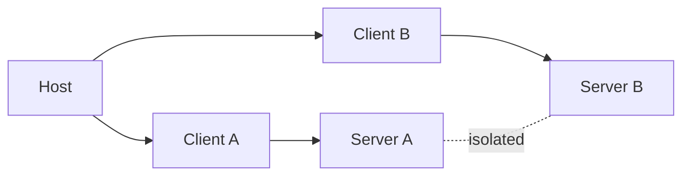
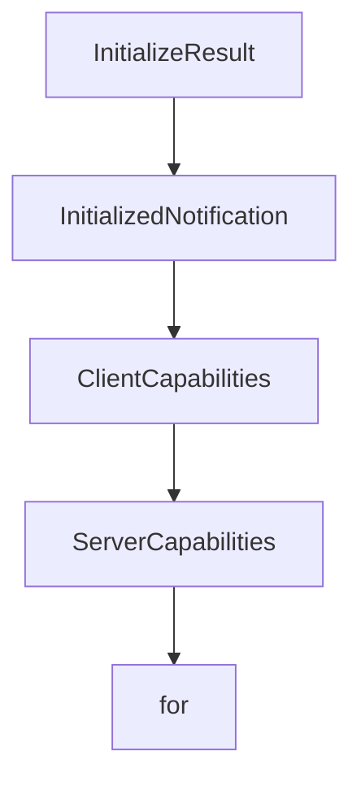

# Chapter 2: Architecture and Capability Negotiation

Welcome to **Chapter 2: Architecture and Capability Negotiation**. In this part of **MCP Specification Tutorial: Designing Production-Grade MCP Clients and Servers From the Source of Truth**, you will build an intuitive mental model first, then move into concrete implementation details and practical production tradeoffs.


MCP architecture quality depends on keeping host, client, and server responsibilities explicit.

## Learning Goals

- model host, client, and server as distinct trust and execution boundaries
- understand why capability negotiation is central to interoperability
- separate transport concerns from feature concerns
- prevent accidental cross-server privilege bleed

## Boundary Model


```mermaid
flowchart LR
    H[Host] --> C1[Client A]
    H --> C2[Client B]
    C1 --> S1[Server A]
    C2 --> S2[Server B]
    S1 -. isolated .- S2
```

Design implications:

- host coordinates user consent and policy
- each client session is scoped to one server connection
- servers expose focused capabilities and should not access full conversation state

## Capability Negotiation Checklist

- client advertises only capabilities it truly supports (`roots`, `sampling`, `elicitation`, `tasks`)
- server advertises only implemented features (`tools`, `resources`, `prompts`, `logging`, `tasks`)
- both sides operate strictly within negotiated capabilities during runtime
- unsupported capability use should fail predictably, not silently

## Source References

- [Architecture](https://github.com/modelcontextprotocol/modelcontextprotocol/blob/main/docs/specification/2025-11-25/architecture/index.mdx)
- [Lifecycle - Capability Negotiation](https://github.com/modelcontextprotocol/modelcontextprotocol/blob/main/docs/specification/2025-11-25/basic/lifecycle.mdx)
- [Learn: Client Concepts](https://github.com/modelcontextprotocol/modelcontextprotocol/blob/main/docs/docs/learn/client-concepts.mdx)
- [Learn: Server Concepts](https://github.com/modelcontextprotocol/modelcontextprotocol/blob/main/docs/docs/learn/server-concepts.mdx)

## Summary

You now have an architectural model that prevents capability confusion and keeps trust boundaries explicit.

Next: [Chapter 3: Base Protocol Messages and Schema Contracts](03-base-protocol-messages-and-schema-contracts.md)

## Source Code Walkthrough

### `schema/2025-06-18/schema.ts`

The `InitializeResult` interface in [`schema/2025-06-18/schema.ts`](https://github.com/modelcontextprotocol/modelcontextprotocol/blob/HEAD/schema/2025-06-18/schema.ts) handles a key part of this chapter's functionality:

```ts
 * @category `initialize`
 */
export interface InitializeResult extends Result {
  /**
   * The version of the Model Context Protocol that the server wants to use. This may not match the version that the client requested. If the client cannot support this version, it MUST disconnect.
   */
  protocolVersion: string;
  capabilities: ServerCapabilities;
  serverInfo: Implementation;

  /**
   * Instructions describing how to use the server and its features.
   *
   * This can be used by clients to improve the LLM's understanding of available tools, resources, etc. It can be thought of like a "hint" to the model. For example, this information MAY be added to the system prompt.
   */
  instructions?: string;
}

/**
 * This notification is sent from the client to the server after initialization has finished.
 *
 * @category `notifications/initialized`
 */
export interface InitializedNotification extends Notification {
  method: "notifications/initialized";
}

/**
 * Capabilities a client may support. Known capabilities are defined here, in this schema, but this is not a closed set: any client can define its own, additional capabilities.
 *
 * @category `initialize`
 */
```

This interface is important because it defines how MCP Specification Tutorial: Designing Production-Grade MCP Clients and Servers From the Source of Truth implements the patterns covered in this chapter.

### `schema/2025-06-18/schema.ts`

The `InitializedNotification` interface in [`schema/2025-06-18/schema.ts`](https://github.com/modelcontextprotocol/modelcontextprotocol/blob/HEAD/schema/2025-06-18/schema.ts) handles a key part of this chapter's functionality:

```ts
 * @category `notifications/initialized`
 */
export interface InitializedNotification extends Notification {
  method: "notifications/initialized";
}

/**
 * Capabilities a client may support. Known capabilities are defined here, in this schema, but this is not a closed set: any client can define its own, additional capabilities.
 *
 * @category `initialize`
 */
export interface ClientCapabilities {
  /**
   * Experimental, non-standard capabilities that the client supports.
   */
  experimental?: { [key: string]: object };
  /**
   * Present if the client supports listing roots.
   */
  roots?: {
    /**
     * Whether the client supports notifications for changes to the roots list.
     */
    listChanged?: boolean;
  };
  /**
   * Present if the client supports sampling from an LLM.
   */
  sampling?: object;
  /**
   * Present if the client supports elicitation from the server.
   */
```

This interface is important because it defines how MCP Specification Tutorial: Designing Production-Grade MCP Clients and Servers From the Source of Truth implements the patterns covered in this chapter.

### `schema/2025-06-18/schema.ts`

The `ClientCapabilities` interface in [`schema/2025-06-18/schema.ts`](https://github.com/modelcontextprotocol/modelcontextprotocol/blob/HEAD/schema/2025-06-18/schema.ts) handles a key part of this chapter's functionality:

```ts
     */
    protocolVersion: string;
    capabilities: ClientCapabilities;
    clientInfo: Implementation;
  };
}

/**
 * After receiving an initialize request from the client, the server sends this response.
 *
 * @category `initialize`
 */
export interface InitializeResult extends Result {
  /**
   * The version of the Model Context Protocol that the server wants to use. This may not match the version that the client requested. If the client cannot support this version, it MUST disconnect.
   */
  protocolVersion: string;
  capabilities: ServerCapabilities;
  serverInfo: Implementation;

  /**
   * Instructions describing how to use the server and its features.
   *
   * This can be used by clients to improve the LLM's understanding of available tools, resources, etc. It can be thought of like a "hint" to the model. For example, this information MAY be added to the system prompt.
   */
  instructions?: string;
}

/**
 * This notification is sent from the client to the server after initialization has finished.
 *
 * @category `notifications/initialized`
```

This interface is important because it defines how MCP Specification Tutorial: Designing Production-Grade MCP Clients and Servers From the Source of Truth implements the patterns covered in this chapter.

### `schema/2025-06-18/schema.ts`

The `ServerCapabilities` interface in [`schema/2025-06-18/schema.ts`](https://github.com/modelcontextprotocol/modelcontextprotocol/blob/HEAD/schema/2025-06-18/schema.ts) handles a key part of this chapter's functionality:

```ts
   */
  protocolVersion: string;
  capabilities: ServerCapabilities;
  serverInfo: Implementation;

  /**
   * Instructions describing how to use the server and its features.
   *
   * This can be used by clients to improve the LLM's understanding of available tools, resources, etc. It can be thought of like a "hint" to the model. For example, this information MAY be added to the system prompt.
   */
  instructions?: string;
}

/**
 * This notification is sent from the client to the server after initialization has finished.
 *
 * @category `notifications/initialized`
 */
export interface InitializedNotification extends Notification {
  method: "notifications/initialized";
}

/**
 * Capabilities a client may support. Known capabilities are defined here, in this schema, but this is not a closed set: any client can define its own, additional capabilities.
 *
 * @category `initialize`
 */
export interface ClientCapabilities {
  /**
   * Experimental, non-standard capabilities that the client supports.
   */
  experimental?: { [key: string]: object };
```

This interface is important because it defines how MCP Specification Tutorial: Designing Production-Grade MCP Clients and Servers From the Source of Truth implements the patterns covered in this chapter.


## How These Components Connect


```mermaid
flowchart TD
    A[InitializeResult]
    B[InitializedNotification]
    C[ClientCapabilities]
    D[ServerCapabilities]
    E[for]
    A --> B
    B --> C
    C --> D
    D --> E
```
