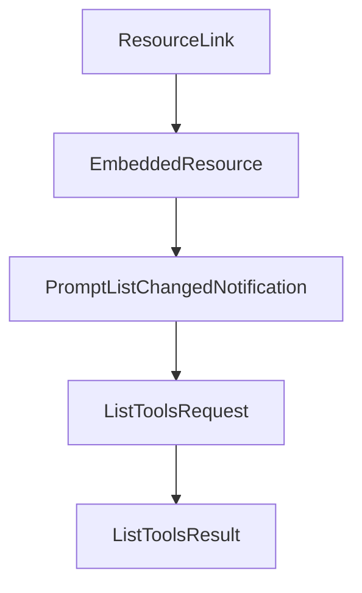

# Chapter 3: Base Protocol Messages and Schema Contracts

Welcome to **Chapter 3: Base Protocol Messages and Schema Contracts**. In this part of **MCP Specification Tutorial: Designing Production-Grade MCP Clients and Servers From the Source of Truth**, you will build an intuitive mental model first, then move into concrete implementation details and practical production tradeoffs.


This chapter covers the core message and schema rules that keep implementations interoperable.

## Learning Goals

- distinguish requests, responses, and notifications correctly
- apply JSON-RPC and MCP field constraints with fewer wire bugs
- use JSON Schema dialect rules consistently
- handle `_meta` and rich metadata fields predictably

## Wire-Contract Rules That Matter

| Area | Practical Rule |
|:-----|:---------------|
| JSON encoding | UTF-8 encoded JSON-RPC messages only |
| Message framing | transport-specific framing must preserve one valid JSON-RPC message per unit |
| Requests vs notifications | requests expect response; notifications do not |
| Schema defaults | JSON Schema 2020-12 is the default dialect in current revisions |
| Validation | validate input and output schemas at boundaries, not deep inside tool logic |

## Implementation Guidance

- maintain strict schema validation for tool/resource payloads
- treat protocol errors separately from tool execution errors
- enforce method-level payload shape expectations in a shared layer
- pin schema artifacts by protocol revision when generating SDK bindings

## Source References

- [Base Protocol](https://github.com/modelcontextprotocol/modelcontextprotocol/blob/main/docs/specification/2025-11-25/basic/index.mdx)
- [Schema Documentation](https://github.com/modelcontextprotocol/modelcontextprotocol/blob/main/docs/specification/2025-11-25/schema.mdx)
- [Protocol Changelog - Schema Updates](https://github.com/modelcontextprotocol/modelcontextprotocol/blob/main/docs/specification/2025-11-25/changelog.mdx)
- [Draft Schema Source](https://github.com/modelcontextprotocol/modelcontextprotocol/blob/main/schema/draft/schema.ts)

## Summary

You now have a protocol-contract baseline that reduces cross-client/server serialization and validation failures.

Next: [Chapter 4: Transport Model: stdio, Streamable HTTP, and Sessions](04-transport-model-stdio-streamable-http-and-sessions.md)

## Source Code Walkthrough

### `schema/2025-06-18/schema.ts`

The `ResourceLink` interface in [`schema/2025-06-18/schema.ts`](https://github.com/modelcontextprotocol/modelcontextprotocol/blob/HEAD/schema/2025-06-18/schema.ts) handles a key part of this chapter's functionality:

```ts
 * @category Content
 */
export interface ResourceLink extends Resource {
  type: "resource_link";
}

/**
 * The contents of a resource, embedded into a prompt or tool call result.
 *
 * It is up to the client how best to render embedded resources for the benefit
 * of the LLM and/or the user.
 *
 * @category Content
 */
export interface EmbeddedResource {
  type: "resource";
  resource: TextResourceContents | BlobResourceContents;

  /**
   * Optional annotations for the client.
   */
  annotations?: Annotations;

  /**
   * See [General fields: `_meta`](/specification/2025-06-18/basic/index#meta) for notes on `_meta` usage.
   */
  _meta?: { [key: string]: unknown };
}
/**
 * An optional notification from the server to the client, informing it that the list of prompts it offers has changed. This may be issued by servers without any previous subscription from the client.
 *
 * @category `notifications/prompts/list_changed`
```

This interface is important because it defines how MCP Specification Tutorial: Designing Production-Grade MCP Clients and Servers From the Source of Truth implements the patterns covered in this chapter.

### `schema/2025-06-18/schema.ts`

The `EmbeddedResource` interface in [`schema/2025-06-18/schema.ts`](https://github.com/modelcontextprotocol/modelcontextprotocol/blob/HEAD/schema/2025-06-18/schema.ts) handles a key part of this chapter's functionality:

```ts
 * @category Content
 */
export interface EmbeddedResource {
  type: "resource";
  resource: TextResourceContents | BlobResourceContents;

  /**
   * Optional annotations for the client.
   */
  annotations?: Annotations;

  /**
   * See [General fields: `_meta`](/specification/2025-06-18/basic/index#meta) for notes on `_meta` usage.
   */
  _meta?: { [key: string]: unknown };
}
/**
 * An optional notification from the server to the client, informing it that the list of prompts it offers has changed. This may be issued by servers without any previous subscription from the client.
 *
 * @category `notifications/prompts/list_changed`
 */
export interface PromptListChangedNotification extends Notification {
  method: "notifications/prompts/list_changed";
}

/* Tools */
/**
 * Sent from the client to request a list of tools the server has.
 *
 * @category `tools/list`
 */
export interface ListToolsRequest extends PaginatedRequest {
```

This interface is important because it defines how MCP Specification Tutorial: Designing Production-Grade MCP Clients and Servers From the Source of Truth implements the patterns covered in this chapter.

### `schema/2025-06-18/schema.ts`

The `PromptListChangedNotification` interface in [`schema/2025-06-18/schema.ts`](https://github.com/modelcontextprotocol/modelcontextprotocol/blob/HEAD/schema/2025-06-18/schema.ts) handles a key part of this chapter's functionality:

```ts
 * @category `notifications/prompts/list_changed`
 */
export interface PromptListChangedNotification extends Notification {
  method: "notifications/prompts/list_changed";
}

/* Tools */
/**
 * Sent from the client to request a list of tools the server has.
 *
 * @category `tools/list`
 */
export interface ListToolsRequest extends PaginatedRequest {
  method: "tools/list";
}

/**
 * The server's response to a tools/list request from the client.
 *
 * @category `tools/list`
 */
export interface ListToolsResult extends PaginatedResult {
  tools: Tool[];
}

/**
 * The server's response to a tool call.
 *
 * @category `tools/call`
 */
export interface CallToolResult extends Result {
  /**
```

This interface is important because it defines how MCP Specification Tutorial: Designing Production-Grade MCP Clients and Servers From the Source of Truth implements the patterns covered in this chapter.

### `schema/2025-06-18/schema.ts`

The `ListToolsRequest` interface in [`schema/2025-06-18/schema.ts`](https://github.com/modelcontextprotocol/modelcontextprotocol/blob/HEAD/schema/2025-06-18/schema.ts) handles a key part of this chapter's functionality:

```ts
 * @category `tools/list`
 */
export interface ListToolsRequest extends PaginatedRequest {
  method: "tools/list";
}

/**
 * The server's response to a tools/list request from the client.
 *
 * @category `tools/list`
 */
export interface ListToolsResult extends PaginatedResult {
  tools: Tool[];
}

/**
 * The server's response to a tool call.
 *
 * @category `tools/call`
 */
export interface CallToolResult extends Result {
  /**
   * A list of content objects that represent the unstructured result of the tool call.
   */
  content: ContentBlock[];

  /**
   * An optional JSON object that represents the structured result of the tool call.
   */
  structuredContent?: { [key: string]: unknown };

  /**
```

This interface is important because it defines how MCP Specification Tutorial: Designing Production-Grade MCP Clients and Servers From the Source of Truth implements the patterns covered in this chapter.


## How These Components Connect


