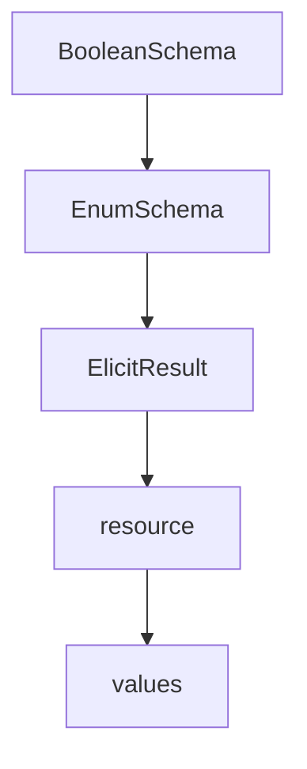

# Chapter 4: Transport Model: stdio, Streamable HTTP, and Sessions

Welcome to **Chapter 4: Transport Model: stdio, Streamable HTTP, and Sessions**. In this part of **MCP Specification Tutorial: Designing Production-Grade MCP Clients and Servers From the Source of Truth**, you will build an intuitive mental model first, then move into concrete implementation details and practical production tradeoffs.


Transport behavior drives most production incidents in MCP systems.

## Learning Goals

- choose between stdio and Streamable HTTP based on deployment context
- implement session headers and protocol-version headers correctly
- handle SSE polling and resumability without breaking message ordering
- apply required security controls for remote/local HTTP endpoints

## Transport Decision Matrix

| Transport | Best Fit | Core Risks |
|:----------|:---------|:-----------|
| `stdio` | local subprocess servers | stdout contamination, process lifecycle leaks |
| Streamable HTTP | remote/shared servers and multi-client deployments | origin validation, session hijack, reconnection loss |

## Streamable HTTP Must-Haves

- validate `Origin` and reject invalid origin with `403`
- include and honor `MCP-Session-Id` when server assigns stateful sessions
- include `MCP-Protocol-Version` on follow-up HTTP requests
- support both `application/json` and `text/event-stream` response paths
- plan explicit behavior for resumability/redelivery and session expiration

## Source References

- [Transports](https://github.com/modelcontextprotocol/modelcontextprotocol/blob/main/docs/specification/2025-11-25/basic/transports.mdx)
- [Lifecycle](https://github.com/modelcontextprotocol/modelcontextprotocol/blob/main/docs/specification/2025-11-25/basic/lifecycle.mdx)
- [Security Best Practices - Session Hijacking](https://github.com/modelcontextprotocol/modelcontextprotocol/blob/main/docs/specification/2025-11-25/basic/security_best_practices.mdx)

## Summary

You now have a transport operations model that is compatible with current session and security requirements.

Next: [Chapter 5: Server Primitives: Tools, Resources, and Prompts](05-server-primitives-tools-resources-and-prompts.md)

## Source Code Walkthrough

### `schema/2025-06-18/schema.ts`

The `BooleanSchema` interface in [`schema/2025-06-18/schema.ts`](https://github.com/modelcontextprotocol/modelcontextprotocol/blob/HEAD/schema/2025-06-18/schema.ts) handles a key part of this chapter's functionality:

```ts
  | StringSchema
  | NumberSchema
  | BooleanSchema
  | EnumSchema;

/**
 * @category `elicitation/create`
 */
export interface StringSchema {
  type: "string";
  title?: string;
  description?: string;
  minLength?: number;
  maxLength?: number;
  format?: "email" | "uri" | "date" | "date-time";
}

/**
 * @category `elicitation/create`
 */
export interface NumberSchema {
  type: "number" | "integer";
  title?: string;
  description?: string;
  minimum?: number;
  maximum?: number;
}

/**
 * @category `elicitation/create`
 */
export interface BooleanSchema {
```

This interface is important because it defines how MCP Specification Tutorial: Designing Production-Grade MCP Clients and Servers From the Source of Truth implements the patterns covered in this chapter.

### `schema/2025-06-18/schema.ts`

The `EnumSchema` interface in [`schema/2025-06-18/schema.ts`](https://github.com/modelcontextprotocol/modelcontextprotocol/blob/HEAD/schema/2025-06-18/schema.ts) handles a key part of this chapter's functionality:

```ts
  | NumberSchema
  | BooleanSchema
  | EnumSchema;

/**
 * @category `elicitation/create`
 */
export interface StringSchema {
  type: "string";
  title?: string;
  description?: string;
  minLength?: number;
  maxLength?: number;
  format?: "email" | "uri" | "date" | "date-time";
}

/**
 * @category `elicitation/create`
 */
export interface NumberSchema {
  type: "number" | "integer";
  title?: string;
  description?: string;
  minimum?: number;
  maximum?: number;
}

/**
 * @category `elicitation/create`
 */
export interface BooleanSchema {
  type: "boolean";
```

This interface is important because it defines how MCP Specification Tutorial: Designing Production-Grade MCP Clients and Servers From the Source of Truth implements the patterns covered in this chapter.

### `schema/2025-06-18/schema.ts`

The `ElicitResult` interface in [`schema/2025-06-18/schema.ts`](https://github.com/modelcontextprotocol/modelcontextprotocol/blob/HEAD/schema/2025-06-18/schema.ts) handles a key part of this chapter's functionality:

```ts
 * @category `elicitation/create`
 */
export interface ElicitResult extends Result {
  /**
   * The user action in response to the elicitation.
   * - "accept": User submitted the form/confirmed the action
   * - "decline": User explicitly declined the action
   * - "cancel": User dismissed without making an explicit choice
   */
  action: "accept" | "decline" | "cancel";

  /**
   * The submitted form data, only present when action is "accept".
   * Contains values matching the requested schema.
   */
  content?: { [key: string]: string | number | boolean };
}

/* Client messages */
/** @internal */
export type ClientRequest =
  | PingRequest
  | InitializeRequest
  | CompleteRequest
  | SetLevelRequest
  | GetPromptRequest
  | ListPromptsRequest
  | ListResourcesRequest
  | ListResourceTemplatesRequest
  | ReadResourceRequest
  | SubscribeRequest
  | UnsubscribeRequest
```

This interface is important because it defines how MCP Specification Tutorial: Designing Production-Grade MCP Clients and Servers From the Source of Truth implements the patterns covered in this chapter.

### `schema/2025-06-18/schema.ts`

The `resource` interface in [`schema/2025-06-18/schema.ts`](https://github.com/modelcontextprotocol/modelcontextprotocol/blob/HEAD/schema/2025-06-18/schema.ts) handles a key part of this chapter's functionality:

```ts
   * Instructions describing how to use the server and its features.
   *
   * This can be used by clients to improve the LLM's understanding of available tools, resources, etc. It can be thought of like a "hint" to the model. For example, this information MAY be added to the system prompt.
   */
  instructions?: string;
}

/**
 * This notification is sent from the client to the server after initialization has finished.
 *
 * @category `notifications/initialized`
 */
export interface InitializedNotification extends Notification {
  method: "notifications/initialized";
}

/**
 * Capabilities a client may support. Known capabilities are defined here, in this schema, but this is not a closed set: any client can define its own, additional capabilities.
 *
 * @category `initialize`
 */
export interface ClientCapabilities {
  /**
   * Experimental, non-standard capabilities that the client supports.
   */
  experimental?: { [key: string]: object };
  /**
   * Present if the client supports listing roots.
   */
  roots?: {
    /**
     * Whether the client supports notifications for changes to the roots list.
```

This interface is important because it defines how MCP Specification Tutorial: Designing Production-Grade MCP Clients and Servers From the Source of Truth implements the patterns covered in this chapter.


## How These Components Connect


