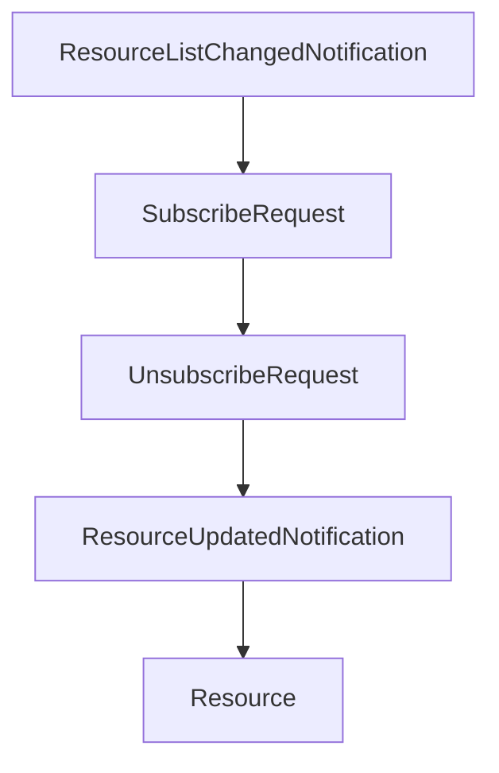

# Chapter 5: Server Primitives: Tools, Resources, and Prompts

Welcome to **Chapter 5: Server Primitives: Tools, Resources, and Prompts**. In this part of **MCP Specification Tutorial: Designing Production-Grade MCP Clients and Servers From the Source of Truth**, you will build an intuitive mental model first, then move into concrete implementation details and practical production tradeoffs.


Server primitives define how useful and safe an MCP integration becomes in real clients.

## Learning Goals

- model tools, resources, and prompts with predictable semantics
- design list-changed/update flows that clients can consume reliably
- align content formats and error behavior with spec expectations
- avoid overloading a single server with unrelated responsibility domains

## Primitive Design Guidance

| Primitive | Primary Use | Common Pitfall |
|:----------|:------------|:---------------|
| Tools | side-effectful or compute actions | weak input schemas and ambiguous naming |
| Resources | retrievable context/data by URI | inconsistent URI schemes and stale update signaling |
| Prompts | reusable structured prompt templates | embedding server-private assumptions into prompt arguments |

## Quality Checklist

- keep tool names clear and format-compliant
- validate and normalize resource URIs
- provide accurate metadata for clients to render or reason over capabilities
- expose change notifications only when your server can maintain correct state

## Source References

- [Server Overview](https://github.com/modelcontextprotocol/modelcontextprotocol/blob/main/docs/specification/2025-11-25/server/index.mdx)
- [Tools](https://github.com/modelcontextprotocol/modelcontextprotocol/blob/main/docs/specification/2025-11-25/server/tools.mdx)
- [Resources](https://github.com/modelcontextprotocol/modelcontextprotocol/blob/main/docs/specification/2025-11-25/server/resources.mdx)
- [Prompts](https://github.com/modelcontextprotocol/modelcontextprotocol/blob/main/docs/specification/2025-11-25/server/prompts.mdx)
- [Completion Utility](https://github.com/modelcontextprotocol/modelcontextprotocol/blob/main/docs/specification/2025-11-25/server/utilities/completion.mdx)

## Summary

You now have a practical design framework for server primitives that is easier for hosts and clients to operate safely.

Next: [Chapter 6: Client Primitives: Roots, Sampling, Elicitation, and Tasks](06-client-primitives-roots-sampling-elicitation-and-tasks.md)

## Source Code Walkthrough

### `schema/2025-03-26/schema.ts`

The `ResourceListChangedNotification` interface in [`schema/2025-03-26/schema.ts`](https://github.com/modelcontextprotocol/modelcontextprotocol/blob/HEAD/schema/2025-03-26/schema.ts) handles a key part of this chapter's functionality:

```ts
 * An optional notification from the server to the client, informing it that the list of resources it can read from has changed. This may be issued by servers without any previous subscription from the client.
 */
export interface ResourceListChangedNotification extends Notification {
  method: "notifications/resources/list_changed";
}

/**
 * Sent from the client to request resources/updated notifications from the server whenever a particular resource changes.
 */
export interface SubscribeRequest extends Request {
  method: "resources/subscribe";
  params: {
    /**
     * The URI of the resource to subscribe to. The URI can use any protocol; it is up to the server how to interpret it.
     *
     * @format uri
     */
    uri: string;
  };
}

/**
 * Sent from the client to request cancellation of resources/updated notifications from the server. This should follow a previous resources/subscribe request.
 */
export interface UnsubscribeRequest extends Request {
  method: "resources/unsubscribe";
  params: {
    /**
     * The URI of the resource to unsubscribe from.
     *
     * @format uri
     */
```

This interface is important because it defines how MCP Specification Tutorial: Designing Production-Grade MCP Clients and Servers From the Source of Truth implements the patterns covered in this chapter.

### `schema/2025-03-26/schema.ts`

The `SubscribeRequest` interface in [`schema/2025-03-26/schema.ts`](https://github.com/modelcontextprotocol/modelcontextprotocol/blob/HEAD/schema/2025-03-26/schema.ts) handles a key part of this chapter's functionality:

```ts
 * Sent from the client to request resources/updated notifications from the server whenever a particular resource changes.
 */
export interface SubscribeRequest extends Request {
  method: "resources/subscribe";
  params: {
    /**
     * The URI of the resource to subscribe to. The URI can use any protocol; it is up to the server how to interpret it.
     *
     * @format uri
     */
    uri: string;
  };
}

/**
 * Sent from the client to request cancellation of resources/updated notifications from the server. This should follow a previous resources/subscribe request.
 */
export interface UnsubscribeRequest extends Request {
  method: "resources/unsubscribe";
  params: {
    /**
     * The URI of the resource to unsubscribe from.
     *
     * @format uri
     */
    uri: string;
  };
}

/**
 * A notification from the server to the client, informing it that a resource has changed and may need to be read again. This should only be sent if the client previously sent a resources/subscribe request.
 */
```

This interface is important because it defines how MCP Specification Tutorial: Designing Production-Grade MCP Clients and Servers From the Source of Truth implements the patterns covered in this chapter.

### `schema/2025-03-26/schema.ts`

The `UnsubscribeRequest` interface in [`schema/2025-03-26/schema.ts`](https://github.com/modelcontextprotocol/modelcontextprotocol/blob/HEAD/schema/2025-03-26/schema.ts) handles a key part of this chapter's functionality:

```ts
 * Sent from the client to request cancellation of resources/updated notifications from the server. This should follow a previous resources/subscribe request.
 */
export interface UnsubscribeRequest extends Request {
  method: "resources/unsubscribe";
  params: {
    /**
     * The URI of the resource to unsubscribe from.
     *
     * @format uri
     */
    uri: string;
  };
}

/**
 * A notification from the server to the client, informing it that a resource has changed and may need to be read again. This should only be sent if the client previously sent a resources/subscribe request.
 */
export interface ResourceUpdatedNotification extends Notification {
  method: "notifications/resources/updated";
  params: {
    /**
     * The URI of the resource that has been updated. This might be a sub-resource of the one that the client actually subscribed to.
     *
     * @format uri
     */
    uri: string;
  };
}

/**
 * A known resource that the server is capable of reading.
 */
```

This interface is important because it defines how MCP Specification Tutorial: Designing Production-Grade MCP Clients and Servers From the Source of Truth implements the patterns covered in this chapter.

### `schema/2025-03-26/schema.ts`

The `ResourceUpdatedNotification` interface in [`schema/2025-03-26/schema.ts`](https://github.com/modelcontextprotocol/modelcontextprotocol/blob/HEAD/schema/2025-03-26/schema.ts) handles a key part of this chapter's functionality:

```ts
 * A notification from the server to the client, informing it that a resource has changed and may need to be read again. This should only be sent if the client previously sent a resources/subscribe request.
 */
export interface ResourceUpdatedNotification extends Notification {
  method: "notifications/resources/updated";
  params: {
    /**
     * The URI of the resource that has been updated. This might be a sub-resource of the one that the client actually subscribed to.
     *
     * @format uri
     */
    uri: string;
  };
}

/**
 * A known resource that the server is capable of reading.
 */
export interface Resource {
  /**
   * The URI of this resource.
   *
   * @format uri
   */
  uri: string;

  /**
   * A human-readable name for this resource.
   *
   * This can be used by clients to populate UI elements.
   */
  name: string;

```

This interface is important because it defines how MCP Specification Tutorial: Designing Production-Grade MCP Clients and Servers From the Source of Truth implements the patterns covered in this chapter.


## How These Components Connect


