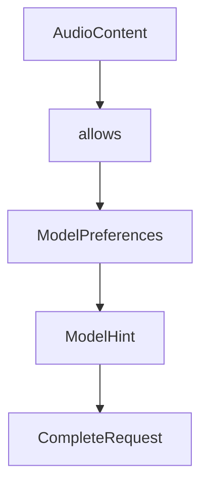

# Chapter 6: Client Primitives: Roots, Sampling, Elicitation, and Tasks

Welcome to **Chapter 6: Client Primitives: Roots, Sampling, Elicitation, and Tasks**. In this part of **MCP Specification Tutorial: Designing Production-Grade MCP Clients and Servers From the Source of Truth**, you will build an intuitive mental model first, then move into concrete implementation details and practical production tradeoffs.


Client capabilities are where host policy and model behavior meet.

## Learning Goals

- scope server access with roots and explicit boundaries
- implement sampling loops without losing operator control
- use elicitation form and URL modes safely for sensitive data
- evaluate experimental task workflows before production rollout

## Capability Discipline

- `roots`: keep filesystem or URI boundaries narrow and auditable
- `sampling`: require host/user policy checks before model-mediated execution
- `elicitation`: validate requested schema and use URL mode with strong trust checks
- `tasks`: treat as experimental and isolate behind feature flags until stabilized

## Operational Advice

1. declare only capabilities your host UI and policy engine can enforce
2. log high-risk capability invocations (sampling, elicitation URL mode)
3. test downgrade behavior when peer capability support differs
4. document client behavior for each capability in product security docs

## Source References

- [Client Roots](https://github.com/modelcontextprotocol/modelcontextprotocol/blob/main/docs/specification/2025-11-25/client/roots.mdx)
- [Client Sampling](https://github.com/modelcontextprotocol/modelcontextprotocol/blob/main/docs/specification/2025-11-25/client/sampling.mdx)
- [Client Elicitation](https://github.com/modelcontextprotocol/modelcontextprotocol/blob/main/docs/specification/2025-11-25/client/elicitation.mdx)
- [Lifecycle Capability Negotiation](https://github.com/modelcontextprotocol/modelcontextprotocol/blob/main/docs/specification/2025-11-25/basic/lifecycle.mdx)
- [Changelog - Tasks and Elicitation Updates](https://github.com/modelcontextprotocol/modelcontextprotocol/blob/main/docs/specification/2025-11-25/changelog.mdx)

## Summary

You now have a client capability strategy that keeps power features usable without giving up host control.

Next: [Chapter 7: Authorization and Security Best Practices](07-authorization-and-security-best-practices.md)

## Source Code Walkthrough

### `schema/2025-03-26/schema.ts`

The `AudioContent` interface in [`schema/2025-03-26/schema.ts`](https://github.com/modelcontextprotocol/modelcontextprotocol/blob/HEAD/schema/2025-03-26/schema.ts) handles a key part of this chapter's functionality:

```ts
export interface PromptMessage {
  role: Role;
  content: TextContent | ImageContent | AudioContent | EmbeddedResource;
}

/**
 * The contents of a resource, embedded into a prompt or tool call result.
 *
 * It is up to the client how best to render embedded resources for the benefit
 * of the LLM and/or the user.
 */
export interface EmbeddedResource {
  type: "resource";
  resource: TextResourceContents | BlobResourceContents;

  /**
   * Optional annotations for the client.
   */
  annotations?: Annotations;
}

/**
 * An optional notification from the server to the client, informing it that the list of prompts it offers has changed. This may be issued by servers without any previous subscription from the client.
 */
export interface PromptListChangedNotification extends Notification {
  method: "notifications/prompts/list_changed";
}

/* Tools */
/**
 * Sent from the client to request a list of tools the server has.
 */
```

This interface is important because it defines how MCP Specification Tutorial: Designing Production-Grade MCP Clients and Servers From the Source of Truth implements the patterns covered in this chapter.

### `schema/2025-03-26/schema.ts`

The `allows` interface in [`schema/2025-03-26/schema.ts`](https://github.com/modelcontextprotocol/modelcontextprotocol/blob/HEAD/schema/2025-03-26/schema.ts) handles a key part of this chapter's functionality:

```ts
 * rarely straightforward.  Different models excel in different areas—some are
 * faster but less capable, others are more capable but more expensive, and so
 * on. This interface allows servers to express their priorities across multiple
 * dimensions to help clients make an appropriate selection for their use case.
 *
 * These preferences are always advisory. The client MAY ignore them. It is also
 * up to the client to decide how to interpret these preferences and how to
 * balance them against other considerations.
 */
export interface ModelPreferences {
  /**
   * Optional hints to use for model selection.
   *
   * If multiple hints are specified, the client MUST evaluate them in order
   * (such that the first match is taken).
   *
   * The client SHOULD prioritize these hints over the numeric priorities, but
   * MAY still use the priorities to select from ambiguous matches.
   */
  hints?: ModelHint[];

  /**
   * How much to prioritize cost when selecting a model. A value of 0 means cost
   * is not important, while a value of 1 means cost is the most important
   * factor.
   *
   * @TJS-type number
   * @minimum 0
   * @maximum 1
   */
  costPriority?: number;

```

This interface is important because it defines how MCP Specification Tutorial: Designing Production-Grade MCP Clients and Servers From the Source of Truth implements the patterns covered in this chapter.

### `schema/2025-03-26/schema.ts`

The `ModelPreferences` interface in [`schema/2025-03-26/schema.ts`](https://github.com/modelcontextprotocol/modelcontextprotocol/blob/HEAD/schema/2025-03-26/schema.ts) handles a key part of this chapter's functionality:

```ts
     * The server's preferences for which model to select. The client MAY ignore these preferences.
     */
    modelPreferences?: ModelPreferences;
    /**
     * An optional system prompt the server wants to use for sampling. The client MAY modify or omit this prompt.
     */
    systemPrompt?: string;
    /**
     * A request to include context from one or more MCP servers (including the caller), to be attached to the prompt. The client MAY ignore this request.
     */
    includeContext?: "none" | "thisServer" | "allServers";
    /**
     * @TJS-type number
     */
    temperature?: number;
    /**
     * The maximum number of tokens to sample, as requested by the server. The client MAY choose to sample fewer tokens than requested.
     */
    maxTokens: number;
    stopSequences?: string[];
    /**
     * Optional metadata to pass through to the LLM provider. The format of this metadata is provider-specific.
     */
    metadata?: object;
  };
}

/**
 * The client's response to a sampling/create_message request from the server. The client should inform the user before returning the sampled message, to allow them to inspect the response (human in the loop) and decide whether to allow the server to see it.
 */
export interface CreateMessageResult extends Result, SamplingMessage {
  /**
```

This interface is important because it defines how MCP Specification Tutorial: Designing Production-Grade MCP Clients and Servers From the Source of Truth implements the patterns covered in this chapter.

### `schema/2025-03-26/schema.ts`

The `ModelHint` interface in [`schema/2025-03-26/schema.ts`](https://github.com/modelcontextprotocol/modelcontextprotocol/blob/HEAD/schema/2025-03-26/schema.ts) handles a key part of this chapter's functionality:

```ts
   * MAY still use the priorities to select from ambiguous matches.
   */
  hints?: ModelHint[];

  /**
   * How much to prioritize cost when selecting a model. A value of 0 means cost
   * is not important, while a value of 1 means cost is the most important
   * factor.
   *
   * @TJS-type number
   * @minimum 0
   * @maximum 1
   */
  costPriority?: number;

  /**
   * How much to prioritize sampling speed (latency) when selecting a model. A
   * value of 0 means speed is not important, while a value of 1 means speed is
   * the most important factor.
   *
   * @TJS-type number
   * @minimum 0
   * @maximum 1
   */
  speedPriority?: number;

  /**
   * How much to prioritize intelligence and capabilities when selecting a
   * model. A value of 0 means intelligence is not important, while a value of 1
   * means intelligence is the most important factor.
   *
   * @TJS-type number
```

This interface is important because it defines how MCP Specification Tutorial: Designing Production-Grade MCP Clients and Servers From the Source of Truth implements the patterns covered in this chapter.


## How These Components Connect


