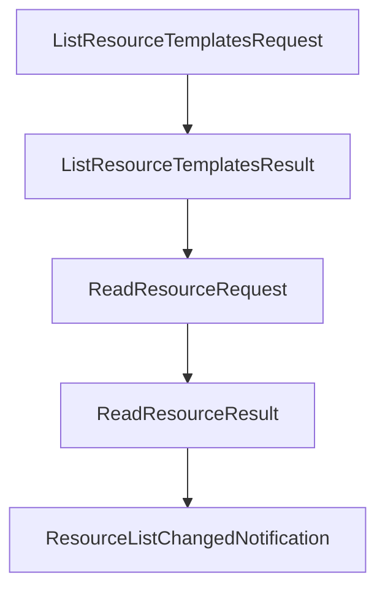

# Chapter 7: Authorization and Security Best Practices

Welcome to **Chapter 7: Authorization and Security Best Practices**. In this part of **MCP Specification Tutorial: Designing Production-Grade MCP Clients and Servers From the Source of Truth**, you will build an intuitive mental model first, then move into concrete implementation details and practical production tradeoffs.


This chapter converts MCP auth and threat guidance into an implementation playbook.

## Learning Goals

- implement OAuth discovery and scope negotiation flows correctly
- separate stdio credential handling from HTTP authorization flows
- mitigate confused deputy, token passthrough, and session hijacking classes
- align server/client/operator responsibilities with the trust model

## Security Control Baseline

| Threat Class | Required Direction |
|:-------------|:-------------------|
| Confused deputy | enforce per-client consent before third-party auth hops |
| Token passthrough | never accept tokens not issued for the MCP server |
| Session hijacking | secure and bind session identifiers, verify every inbound request |
| Scope creep | request least privilege and honor challenge scope guidance |

## Authorization Implementation Notes

- support both `WWW-Authenticate`-based discovery and `.well-known` fallback
- parse and honor `scope` challenges from unauthorized responses
- support OAuth metadata discovery priority order for issuer URLs with/without paths
- for stdio-based local servers, do not force HTTP OAuth flow patterns that do not apply

## Source References

- [Authorization Specification](https://github.com/modelcontextprotocol/modelcontextprotocol/blob/main/docs/specification/2025-11-25/basic/authorization.mdx)
- [Security Best Practices](https://github.com/modelcontextprotocol/modelcontextprotocol/blob/main/docs/specification/2025-11-25/basic/security_best_practices.mdx)
- [Security Policy (Trust Model)](https://github.com/modelcontextprotocol/modelcontextprotocol/blob/main/SECURITY.md)
- [Security Tutorial - Authorization](https://github.com/modelcontextprotocol/modelcontextprotocol/blob/main/docs/docs/tutorials/security/authorization.mdx)

## Summary

You now have a concrete security baseline for authorization, session handling, and operator controls.

Next: [Chapter 8: Governance, SEPs, and Contribution Workflow](08-governance-seps-and-contribution-workflow.md)

## Source Code Walkthrough

### `schema/2024-11-05/schema.ts`

The `ListResourceTemplatesRequest` interface in [`schema/2024-11-05/schema.ts`](https://github.com/modelcontextprotocol/modelcontextprotocol/blob/HEAD/schema/2024-11-05/schema.ts) handles a key part of this chapter's functionality:

```ts
 * Sent from the client to request a list of resource templates the server has.
 */
export interface ListResourceTemplatesRequest extends PaginatedRequest {
  method: "resources/templates/list";
}

/**
 * The server's response to a resources/templates/list request from the client.
 */
export interface ListResourceTemplatesResult extends PaginatedResult {
  resourceTemplates: ResourceTemplate[];
}

/**
 * Sent from the client to the server, to read a specific resource URI.
 */
export interface ReadResourceRequest extends Request {
  method: "resources/read";
  params: {
    /**
     * The URI of the resource to read. The URI can use any protocol; it is up to the server how to interpret it.
     *
     * @format uri
     */
    uri: string;
  };
}

/**
 * The server's response to a resources/read request from the client.
 */
export interface ReadResourceResult extends Result {
```

This interface is important because it defines how MCP Specification Tutorial: Designing Production-Grade MCP Clients and Servers From the Source of Truth implements the patterns covered in this chapter.

### `schema/2024-11-05/schema.ts`

The `ListResourceTemplatesResult` interface in [`schema/2024-11-05/schema.ts`](https://github.com/modelcontextprotocol/modelcontextprotocol/blob/HEAD/schema/2024-11-05/schema.ts) handles a key part of this chapter's functionality:

```ts
 * The server's response to a resources/templates/list request from the client.
 */
export interface ListResourceTemplatesResult extends PaginatedResult {
  resourceTemplates: ResourceTemplate[];
}

/**
 * Sent from the client to the server, to read a specific resource URI.
 */
export interface ReadResourceRequest extends Request {
  method: "resources/read";
  params: {
    /**
     * The URI of the resource to read. The URI can use any protocol; it is up to the server how to interpret it.
     *
     * @format uri
     */
    uri: string;
  };
}

/**
 * The server's response to a resources/read request from the client.
 */
export interface ReadResourceResult extends Result {
  contents: (TextResourceContents | BlobResourceContents)[];
}

/**
 * An optional notification from the server to the client, informing it that the list of resources it can read from has changed. This may be issued by servers without any previous subscription from the client.
 */
export interface ResourceListChangedNotification extends Notification {
```

This interface is important because it defines how MCP Specification Tutorial: Designing Production-Grade MCP Clients and Servers From the Source of Truth implements the patterns covered in this chapter.

### `schema/2024-11-05/schema.ts`

The `ReadResourceRequest` interface in [`schema/2024-11-05/schema.ts`](https://github.com/modelcontextprotocol/modelcontextprotocol/blob/HEAD/schema/2024-11-05/schema.ts) handles a key part of this chapter's functionality:

```ts
 * Sent from the client to the server, to read a specific resource URI.
 */
export interface ReadResourceRequest extends Request {
  method: "resources/read";
  params: {
    /**
     * The URI of the resource to read. The URI can use any protocol; it is up to the server how to interpret it.
     *
     * @format uri
     */
    uri: string;
  };
}

/**
 * The server's response to a resources/read request from the client.
 */
export interface ReadResourceResult extends Result {
  contents: (TextResourceContents | BlobResourceContents)[];
}

/**
 * An optional notification from the server to the client, informing it that the list of resources it can read from has changed. This may be issued by servers without any previous subscription from the client.
 */
export interface ResourceListChangedNotification extends Notification {
  method: "notifications/resources/list_changed";
}

/**
 * Sent from the client to request resources/updated notifications from the server whenever a particular resource changes.
 */
export interface SubscribeRequest extends Request {
```

This interface is important because it defines how MCP Specification Tutorial: Designing Production-Grade MCP Clients and Servers From the Source of Truth implements the patterns covered in this chapter.

### `schema/2024-11-05/schema.ts`

The `ReadResourceResult` interface in [`schema/2024-11-05/schema.ts`](https://github.com/modelcontextprotocol/modelcontextprotocol/blob/HEAD/schema/2024-11-05/schema.ts) handles a key part of this chapter's functionality:

```ts
 * The server's response to a resources/read request from the client.
 */
export interface ReadResourceResult extends Result {
  contents: (TextResourceContents | BlobResourceContents)[];
}

/**
 * An optional notification from the server to the client, informing it that the list of resources it can read from has changed. This may be issued by servers without any previous subscription from the client.
 */
export interface ResourceListChangedNotification extends Notification {
  method: "notifications/resources/list_changed";
}

/**
 * Sent from the client to request resources/updated notifications from the server whenever a particular resource changes.
 */
export interface SubscribeRequest extends Request {
  method: "resources/subscribe";
  params: {
    /**
     * The URI of the resource to subscribe to. The URI can use any protocol; it is up to the server how to interpret it.
     *
     * @format uri
     */
    uri: string;
  };
}

/**
 * Sent from the client to request cancellation of resources/updated notifications from the server. This should follow a previous resources/subscribe request.
 */
export interface UnsubscribeRequest extends Request {
```

This interface is important because it defines how MCP Specification Tutorial: Designing Production-Grade MCP Clients and Servers From the Source of Truth implements the patterns covered in this chapter.


## How These Components Connect


