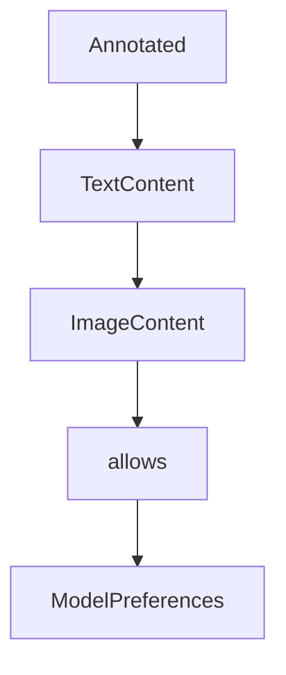

# Chapter 8: Governance, SEPs, and Contribution Workflow

Welcome to **Chapter 8: Governance, SEPs, and Contribution Workflow**. In this part of **MCP Specification Tutorial: Designing Production-Grade MCP Clients and Servers From the Source of Truth**, you will build an intuitive mental model first, then move into concrete implementation details and practical production tradeoffs.


Protocol-level quality depends on governance clarity and disciplined proposal workflows.

## Learning Goals

- understand maintainer roles and decision boundaries
- use SEP workflow to propose non-trivial protocol changes
- map roadmap priorities to your internal adoption strategy
- contribute docs/schema updates in a review-friendly way

## Governance and Change Workflow

1. validate problem fit in community channels and working groups
2. prototype and gather evidence before drafting a SEP
3. follow SEP format and sponsorship expectations
4. update schema/docs with generated artifacts and cross-links
5. ship protocol changes with migration notes and compatibility testing

## Long-Term Adoption Strategy

- monitor roadmap priority themes (async ops, statelessness, identity, registry GA)
- maintain an internal compatibility matrix across spec revisions and SDK versions
- allocate capacity for security-impacting changes separately from feature work
- treat governance/process updates as operational requirements, not only community context

## Source References

- [Governance](https://github.com/modelcontextprotocol/modelcontextprotocol/blob/main/docs/community/governance.mdx)
- [SEP Guidelines](https://github.com/modelcontextprotocol/modelcontextprotocol/blob/main/docs/community/sep-guidelines.mdx)
- [Working and Interest Groups](https://github.com/modelcontextprotocol/modelcontextprotocol/blob/main/docs/community/working-interest-groups.mdx)
- [Contributing Guide](https://github.com/modelcontextprotocol/modelcontextprotocol/blob/main/CONTRIBUTING.md)
- [Development Roadmap](https://github.com/modelcontextprotocol/modelcontextprotocol/blob/main/docs/development/roadmap.mdx)

## Summary

You now have a governance-aware operating model for shipping MCP changes and tracking protocol evolution over time.

Next: Continue with [MCP Go SDK Tutorial](../mcp-go-sdk-tutorial/)

## Depth Expansion Playbook

## Source Code Walkthrough

### `schema/2024-11-05/schema.ts`

The `Annotated` interface in [`schema/2024-11-05/schema.ts`](https://github.com/modelcontextprotocol/modelcontextprotocol/blob/HEAD/schema/2024-11-05/schema.ts) handles a key part of this chapter's functionality:

```ts
 * A known resource that the server is capable of reading.
 */
export interface Resource extends Annotated {
  /**
   * The URI of this resource.
   *
   * @format uri
   */
  uri: string;

  /**
   * A human-readable name for this resource.
   *
   * This can be used by clients to populate UI elements.
   */
  name: string;

  /**
   * A description of what this resource represents.
   *
   * This can be used by clients to improve the LLM's understanding of available resources. It can be thought of like a "hint" to the model.
   */
  description?: string;

  /**
   * The MIME type of this resource, if known.
   */
  mimeType?: string;

  /**
   * The size of the raw resource content, in bytes (i.e., before base64 encoding or any tokenization), if known.
   *
```

This interface is important because it defines how MCP Specification Tutorial: Designing Production-Grade MCP Clients and Servers From the Source of Truth implements the patterns covered in this chapter.

### `schema/2024-11-05/schema.ts`

The `TextContent` interface in [`schema/2024-11-05/schema.ts`](https://github.com/modelcontextprotocol/modelcontextprotocol/blob/HEAD/schema/2024-11-05/schema.ts) handles a key part of this chapter's functionality:

```ts
export interface PromptMessage {
  role: Role;
  content: TextContent | ImageContent | EmbeddedResource;
}

/**
 * The contents of a resource, embedded into a prompt or tool call result.
 *
 * It is up to the client how best to render embedded resources for the benefit
 * of the LLM and/or the user.
 */
export interface EmbeddedResource extends Annotated {
  type: "resource";
  resource: TextResourceContents | BlobResourceContents;
}

/**
 * An optional notification from the server to the client, informing it that the list of prompts it offers has changed. This may be issued by servers without any previous subscription from the client.
 */
export interface PromptListChangedNotification extends Notification {
  method: "notifications/prompts/list_changed";
}

/* Tools */
/**
 * Sent from the client to request a list of tools the server has.
 */
export interface ListToolsRequest extends PaginatedRequest {
  method: "tools/list";
}

/**
```

This interface is important because it defines how MCP Specification Tutorial: Designing Production-Grade MCP Clients and Servers From the Source of Truth implements the patterns covered in this chapter.

### `schema/2024-11-05/schema.ts`

The `ImageContent` interface in [`schema/2024-11-05/schema.ts`](https://github.com/modelcontextprotocol/modelcontextprotocol/blob/HEAD/schema/2024-11-05/schema.ts) handles a key part of this chapter's functionality:

```ts
export interface PromptMessage {
  role: Role;
  content: TextContent | ImageContent | EmbeddedResource;
}

/**
 * The contents of a resource, embedded into a prompt or tool call result.
 *
 * It is up to the client how best to render embedded resources for the benefit
 * of the LLM and/or the user.
 */
export interface EmbeddedResource extends Annotated {
  type: "resource";
  resource: TextResourceContents | BlobResourceContents;
}

/**
 * An optional notification from the server to the client, informing it that the list of prompts it offers has changed. This may be issued by servers without any previous subscription from the client.
 */
export interface PromptListChangedNotification extends Notification {
  method: "notifications/prompts/list_changed";
}

/* Tools */
/**
 * Sent from the client to request a list of tools the server has.
 */
export interface ListToolsRequest extends PaginatedRequest {
  method: "tools/list";
}

/**
```

This interface is important because it defines how MCP Specification Tutorial: Designing Production-Grade MCP Clients and Servers From the Source of Truth implements the patterns covered in this chapter.

### `schema/2024-11-05/schema.ts`

The `allows` interface in [`schema/2024-11-05/schema.ts`](https://github.com/modelcontextprotocol/modelcontextprotocol/blob/HEAD/schema/2024-11-05/schema.ts) handles a key part of this chapter's functionality:

```ts
 * rarely straightforward.  Different models excel in different areas—some are
 * faster but less capable, others are more capable but more expensive, and so
 * on. This interface allows servers to express their priorities across multiple
 * dimensions to help clients make an appropriate selection for their use case.
 *
 * These preferences are always advisory. The client MAY ignore them. It is also
 * up to the client to decide how to interpret these preferences and how to
 * balance them against other considerations.
 */
export interface ModelPreferences {
  /**
   * Optional hints to use for model selection.
   *
   * If multiple hints are specified, the client MUST evaluate them in order
   * (such that the first match is taken).
   *
   * The client SHOULD prioritize these hints over the numeric priorities, but
   * MAY still use the priorities to select from ambiguous matches.
   */
  hints?: ModelHint[];

  /**
   * How much to prioritize cost when selecting a model. A value of 0 means cost
   * is not important, while a value of 1 means cost is the most important
   * factor.
   *
   * @TJS-type number
   * @minimum 0
   * @maximum 1
   */
  costPriority?: number;

```

This interface is important because it defines how MCP Specification Tutorial: Designing Production-Grade MCP Clients and Servers From the Source of Truth implements the patterns covered in this chapter.


## How These Components Connect


