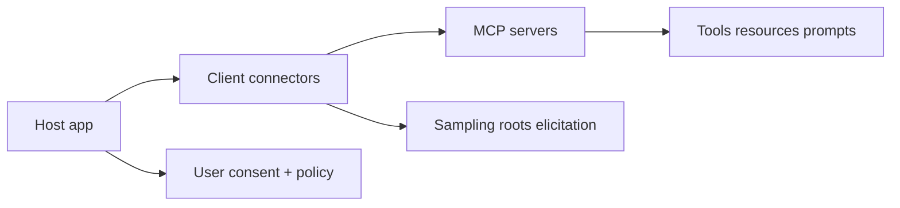

# MCP Specification Tutorial: Designing Production-Grade MCP Clients and Servers From the Source of Truth

> Learn the current Model Context Protocol directly from `modelcontextprotocol/modelcontextprotocol`, including lifecycle, transports, security, authorization, and governance workflows.

## Why This Track Matters

Most MCP teams read SDK docs only. That is useful, but the protocol specification is the canonical contract across languages, transports, and products.

This track focuses on:

- mapping the 2025-11-25 protocol revision to real implementation choices
- understanding transport and session rules before building production systems
- applying authorization and security guidance with fewer blind spots
- using governance and SEP process knowledge to plan upgrades safely

## Current Snapshot (auto-updated)

- repository: [`modelcontextprotocol/modelcontextprotocol`](https://github.com/modelcontextprotocol/modelcontextprotocol)
- stars: about **7.1k**
- latest release: [`2025-11-25`](https://github.com/modelcontextprotocol/modelcontextprotocol/releases/tag/2025-11-25) (**November 25, 2025**)
- recent activity: updated on **February 12, 2026**
- primary role: specification + schema + official docs
- licensing note: project transition from MIT to Apache-2.0 (documentation non-spec content under CC-BY-4.0)

## Mental Model

## Chapter Guide

| Chapter | Key Question | Outcome |
|:--------|:-------------|:--------|
| [01 - Getting Started and Version Navigation](01-getting-started-and-version-navigation.md) | Which specification revision should I implement against? | Clear protocol baseline |
| [02 - Architecture and Capability Negotiation](02-architecture-and-capability-negotiation.md) | How do host, client, and server boundaries work in practice? | Cleaner system design |
| [03 - Base Protocol Messages and Schema Contracts](03-base-protocol-messages-and-schema-contracts.md) | What message and schema rules are non-negotiable? | Fewer interoperability bugs |
| [04 - Transport Model: stdio, Streamable HTTP, and Sessions](04-transport-model-stdio-streamable-http-and-sessions.md) | How should transport and session semantics shape deployment? | More robust runtime behavior |
| [05 - Server Primitives: Tools, Resources, and Prompts](05-server-primitives-tools-resources-and-prompts.md) | How should server capabilities be modeled and exposed? | Better server interface quality |
| [06 - Client Primitives: Roots, Sampling, Elicitation, and Tasks](06-client-primitives-roots-sampling-elicitation-and-tasks.md) | How do clients safely expose advanced capabilities? | Stronger host-client control |
| [07 - Authorization and Security Best Practices](07-authorization-and-security-best-practices.md) | How do we harden MCP deployments against real attack classes? | Lower security risk |
| [08 - Governance, SEPs, and Contribution Workflow](08-governance-seps-and-contribution-workflow.md) | How do teams track and influence protocol evolution? | Better long-term maintainability |

## What You Will Learn

- how to read MCP as a protocol contract instead of SDK-specific guidance
- how to implement transport/session behavior that matches spec intent
- how to operationalize OAuth and threat mitigations for MCP systems
- how to use SEP and governance processes when planning protocol changes

## Source References

- [Model Context Protocol README](https://github.com/modelcontextprotocol/modelcontextprotocol/blob/main/README.md)
- [Specification 2025-11-25](https://github.com/modelcontextprotocol/modelcontextprotocol/blob/main/docs/specification/2025-11-25/index.mdx)
- [Architecture](https://github.com/modelcontextprotocol/modelcontextprotocol/blob/main/docs/specification/2025-11-25/architecture/index.mdx)
- [Lifecycle](https://github.com/modelcontextprotocol/modelcontextprotocol/blob/main/docs/specification/2025-11-25/basic/lifecycle.mdx)
- [Transports](https://github.com/modelcontextprotocol/modelcontextprotocol/blob/main/docs/specification/2025-11-25/basic/transports.mdx)
- [Authorization](https://github.com/modelcontextprotocol/modelcontextprotocol/blob/main/docs/specification/2025-11-25/basic/authorization.mdx)
- [Security Best Practices](https://github.com/modelcontextprotocol/modelcontextprotocol/blob/main/docs/specification/2025-11-25/basic/security_best_practices.mdx)
- [Key Changes (2025-11-25)](https://github.com/modelcontextprotocol/modelcontextprotocol/blob/main/docs/specification/2025-11-25/changelog.mdx)
- [Governance](https://github.com/modelcontextprotocol/modelcontextprotocol/blob/main/docs/community/governance.mdx)
- [SEP Guidelines](https://github.com/modelcontextprotocol/modelcontextprotocol/blob/main/docs/community/sep-guidelines.mdx)

## Related Tutorials

- [MCP Python SDK Tutorial](../mcp-python-sdk-tutorial/)
- [MCP TypeScript SDK Tutorial](../mcp-typescript-sdk-tutorial/)
- [MCP Go SDK Tutorial](../mcp-go-sdk-tutorial/)
- [MCP Inspector Tutorial](../mcp-inspector-tutorial/)
- [MCP Registry Tutorial](../mcp-registry-tutorial/)

---

Start with [Chapter 1: Getting Started and Version Navigation](01-getting-started-and-version-navigation.md).

## Navigation & Backlinks

- [Start Here: Chapter 1: Getting Started and Version Navigation](01-getting-started-and-version-navigation.md)
- [Back to Main Catalog](../../README.md#-tutorial-catalog)
- [Browse A-Z Tutorial Directory](../../discoverability/tutorial-directory.md)
- [Search by Intent](../../discoverability/query-hub.md)
- [Explore Category Hubs](../../README.md#category-hubs)

## Full Chapter Map

1. [Chapter 1: Getting Started and Version Navigation](01-getting-started-and-version-navigation.md)
2. [Chapter 2: Architecture and Capability Negotiation](02-architecture-and-capability-negotiation.md)
3. [Chapter 3: Base Protocol Messages and Schema Contracts](03-base-protocol-messages-and-schema-contracts.md)
4. [Chapter 4: Transport Model: stdio, Streamable HTTP, and Sessions](04-transport-model-stdio-streamable-http-and-sessions.md)
5. [Chapter 5: Server Primitives: Tools, Resources, and Prompts](05-server-primitives-tools-resources-and-prompts.md)
6. [Chapter 6: Client Primitives: Roots, Sampling, Elicitation, and Tasks](06-client-primitives-roots-sampling-elicitation-and-tasks.md)
7. [Chapter 7: Authorization and Security Best Practices](07-authorization-and-security-best-practices.md)
8. [Chapter 8: Governance, SEPs, and Contribution Workflow](08-governance-seps-and-contribution-workflow.md)

*Generated by [AI Codebase Knowledge Builder](https://github.com/The-Pocket/Tutorial-Codebase-Knowledge)*
