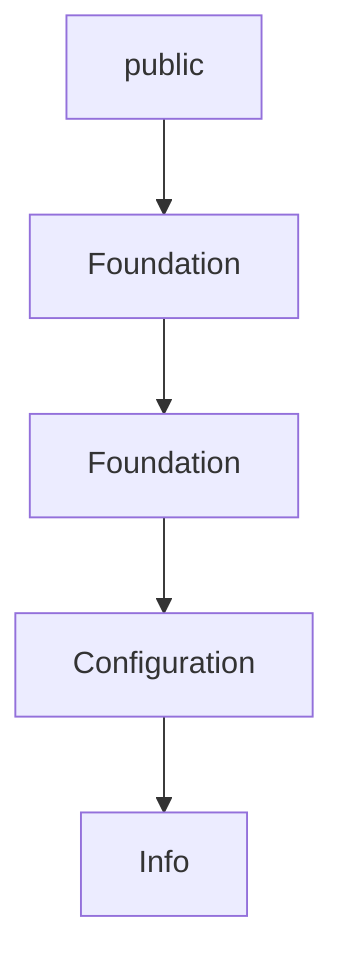

# Chapter 1: Getting Started and Package Baseline

Welcome to **Chapter 1: Getting Started and Package Baseline**. In this part of **MCP Swift SDK Tutorial: Building MCP Clients and Servers in Swift**, you will build an intuitive mental model first, then move into concrete implementation details and practical production tradeoffs.


This chapter sets up a minimal, reproducible Swift MCP environment.

## Learning Goals

- configure Swift Package Manager dependencies correctly
- validate runtime prerequisites (Swift 6+, Xcode 16+)
- bootstrap a simple client/server setup before advanced features
- avoid mismatched SDK/protocol assumptions early

## Baseline Steps

1. add `swift-sdk` package dependency from tagged release
2. import `MCP` in target modules
3. run a minimal client connect flow
4. verify server capability negotiation output before feature development

## Source References

- [Swift SDK README - Installation](https://github.com/modelcontextprotocol/swift-sdk/blob/main/README.md)
- [Swift SDK README - Requirements](https://github.com/modelcontextprotocol/swift-sdk/blob/main/README.md#requirements)

## Summary

You now have a stable Swift MCP baseline for subsequent client/server implementation.

Next: [Chapter 2: Client Transport and Capability Negotiation](02-client-transport-and-capability-negotiation.md)

## Depth Expansion Playbook

## Source Code Walkthrough

### `Sources/MCP/Client/Client.swift`

The `public` interface in [`Sources/MCP/Client/Client.swift`](https://github.com/modelcontextprotocol/swift-sdk/blob/HEAD/Sources/MCP/Client/Client.swift) handles a key part of this chapter's functionality:

```swift

/// Model Context Protocol client
public actor Client {
    /// The client configuration
    public struct Configuration: Hashable, Codable, Sendable {
        /// The default configuration.
        public static let `default` = Configuration(strict: false)

        /// The strict configuration.
        public static let strict = Configuration(strict: true)

        /// When strict mode is enabled, the client:
        /// - Requires server capabilities to be initialized before making requests
        /// - Rejects all requests that require capabilities before initialization
        ///
        /// While the MCP specification requires servers to respond to initialize requests
        /// with their capabilities, some implementations may not follow this.
        /// Disabling strict mode allows the client to be more lenient with non-compliant
        /// servers, though this may lead to undefined behavior.
        public var strict: Bool

        public init(strict: Bool = false) {
            self.strict = strict
        }
    }

    /// Implementation information
    public struct Info: Hashable, Codable, Sendable {
        /// The client name
        public var name: String
        /// A human-readable title for display purposes
        public var title: String?
```

This interface is important because it defines how MCP Swift SDK Tutorial: Building MCP Clients and Servers in Swift implements the patterns covered in this chapter.

### `Sources/MCP/Client/Client.swift`

The `Foundation` interface in [`Sources/MCP/Client/Client.swift`](https://github.com/modelcontextprotocol/swift-sdk/blob/HEAD/Sources/MCP/Client/Client.swift) handles a key part of this chapter's functionality:

```swift
import Logging

import struct Foundation.Data
import struct Foundation.Date
import class Foundation.JSONDecoder
import class Foundation.JSONEncoder

/// Model Context Protocol client
public actor Client {
    /// The client configuration
    public struct Configuration: Hashable, Codable, Sendable {
        /// The default configuration.
        public static let `default` = Configuration(strict: false)

        /// The strict configuration.
        public static let strict = Configuration(strict: true)

        /// When strict mode is enabled, the client:
        /// - Requires server capabilities to be initialized before making requests
        /// - Rejects all requests that require capabilities before initialization
        ///
        /// While the MCP specification requires servers to respond to initialize requests
        /// with their capabilities, some implementations may not follow this.
        /// Disabling strict mode allows the client to be more lenient with non-compliant
        /// servers, though this may lead to undefined behavior.
        public var strict: Bool

        public init(strict: Bool = false) {
            self.strict = strict
        }
    }

```

This interface is important because it defines how MCP Swift SDK Tutorial: Building MCP Clients and Servers in Swift implements the patterns covered in this chapter.

### `Sources/MCP/Client/Client.swift`

The `Foundation` interface in [`Sources/MCP/Client/Client.swift`](https://github.com/modelcontextprotocol/swift-sdk/blob/HEAD/Sources/MCP/Client/Client.swift) handles a key part of this chapter's functionality:

```swift
import Logging

import struct Foundation.Data
import struct Foundation.Date
import class Foundation.JSONDecoder
import class Foundation.JSONEncoder

/// Model Context Protocol client
public actor Client {
    /// The client configuration
    public struct Configuration: Hashable, Codable, Sendable {
        /// The default configuration.
        public static let `default` = Configuration(strict: false)

        /// The strict configuration.
        public static let strict = Configuration(strict: true)

        /// When strict mode is enabled, the client:
        /// - Requires server capabilities to be initialized before making requests
        /// - Rejects all requests that require capabilities before initialization
        ///
        /// While the MCP specification requires servers to respond to initialize requests
        /// with their capabilities, some implementations may not follow this.
        /// Disabling strict mode allows the client to be more lenient with non-compliant
        /// servers, though this may lead to undefined behavior.
        public var strict: Bool

        public init(strict: Bool = false) {
            self.strict = strict
        }
    }

```

This interface is important because it defines how MCP Swift SDK Tutorial: Building MCP Clients and Servers in Swift implements the patterns covered in this chapter.

### `Sources/MCP/Client/Client.swift`

The `Configuration` interface in [`Sources/MCP/Client/Client.swift`](https://github.com/modelcontextprotocol/swift-sdk/blob/HEAD/Sources/MCP/Client/Client.swift) handles a key part of this chapter's functionality:

```swift
public actor Client {
    /// The client configuration
    public struct Configuration: Hashable, Codable, Sendable {
        /// The default configuration.
        public static let `default` = Configuration(strict: false)

        /// The strict configuration.
        public static let strict = Configuration(strict: true)

        /// When strict mode is enabled, the client:
        /// - Requires server capabilities to be initialized before making requests
        /// - Rejects all requests that require capabilities before initialization
        ///
        /// While the MCP specification requires servers to respond to initialize requests
        /// with their capabilities, some implementations may not follow this.
        /// Disabling strict mode allows the client to be more lenient with non-compliant
        /// servers, though this may lead to undefined behavior.
        public var strict: Bool

        public init(strict: Bool = false) {
            self.strict = strict
        }
    }

    /// Implementation information
    public struct Info: Hashable, Codable, Sendable {
        /// The client name
        public var name: String
        /// A human-readable title for display purposes
        public var title: String?
        /// The client version
        public var version: String
```

This interface is important because it defines how MCP Swift SDK Tutorial: Building MCP Clients and Servers in Swift implements the patterns covered in this chapter.


## How These Components Connect


