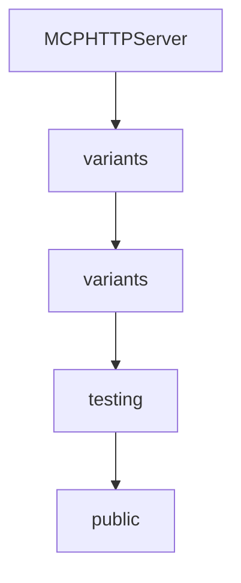

# Chapter 1: Getting Started and Package Baseline

Welcome to **Chapter 1: Getting Started and Package Baseline**. In this part of **MCP Swift SDK Tutorial: Building MCP Clients and Servers in Swift**, you will build an intuitive mental model first, then move into concrete implementation details and practical production tradeoffs.


This chapter sets up a minimal, reproducible Swift MCP environment.

## Learning Goals

- configure Swift Package Manager dependencies correctly
- validate runtime prerequisites (Swift 6+, Xcode 16+)
- bootstrap a simple client/server setup before advanced features
- avoid mismatched SDK/protocol assumptions early

## Baseline Steps

1. add `swift-sdk` package dependency from tagged release
2. import `MCP` in target modules
3. run a minimal client connect flow
4. verify server capability negotiation output before feature development

## Source References

- [Swift SDK README - Installation](https://github.com/modelcontextprotocol/swift-sdk/blob/main/README.md)
- [Swift SDK README - Requirements](https://github.com/modelcontextprotocol/swift-sdk/blob/main/README.md#requirements)

## Summary

You now have a stable Swift MCP baseline for subsequent client/server implementation.

Next: [Chapter 2: Client Transport and Capability Negotiation](02-client-transport-and-capability-negotiation.md)

## Source Code Walkthrough

### `Sources/MCPConformance/Server/main.swift`

The `MCPHTTPServer` interface in [`Sources/MCPConformance/Server/main.swift`](https://github.com/modelcontextprotocol/swift-sdk/blob/HEAD/Sources/MCPConformance/Server/main.swift) handles a key part of this chapter's functionality:

```swift
// MARK: - Main

struct MCPHTTPServer {
    static func run() async throws {
        let args = CommandLine.arguments
        var port = 3001

        for (index, arg) in args.enumerated() {
            if arg == "--port" && index + 1 < args.count {
                if let p = Int(args[index + 1]) {
                    port = p
                }
            }
        }

        var loggerConfig = Logger(label: "mcp.http.server", factory: { StreamLogHandler.standardError(label: $0) })
        loggerConfig.logLevel = .trace
        let logger = loggerConfig

        let state = ServerState()

        logger.info("Starting MCP HTTP Server...", metadata: ["port": "\(port)"])

        // Create HTTPApp with server factory
        let app = HTTPApp(
            configuration: .init(
                host: "127.0.0.1",
                port: port,
                endpoint: "/mcp",
                retryInterval: 1000
            ),
            validationPipeline: StandardValidationPipeline(validators: [
```

This interface is important because it defines how MCP Swift SDK Tutorial: Building MCP Clients and Servers in Swift implements the patterns covered in this chapter.

### `Sources/MCPConformance/Server/main.swift`

The `variants` interface in [`Sources/MCPConformance/Server/main.swift`](https://github.com/modelcontextprotocol/swift-sdk/blob/HEAD/Sources/MCPConformance/Server/main.swift) handles a key part of this chapter's functionality:

```swift
            Tool(name: "test_elicitation", description: "Tests user input elicitation", inputSchema: .object(["type": "object", "properties": ["message": ["type": "string", "description": "Text displayed to user"]], "required": ["message"]])),
            Tool(name: "test_elicitation_sep1034_defaults", description: "Tests elicitation with default values (SEP-1034)", inputSchema: .object(["type": "object", "properties": [:]])),
            Tool(name: "test_elicitation_sep1330_enums", description: "Tests elicitation with enum variants (SEP-1330)", inputSchema: .object(["type": "object", "properties": [:]])),
            Tool(name: "test_client_elicitation_defaults", description: "Tests that client applies defaults for omitted elicitation fields", inputSchema: .object(["type": "object", "properties": [:]])),
            Tool(name: "json_schema_2020_12_tool", description: "Tool with JSON Schema 2020-12 features", inputSchema: .object([
                "$schema": .string("https://json-schema.org/draft/2020-12/schema"),
                "type": .string("object"),
                "$defs": .object([
                    "address": .object([
                        "type": .string("object"),
                        "properties": .object([
                            "street": .object(["type": .string("string")]),
                            "city": .object(["type": .string("string")])
                        ])
                    ])
                ]),
                "properties": .object([
                    "name": .object(["type": .string("string")]),
                    "address": .object(["$ref": .string("#/$defs/address")])
                ]),
                "additionalProperties": .bool(false)
            ]))
        ])
    }

    await server.withMethodHandler(CallTool.self) { [weak server, transport] params in
        switch params.name {
        case "test_simple_text":
            return .init(content: [.text(text: "This is a simple text response for testing.", annotations: nil, _meta: nil)], isError: false)
        case "test_image_content":
            return .init(content: [.image(data: testImageBase64, mimeType: "image/png", annotations: nil, _meta: nil)], isError: false)
        case "test_audio_content":
```

This interface is important because it defines how MCP Swift SDK Tutorial: Building MCP Clients and Servers in Swift implements the patterns covered in this chapter.

### `Sources/MCPConformance/Server/main.swift`

The `variants` interface in [`Sources/MCPConformance/Server/main.swift`](https://github.com/modelcontextprotocol/swift-sdk/blob/HEAD/Sources/MCPConformance/Server/main.swift) handles a key part of this chapter's functionality:

```swift
            Tool(name: "test_elicitation", description: "Tests user input elicitation", inputSchema: .object(["type": "object", "properties": ["message": ["type": "string", "description": "Text displayed to user"]], "required": ["message"]])),
            Tool(name: "test_elicitation_sep1034_defaults", description: "Tests elicitation with default values (SEP-1034)", inputSchema: .object(["type": "object", "properties": [:]])),
            Tool(name: "test_elicitation_sep1330_enums", description: "Tests elicitation with enum variants (SEP-1330)", inputSchema: .object(["type": "object", "properties": [:]])),
            Tool(name: "test_client_elicitation_defaults", description: "Tests that client applies defaults for omitted elicitation fields", inputSchema: .object(["type": "object", "properties": [:]])),
            Tool(name: "json_schema_2020_12_tool", description: "Tool with JSON Schema 2020-12 features", inputSchema: .object([
                "$schema": .string("https://json-schema.org/draft/2020-12/schema"),
                "type": .string("object"),
                "$defs": .object([
                    "address": .object([
                        "type": .string("object"),
                        "properties": .object([
                            "street": .object(["type": .string("string")]),
                            "city": .object(["type": .string("string")])
                        ])
                    ])
                ]),
                "properties": .object([
                    "name": .object(["type": .string("string")]),
                    "address": .object(["$ref": .string("#/$defs/address")])
                ]),
                "additionalProperties": .bool(false)
            ]))
        ])
    }

    await server.withMethodHandler(CallTool.self) { [weak server, transport] params in
        switch params.name {
        case "test_simple_text":
            return .init(content: [.text(text: "This is a simple text response for testing.", annotations: nil, _meta: nil)], isError: false)
        case "test_image_content":
            return .init(content: [.image(data: testImageBase64, mimeType: "image/png", annotations: nil, _meta: nil)], isError: false)
        case "test_audio_content":
```

This interface is important because it defines how MCP Swift SDK Tutorial: Building MCP Clients and Servers in Swift implements the patterns covered in this chapter.

### `Sources/MCPConformance/Server/main.swift`

The `testing` interface in [`Sources/MCPConformance/Server/main.swift`](https://github.com/modelcontextprotocol/swift-sdk/blob/HEAD/Sources/MCPConformance/Server/main.swift) handles a key part of this chapter's functionality:

```swift
 * MCP HTTP Server Wrapper
 *
 * HTTP server that wraps the MCP conformance server for testing with the
 * official conformance framework.
 *
 * Usage: mcp-http-server [--port PORT]
 */

import Foundation
import Logging
import MCP

#if canImport(FoundationNetworking)
    import FoundationNetworking
#endif

// MARK: - Test Data

private let testImageBase64 = "iVBORw0KGgoAAAANSUhEUgAAAAEAAAABCAYAAAAfFcSJAAAADUlEQVR42mP8z8DwHwAFBQIAX8jx0gAAAABJRU5ErkJggg=="
private let testAudioBase64 = "UklGRiYAAABXQVZFZm10IBAAAAABAAEAQB8AAAB9AAACABAAZGF0YQIAAAA="

// MARK: - Server State

actor ServerState {
    var resourceSubscriptions: Set<String> = []
    var watchedResourceContent = "Watched resource content"

    func subscribe(to uri: String) {
        resourceSubscriptions.insert(uri)
    }

    func unsubscribe(from uri: String) {
```

This interface is important because it defines how MCP Swift SDK Tutorial: Building MCP Clients and Servers in Swift implements the patterns covered in this chapter.


## How These Components Connect


