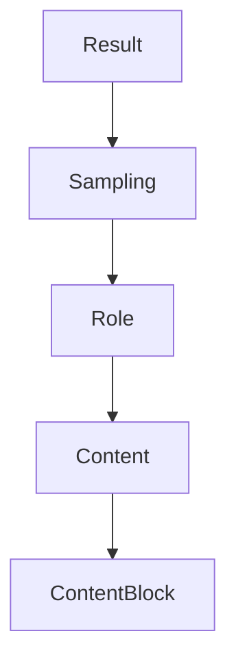

# Chapter 2: Client Transport and Capability Negotiation

Welcome to **Chapter 2: Client Transport and Capability Negotiation**. In this part of **MCP Swift SDK Tutorial: Building MCP Clients and Servers in Swift**, you will build an intuitive mental model first, then move into concrete implementation details and practical production tradeoffs.


Transport and capability negotiation choices drive most client-side behavior variance.

## Learning Goals

- choose between stdio and HTTP client transport paths
- interpret initialization results and capability availability
- handle capability mismatch behavior intentionally
- keep transport configuration explicit in app architecture

## Transport Decision Guide

| Transport | Best Fit |
|:----------|:---------|
| `StdioTransport` | local subprocess workflows |
| `HTTPClientTransport` | remote MCP endpoints with optional streaming |

## Source References

- [Swift SDK README - Client Usage](https://github.com/modelcontextprotocol/swift-sdk/blob/main/README.md#client-usage)
- [Swift SDK README - Transport Options](https://github.com/modelcontextprotocol/swift-sdk/blob/main/README.md#transport-options-for-clients)

## Summary

You now have a client setup model that keeps capability assumptions and transport behavior aligned.

Next: [Chapter 3: Tools, Resources, Prompts, and Request Patterns](03-tools-resources-prompts-and-request-patterns.md)

## Depth Expansion Playbook

## Source Code Walkthrough

### `Sources/MCP/Client/Sampling.swift`

The `Result` interface in [`Sources/MCP/Client/Sampling.swift`](https://github.com/modelcontextprotocol/swift-sdk/blob/HEAD/Sources/MCP/Client/Sampling.swift) handles a key part of this chapter's functionality:

```swift
                case toolUse(Sampling.ToolUseContent)
                /// Tool result content
                case toolResult(Sampling.ToolResultContent)
            }

            /// Returns true if this is a single content block
            public var isSingle: Bool {
                if case .single = self { return true }
                return false
            }

            /// Returns content as an array of blocks
            public var asArray: [ContentBlock] {
                switch self {
                case .single(let block):
                    return [block]
                case .multiple(let blocks):
                    return blocks
                }
            }

            /// Creates content from a text string (convenience)
            public static func text(_ text: String) -> Content {
                .single(.text(text))
            }

            /// Creates content from an image (convenience)
            public static func image(data: String, mimeType: String) -> Content {
                .single(.image(data: data, mimeType: mimeType))
            }

            /// Creates content from audio (convenience)
```

This interface is important because it defines how MCP Swift SDK Tutorial: Building MCP Clients and Servers in Swift implements the patterns covered in this chapter.

### `Sources/MCP/Client/Sampling.swift`

The `Sampling` interface in [`Sources/MCP/Client/Sampling.swift`](https://github.com/modelcontextprotocol/swift-sdk/blob/HEAD/Sources/MCP/Client/Sampling.swift) handles a key part of this chapter's functionality:

```swift
///
/// - SeeAlso: https://modelcontextprotocol.io/docs/concepts/sampling#how-sampling-works
public enum Sampling {
    /// A message in the conversation history.
    public struct Message: Hashable, Sendable {
        /// The message role
        public enum Role: String, Hashable, Codable, Sendable {
            /// A user message
            case user
            /// An assistant message
            case assistant
        }

        /// The message role
        public let role: Role
        /// The message content
        public let content: Content
        /// Optional metadata
        public var _meta: Metadata?

        /// Creates a message with the specified role and content
        @available(
            *, deprecated, message: "Use static factory methods .user(_:) or .assistant(_:) instead"
        )
        public init(role: Role, content: Content, _meta: Metadata? = nil) {
            self.role = role
            self.content = content
            self._meta = _meta
        }

        /// Private initializer for convenience methods to avoid deprecation warnings
        private init(_role role: Role, _content content: Content, _meta: Metadata? = nil) {
```

This interface is important because it defines how MCP Swift SDK Tutorial: Building MCP Clients and Servers in Swift implements the patterns covered in this chapter.

### `Sources/MCP/Client/Sampling.swift`

The `Role` interface in [`Sources/MCP/Client/Sampling.swift`](https://github.com/modelcontextprotocol/swift-sdk/blob/HEAD/Sources/MCP/Client/Sampling.swift) handles a key part of this chapter's functionality:

```swift
    public struct Message: Hashable, Sendable {
        /// The message role
        public enum Role: String, Hashable, Codable, Sendable {
            /// A user message
            case user
            /// An assistant message
            case assistant
        }

        /// The message role
        public let role: Role
        /// The message content
        public let content: Content
        /// Optional metadata
        public var _meta: Metadata?

        /// Creates a message with the specified role and content
        @available(
            *, deprecated, message: "Use static factory methods .user(_:) or .assistant(_:) instead"
        )
        public init(role: Role, content: Content, _meta: Metadata? = nil) {
            self.role = role
            self.content = content
            self._meta = _meta
        }

        /// Private initializer for convenience methods to avoid deprecation warnings
        private init(_role role: Role, _content content: Content, _meta: Metadata? = nil) {
            self.role = role
            self.content = content
            self._meta = _meta
        }
```

This interface is important because it defines how MCP Swift SDK Tutorial: Building MCP Clients and Servers in Swift implements the patterns covered in this chapter.

### `Sources/MCP/Client/Sampling.swift`

The `Content` interface in [`Sources/MCP/Client/Sampling.swift`](https://github.com/modelcontextprotocol/swift-sdk/blob/HEAD/Sources/MCP/Client/Sampling.swift) handles a key part of this chapter's functionality:

```swift
        public let role: Role
        /// The message content
        public let content: Content
        /// Optional metadata
        public var _meta: Metadata?

        /// Creates a message with the specified role and content
        @available(
            *, deprecated, message: "Use static factory methods .user(_:) or .assistant(_:) instead"
        )
        public init(role: Role, content: Content, _meta: Metadata? = nil) {
            self.role = role
            self.content = content
            self._meta = _meta
        }

        /// Private initializer for convenience methods to avoid deprecation warnings
        private init(_role role: Role, _content content: Content, _meta: Metadata? = nil) {
            self.role = role
            self.content = content
            self._meta = _meta
        }

        /// Creates a user message with the specified content
        public static func user(_ content: Content, _meta: Metadata? = nil) -> Message {
            return Message(_role: .user, _content: content, _meta: _meta)
        }

        /// Creates an assistant message with the specified content
        public static func assistant(_ content: Content, _meta: Metadata? = nil) -> Message {
            return Message(_role: .assistant, _content: content, _meta: _meta)
        }
```

This interface is important because it defines how MCP Swift SDK Tutorial: Building MCP Clients and Servers in Swift implements the patterns covered in this chapter.


## How These Components Connect


