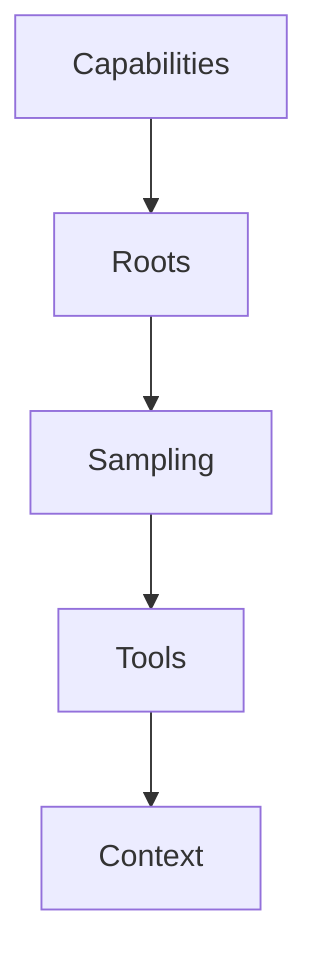

# Chapter 2: Client Transport and Capability Negotiation

Welcome to **Chapter 2: Client Transport and Capability Negotiation**. In this part of **MCP Swift SDK Tutorial: Building MCP Clients and Servers in Swift**, you will build an intuitive mental model first, then move into concrete implementation details and practical production tradeoffs.


Transport and capability negotiation choices drive most client-side behavior variance.

## Learning Goals

- choose between stdio and HTTP client transport paths
- interpret initialization results and capability availability
- handle capability mismatch behavior intentionally
- keep transport configuration explicit in app architecture

## Transport Decision Guide

| Transport | Best Fit |
|:----------|:---------|
| `StdioTransport` | local subprocess workflows |
| `HTTPClientTransport` | remote MCP endpoints with optional streaming |

## Source References

- [Swift SDK README - Client Usage](https://github.com/modelcontextprotocol/swift-sdk/blob/main/README.md#client-usage)
- [Swift SDK README - Transport Options](https://github.com/modelcontextprotocol/swift-sdk/blob/main/README.md#transport-options-for-clients)

## Summary

You now have a client setup model that keeps capability assumptions and transport behavior aligned.

Next: [Chapter 3: Tools, Resources, Prompts, and Request Patterns](03-tools-resources-prompts-and-request-patterns.md)

## Source Code Walkthrough

### `Sources/MCP/Client/Client.swift`

The `Capabilities` interface in [`Sources/MCP/Client/Client.swift`](https://github.com/modelcontextprotocol/swift-sdk/blob/HEAD/Sources/MCP/Client/Client.swift) handles a key part of this chapter's functionality:

```swift

    /// The client capabilities
    public struct Capabilities: Hashable, Codable, Sendable {
        /// The roots capabilities
        public struct Roots: Hashable, Codable, Sendable {
            /// Whether the list of roots has changed
            public var listChanged: Bool?

            public init(listChanged: Bool? = nil) {
                self.listChanged = listChanged
            }
        }

        /// The sampling capabilities
        public struct Sampling: Hashable, Sendable {
            /// Tools sub-capability for sampling
            public struct Tools: Hashable, Codable, Sendable {
                public init() {}
            }

            /// Context sub-capability for sampling
            public struct Context: Hashable, Codable, Sendable {
                public init() {}
            }

            /// Whether tools are supported in sampling
            public var tools: Tools?
            /// Whether context is supported in sampling
            public var context: Context?

            public init(tools: Tools? = nil, context: Context? = nil) {
                self.tools = tools
```

This interface is important because it defines how MCP Swift SDK Tutorial: Building MCP Clients and Servers in Swift implements the patterns covered in this chapter.

### `Sources/MCP/Client/Client.swift`

The `Roots` interface in [`Sources/MCP/Client/Client.swift`](https://github.com/modelcontextprotocol/swift-sdk/blob/HEAD/Sources/MCP/Client/Client.swift) handles a key part of this chapter's functionality:

```swift
    public struct Capabilities: Hashable, Codable, Sendable {
        /// The roots capabilities
        public struct Roots: Hashable, Codable, Sendable {
            /// Whether the list of roots has changed
            public var listChanged: Bool?

            public init(listChanged: Bool? = nil) {
                self.listChanged = listChanged
            }
        }

        /// The sampling capabilities
        public struct Sampling: Hashable, Sendable {
            /// Tools sub-capability for sampling
            public struct Tools: Hashable, Codable, Sendable {
                public init() {}
            }

            /// Context sub-capability for sampling
            public struct Context: Hashable, Codable, Sendable {
                public init() {}
            }

            /// Whether tools are supported in sampling
            public var tools: Tools?
            /// Whether context is supported in sampling
            public var context: Context?

            public init(tools: Tools? = nil, context: Context? = nil) {
                self.tools = tools
                self.context = context
            }
```

This interface is important because it defines how MCP Swift SDK Tutorial: Building MCP Clients and Servers in Swift implements the patterns covered in this chapter.

### `Sources/MCP/Client/Client.swift`

The `Sampling` interface in [`Sources/MCP/Client/Client.swift`](https://github.com/modelcontextprotocol/swift-sdk/blob/HEAD/Sources/MCP/Client/Client.swift) handles a key part of this chapter's functionality:

```swift

        /// The sampling capabilities
        public struct Sampling: Hashable, Sendable {
            /// Tools sub-capability for sampling
            public struct Tools: Hashable, Codable, Sendable {
                public init() {}
            }

            /// Context sub-capability for sampling
            public struct Context: Hashable, Codable, Sendable {
                public init() {}
            }

            /// Whether tools are supported in sampling
            public var tools: Tools?
            /// Whether context is supported in sampling
            public var context: Context?

            public init(tools: Tools? = nil, context: Context? = nil) {
                self.tools = tools
                self.context = context
            }
        }

        /// The elicitation capabilities
        public struct Elicitation: Hashable, Sendable {
            /// Form-based elicitation sub-capability
            public struct Form: Hashable, Codable, Sendable {
                public init() {}
            }

            /// URL-based elicitation sub-capability
```

This interface is important because it defines how MCP Swift SDK Tutorial: Building MCP Clients and Servers in Swift implements the patterns covered in this chapter.

### `Sources/MCP/Client/Client.swift`

The `Tools` interface in [`Sources/MCP/Client/Client.swift`](https://github.com/modelcontextprotocol/swift-sdk/blob/HEAD/Sources/MCP/Client/Client.swift) handles a key part of this chapter's functionality:

```swift
        /// The sampling capabilities
        public struct Sampling: Hashable, Sendable {
            /// Tools sub-capability for sampling
            public struct Tools: Hashable, Codable, Sendable {
                public init() {}
            }

            /// Context sub-capability for sampling
            public struct Context: Hashable, Codable, Sendable {
                public init() {}
            }

            /// Whether tools are supported in sampling
            public var tools: Tools?
            /// Whether context is supported in sampling
            public var context: Context?

            public init(tools: Tools? = nil, context: Context? = nil) {
                self.tools = tools
                self.context = context
            }
        }

        /// The elicitation capabilities
        public struct Elicitation: Hashable, Sendable {
            /// Form-based elicitation sub-capability
            public struct Form: Hashable, Codable, Sendable {
                public init() {}
            }

            /// URL-based elicitation sub-capability
            public struct URL: Hashable, Codable, Sendable {
```

This interface is important because it defines how MCP Swift SDK Tutorial: Building MCP Clients and Servers in Swift implements the patterns covered in this chapter.


## How These Components Connect


