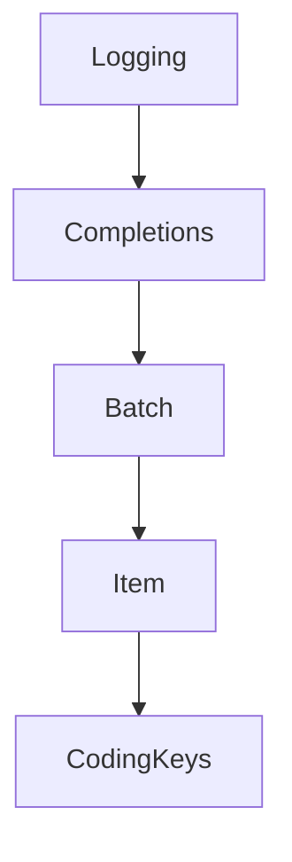

# Chapter 3: Tools, Resources, Prompts, and Request Patterns

Welcome to **Chapter 3: Tools, Resources, Prompts, and Request Patterns**. In this part of **MCP Swift SDK Tutorial: Building MCP Clients and Servers in Swift**, you will build an intuitive mental model first, then move into concrete implementation details and practical production tradeoffs.


This chapter maps common MCP primitive interactions to Swift client usage patterns.

## Learning Goals

- list and invoke tools with typed argument handling
- read and subscribe to resources where available
- fetch prompts with argument expansion reliably
- manage content-type handling across text/image/audio/resource returns

## Usage Guidance

- centralize primitive invocation wrappers for consistency
- validate argument and response assumptions before UI consumption
- treat resource subscriptions as stateful flows requiring explicit lifecycle handling
- keep prompt retrieval separate from model execution logic

## Source References

- [Swift SDK README - Tools](https://github.com/modelcontextprotocol/swift-sdk/blob/main/README.md#tools)
- [Swift SDK README - Resources](https://github.com/modelcontextprotocol/swift-sdk/blob/main/README.md#resources)
- [Swift SDK README - Prompts](https://github.com/modelcontextprotocol/swift-sdk/blob/main/README.md#prompts)

## Summary

You now have a predictable pattern for primitive interactions in Swift MCP clients.

Next: [Chapter 4: Sampling, Human-in-the-Loop, and Error Handling](04-sampling-human-in-the-loop-and-error-handling.md)

## Depth Expansion Playbook

## Source Code Walkthrough

### `Sources/MCP/Server/Server.swift`

The `Logging` interface in [`Sources/MCP/Server/Server.swift`](https://github.com/modelcontextprotocol/swift-sdk/blob/HEAD/Sources/MCP/Server/Server.swift) handles a key part of this chapter's functionality:

```swift
import Logging

import struct Foundation.Data
import struct Foundation.Date
import class Foundation.JSONDecoder
import class Foundation.JSONEncoder

/// Model Context Protocol server
public actor Server {
    /// The server configuration
    public struct Configuration: Hashable, Codable, Sendable {
        /// The default configuration.
        public static let `default` = Configuration(strict: false)

        /// The strict configuration.
        public static let strict = Configuration(strict: true)

        /// When strict mode is enabled, the server:
        /// - Requires clients to send an initialize request before any other requests
        /// - Rejects all requests from uninitialized clients with a protocol error
        ///
        /// While the MCP specification requires clients to initialize the connection
        /// before sending other requests, some implementations may not follow this.
        /// Disabling strict mode allows the server to be more lenient with non-compliant
        /// clients, though this may lead to undefined behavior.
        public var strict: Bool
    }

    /// Implementation information
    public struct Info: Hashable, Codable, Sendable {
```

This interface is important because it defines how MCP Swift SDK Tutorial: Building MCP Clients and Servers in Swift implements the patterns covered in this chapter.

### `Sources/MCP/Server/Server.swift`

The `Completions` interface in [`Sources/MCP/Server/Server.swift`](https://github.com/modelcontextprotocol/swift-sdk/blob/HEAD/Sources/MCP/Server/Server.swift) handles a key part of this chapter's functionality:

```swift
        }

        /// Completions capabilities
        public struct Completions: Hashable, Codable, Sendable {
            public init() {}
        }

        /// Completions capabilities
        public var completions: Completions?
        /// Logging capabilities
        public var logging: Logging?
        /// Prompts capabilities
        public var prompts: Prompts?
        /// Resources capabilities
        public var resources: Resources?
        /// Tools capabilities
        public var tools: Tools?

        public init(
            completions: Completions? = nil,
            logging: Logging? = nil,
            prompts: Prompts? = nil,
            resources: Resources? = nil,
            tools: Tools? = nil
        ) {
            self.completions = completions
            self.logging = logging
            self.prompts = prompts
            self.resources = resources
            self.tools = tools
        }
    }
```

This interface is important because it defines how MCP Swift SDK Tutorial: Building MCP Clients and Servers in Swift implements the patterns covered in this chapter.

### `Sources/MCP/Server/Server.swift`

The `Batch` interface in [`Sources/MCP/Server/Server.swift`](https://github.com/modelcontextprotocol/swift-sdk/blob/HEAD/Sources/MCP/Server/Server.swift) handles a key part of this chapter's functionality:

```swift
                        // Attempt to decode as batch first, then as individual response, request, or notification
                        let decoder = JSONDecoder()
                        if let batch = try? decoder.decode(Server.Batch.self, from: data) {
                            try await handleBatch(batch)
                        } else if let response = try? decoder.decode(AnyResponse.self, from: data) {
                            await handleResponse(response)
                        } else if let request = try? decoder.decode(AnyRequest.self, from: data) {
                            // Handle request in a separate task to avoid blocking the receive loop
                            Task {
                                _ = try? await self.handleRequest(request, sendResponse: true)
                            }
                        } else if let message = try? decoder.decode(AnyMessage.self, from: data) {
                            try await handleMessage(message)
                        } else {
                            // Try to extract request ID from raw JSON if possible
                            if let json = try? JSONDecoder().decode(
                                [String: Value].self, from: data),
                                let idValue = json["id"]
                            {
                                if let strValue = idValue.stringValue {
                                    requestID = .string(strValue)
                                } else if let intValue = idValue.intValue {
                                    requestID = .number(intValue)
                                }
                            }
                            throw MCPError.parseError("Invalid message format")
                        }
                    } catch let error where MCPError.isResourceTemporarilyUnavailable(error) {
                        // Resource temporarily unavailable, retry after a short delay
                        try? await Task.sleep(for: .milliseconds(10))
                        continue
                    } catch {
```

This interface is important because it defines how MCP Swift SDK Tutorial: Building MCP Clients and Servers in Swift implements the patterns covered in this chapter.

### `Sources/MCP/Server/Server.swift`

The `Item` interface in [`Sources/MCP/Server/Server.swift`](https://github.com/modelcontextprotocol/swift-sdk/blob/HEAD/Sources/MCP/Server/Server.swift) handles a key part of this chapter's functionality:

```swift
    struct Batch: Sendable {
        /// An item in a JSON-RPC batch
        enum Item: Sendable {
            case request(Request<AnyMethod>)
            case notification(Message<AnyNotification>)

        }

        var items: [Item]

        init(items: [Item]) {
            self.items = items
        }
    }

    /// Process a batch of requests and/or notifications
    private func handleBatch(_ batch: Batch) async throws {
        await logger?.trace("Processing batch request", metadata: ["size": "\(batch.items.count)"])

        if batch.items.isEmpty {
            // Empty batch is invalid according to JSON-RPC spec
            let error = MCPError.invalidRequest("Batch array must not be empty")
            let response = AnyMethod.response(id: .random, error: error)
            try await send(response)
            return
        }

        // Process each item in the batch and collect responses
        var responses: [Response<AnyMethod>] = []

        for item in batch.items {
            do {
```

This interface is important because it defines how MCP Swift SDK Tutorial: Building MCP Clients and Servers in Swift implements the patterns covered in this chapter.


## How These Components Connect


