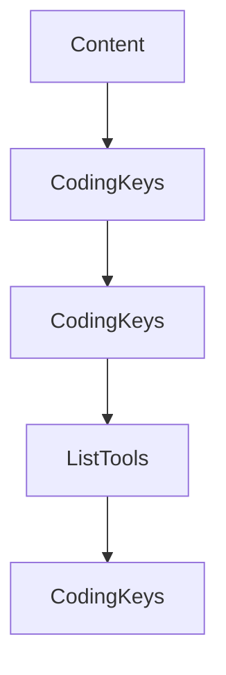

# Chapter 3: Tools, Resources, Prompts, and Request Patterns

Welcome to **Chapter 3: Tools, Resources, Prompts, and Request Patterns**. In this part of **MCP Swift SDK Tutorial: Building MCP Clients and Servers in Swift**, you will build an intuitive mental model first, then move into concrete implementation details and practical production tradeoffs.


This chapter maps common MCP primitive interactions to Swift client usage patterns.

## Learning Goals

- list and invoke tools with typed argument handling
- read and subscribe to resources where available
- fetch prompts with argument expansion reliably
- manage content-type handling across text/image/audio/resource returns

## Usage Guidance

- centralize primitive invocation wrappers for consistency
- validate argument and response assumptions before UI consumption
- treat resource subscriptions as stateful flows requiring explicit lifecycle handling
- keep prompt retrieval separate from model execution logic

## Source References

- [Swift SDK README - Tools](https://github.com/modelcontextprotocol/swift-sdk/blob/main/README.md#tools)
- [Swift SDK README - Resources](https://github.com/modelcontextprotocol/swift-sdk/blob/main/README.md#resources)
- [Swift SDK README - Prompts](https://github.com/modelcontextprotocol/swift-sdk/blob/main/README.md#prompts)

## Summary

You now have a predictable pattern for primitive interactions in Swift MCP clients.

Next: [Chapter 4: Sampling, Human-in-the-Loop, and Error Handling](04-sampling-human-in-the-loop-and-error-handling.md)

## Source Code Walkthrough

### `Sources/MCP/Server/Tools.swift`

The `Content` interface in [`Sources/MCP/Server/Tools.swift`](https://github.com/modelcontextprotocol/swift-sdk/blob/HEAD/Sources/MCP/Server/Tools.swift) handles a key part of this chapter's functionality:

```swift
    }

    /// Content types that can be returned by a tool
    public enum Content: Hashable, Codable, Sendable {
        /// Text content
        case text(text: String, annotations: Resource.Annotations?, _meta: Metadata?)
        /// Image content
        case image(data: String, mimeType: String, annotations: Resource.Annotations?, _meta: Metadata?)
        /// Audio content
        case audio(data: String, mimeType: String, annotations: Resource.Annotations?, _meta: Metadata?)
        /// Embedded resource content (EmbeddedResource from spec)
        case resource(resource: Resource.Content, annotations: Resource.Annotations? = nil, _meta: Metadata? = nil)
        /// Resource link
        case resourceLink(
            uri: String, name: String, title: String? = nil, description: String? = nil,
            mimeType: String? = nil,
            annotations: Resource.Annotations? = nil
        )

        /// Deprecated compatibility factory for older call sites that used `.text("...")` and `.text("...", metadata: ...)`.
        @available(*, deprecated, message: "Use .text(text:annotations:_meta:) instead.")
        public static func text(_ text: String, metadata: Metadata? = nil) -> Self {
            .text(text: text, annotations: nil, _meta: metadata)
        }

        /// Deprecated compatibility factory for older call sites that used `.text(text: ..., metadata: ...)`.
        @available(*, deprecated, message: "Use .text(text:annotations:_meta:) instead.")
        public static func text(text: String, metadata: Metadata? = nil) -> Self {
            .text(text: text, annotations: nil, _meta: metadata)
        }

        /// Deprecated compatibility factory for older call sites that used `.image(..., metadata: ...)`.
```

This interface is important because it defines how MCP Swift SDK Tutorial: Building MCP Clients and Servers in Swift implements the patterns covered in this chapter.

### `Sources/MCP/Server/Tools.swift`

The `CodingKeys` interface in [`Sources/MCP/Server/Tools.swift`](https://github.com/modelcontextprotocol/swift-sdk/blob/HEAD/Sources/MCP/Server/Tools.swift) handles a key part of this chapter's functionality:

```swift
        }

        private enum CodingKeys: String, CodingKey {
            case type
            case text
            case image
            case resource
            case resource_link
            case audio
            case uri
            case name
            case title
            case description
            case annotations
            case mimeType
            case data
            case _meta
        }

        public init(from decoder: Decoder) throws {
            let container = try decoder.container(keyedBy: CodingKeys.self)
            let type = try container.decode(String.self, forKey: .type)

            switch type {
            case "text":
                let text = try container.decode(String.self, forKey: .text)
                let annotations = try container.decodeIfPresent(Resource.Annotations.self, forKey: .annotations)
                let _meta = try container.decodeIfPresent(Metadata.self, forKey: ._meta)
                self = .text(text: text, annotations: annotations, _meta: _meta)
            case "image":
                let data = try container.decode(String.self, forKey: .data)
                let mimeType = try container.decode(String.self, forKey: .mimeType)
```

This interface is important because it defines how MCP Swift SDK Tutorial: Building MCP Clients and Servers in Swift implements the patterns covered in this chapter.

### `Sources/MCP/Server/Tools.swift`

The `CodingKeys` interface in [`Sources/MCP/Server/Tools.swift`](https://github.com/modelcontextprotocol/swift-sdk/blob/HEAD/Sources/MCP/Server/Tools.swift) handles a key part of this chapter's functionality:

```swift
        }

        private enum CodingKeys: String, CodingKey {
            case type
            case text
            case image
            case resource
            case resource_link
            case audio
            case uri
            case name
            case title
            case description
            case annotations
            case mimeType
            case data
            case _meta
        }

        public init(from decoder: Decoder) throws {
            let container = try decoder.container(keyedBy: CodingKeys.self)
            let type = try container.decode(String.self, forKey: .type)

            switch type {
            case "text":
                let text = try container.decode(String.self, forKey: .text)
                let annotations = try container.decodeIfPresent(Resource.Annotations.self, forKey: .annotations)
                let _meta = try container.decodeIfPresent(Metadata.self, forKey: ._meta)
                self = .text(text: text, annotations: annotations, _meta: _meta)
            case "image":
                let data = try container.decode(String.self, forKey: .data)
                let mimeType = try container.decode(String.self, forKey: .mimeType)
```

This interface is important because it defines how MCP Swift SDK Tutorial: Building MCP Clients and Servers in Swift implements the patterns covered in this chapter.

### `Sources/MCP/Server/Tools.swift`

The `ListTools` interface in [`Sources/MCP/Server/Tools.swift`](https://github.com/modelcontextprotocol/swift-sdk/blob/HEAD/Sources/MCP/Server/Tools.swift) handles a key part of this chapter's functionality:

```swift
/// To discover available tools, clients send a `tools/list` request.
/// - SeeAlso: https://modelcontextprotocol.io/specification/2025-11-25/server/tools/#listing-tools
public enum ListTools: Method {
    public static let name = "tools/list"

    public struct Parameters: NotRequired, Hashable, Codable, Sendable {
        public let cursor: String?

        public init() {
            self.cursor = nil
        }

        public init(cursor: String) {
            self.cursor = cursor
        }
    }

    public struct Result: Hashable, Codable, Sendable {
        public let tools: [Tool]
        public let nextCursor: String?
        public var _meta: Metadata?

        public init(
            tools: [Tool],
            nextCursor: String? = nil,
            _meta: Metadata? = nil
        ) {
            self.tools = tools
            self.nextCursor = nextCursor
            self._meta = _meta
        }

```

This interface is important because it defines how MCP Swift SDK Tutorial: Building MCP Clients and Servers in Swift implements the patterns covered in this chapter.


## How These Components Connect


