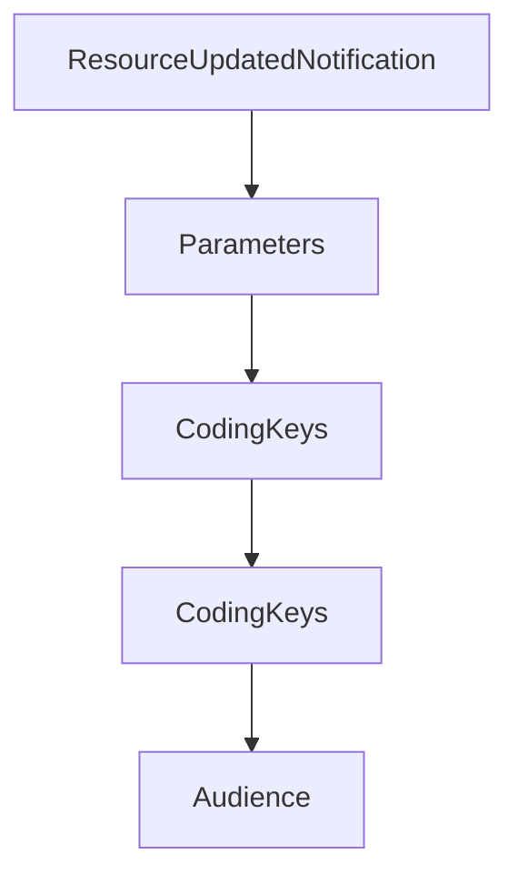

# Chapter 4: Sampling, Human-in-the-Loop, and Error Handling

Welcome to **Chapter 4: Sampling, Human-in-the-Loop, and Error Handling**. In this part of **MCP Swift SDK Tutorial: Building MCP Clients and Servers in Swift**, you will build an intuitive mental model first, then move into concrete implementation details and practical production tradeoffs.


Sampling is powerful and risky; this chapter focuses on safe control points.

## Learning Goals

- implement sampling handlers with explicit user-control steps
- reason about message flow between server, client, user, and LLM
- handle MCP and runtime errors with clear fallback behavior
- prevent silent failures in AI-assisted workflows

## Control Checklist

- review incoming sampling requests before forwarding to model providers
- inspect and optionally edit model output before sending response
- log sampling flow metadata for auditability
- standardize error surfaces for upstream callers

## Source References

- [Swift SDK README - Sampling](https://github.com/modelcontextprotocol/swift-sdk/blob/main/README.md#sampling)
- [Swift SDK README - Error Handling](https://github.com/modelcontextprotocol/swift-sdk/blob/main/README.md#error-handling)

## Summary

You now have a human-in-the-loop sampling pattern for safer Swift client operation.

Next: [Chapter 5: Server Setup, Hooks, and Primitive Authoring](05-server-setup-hooks-and-primitive-authoring.md)

## Source Code Walkthrough

### `Sources/MCP/Server/Resources.swift`

The `ResourceUpdatedNotification` interface in [`Sources/MCP/Server/Resources.swift`](https://github.com/modelcontextprotocol/swift-sdk/blob/HEAD/Sources/MCP/Server/Resources.swift) handles a key part of this chapter's functionality:

```swift
/// When a resource changes, servers that declared the updated capability SHOULD send a notification to subscribed clients.
/// - SeeAlso: https://modelcontextprotocol.io/specification/2025-11-25/server/resources/#subscriptions
public struct ResourceUpdatedNotification: Notification {
    public static let name: String = "notifications/resources/updated"

    public struct Parameters: Hashable, Codable, Sendable {
        public let uri: String

        public init(uri: String) {
            self.uri = uri
        }
    }
}

```

This interface is important because it defines how MCP Swift SDK Tutorial: Building MCP Clients and Servers in Swift implements the patterns covered in this chapter.

### `Sources/MCP/Server/Resources.swift`

The `Parameters` interface in [`Sources/MCP/Server/Resources.swift`](https://github.com/modelcontextprotocol/swift-sdk/blob/HEAD/Sources/MCP/Server/Resources.swift) handles a key part of this chapter's functionality:

```swift
    public static let name: String = "resources/list"

    public struct Parameters: NotRequired, Hashable, Codable, Sendable {
        public let cursor: String?

        public init() {
            self.cursor = nil
        }

        public init(cursor: String) {
            self.cursor = cursor
        }
    }

    public struct Result: Hashable, Codable, Sendable {
        public let resources: [Resource]
        public let nextCursor: String?
        public var _meta: Metadata?

        public init(
            resources: [Resource],
            nextCursor: String? = nil,
            _meta: Metadata? = nil
        ) {
            self.resources = resources
            self.nextCursor = nextCursor
            self._meta = _meta
        }

        private enum CodingKeys: String, CodingKey, CaseIterable {
            case resources, nextCursor, _meta
        }
```

This interface is important because it defines how MCP Swift SDK Tutorial: Building MCP Clients and Servers in Swift implements the patterns covered in this chapter.

### `Sources/MCP/Server/Resources.swift`

The `CodingKeys` interface in [`Sources/MCP/Server/Resources.swift`](https://github.com/modelcontextprotocol/swift-sdk/blob/HEAD/Sources/MCP/Server/Resources.swift) handles a key part of this chapter's functionality:

```swift
    }

    private enum CodingKeys: String, CodingKey {
        case name
        case uri
        case title
        case description
        case mimeType
        case size
        case annotations
        case icons
        case _meta
    }

    public init(from decoder: Decoder) throws {
        let container = try decoder.container(keyedBy: CodingKeys.self)
        name = try container.decode(String.self, forKey: .name)
        uri = try container.decode(String.self, forKey: .uri)
        title = try container.decodeIfPresent(String.self, forKey: .title)
        description = try container.decodeIfPresent(String.self, forKey: .description)
        mimeType = try container.decodeIfPresent(String.self, forKey: .mimeType)
        size = try container.decodeIfPresent(Int.self, forKey: .size)
        annotations = try container.decodeIfPresent(Resource.Annotations.self, forKey: .annotations)
        icons = try container.decodeIfPresent([Icon].self, forKey: .icons)
        _meta = try container.decodeIfPresent(Metadata.self, forKey: ._meta)
    }

    public func encode(to encoder: Encoder) throws {
        var container = encoder.container(keyedBy: CodingKeys.self)
        try container.encode(name, forKey: .name)
        try container.encode(uri, forKey: .uri)
        try container.encodeIfPresent(title, forKey: .title)
```

This interface is important because it defines how MCP Swift SDK Tutorial: Building MCP Clients and Servers in Swift implements the patterns covered in this chapter.

### `Sources/MCP/Server/Resources.swift`

The `CodingKeys` interface in [`Sources/MCP/Server/Resources.swift`](https://github.com/modelcontextprotocol/swift-sdk/blob/HEAD/Sources/MCP/Server/Resources.swift) handles a key part of this chapter's functionality:

```swift
    }

    private enum CodingKeys: String, CodingKey {
        case name
        case uri
        case title
        case description
        case mimeType
        case size
        case annotations
        case icons
        case _meta
    }

    public init(from decoder: Decoder) throws {
        let container = try decoder.container(keyedBy: CodingKeys.self)
        name = try container.decode(String.self, forKey: .name)
        uri = try container.decode(String.self, forKey: .uri)
        title = try container.decodeIfPresent(String.self, forKey: .title)
        description = try container.decodeIfPresent(String.self, forKey: .description)
        mimeType = try container.decodeIfPresent(String.self, forKey: .mimeType)
        size = try container.decodeIfPresent(Int.self, forKey: .size)
        annotations = try container.decodeIfPresent(Resource.Annotations.self, forKey: .annotations)
        icons = try container.decodeIfPresent([Icon].self, forKey: .icons)
        _meta = try container.decodeIfPresent(Metadata.self, forKey: ._meta)
    }

    public func encode(to encoder: Encoder) throws {
        var container = encoder.container(keyedBy: CodingKeys.self)
        try container.encode(name, forKey: .name)
        try container.encode(uri, forKey: .uri)
        try container.encodeIfPresent(title, forKey: .title)
```

This interface is important because it defines how MCP Swift SDK Tutorial: Building MCP Clients and Servers in Swift implements the patterns covered in this chapter.


## How These Components Connect


