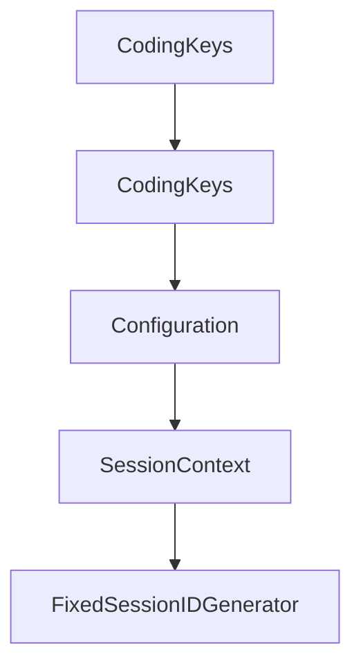

# Chapter 4: Sampling, Human-in-the-Loop, and Error Handling

Welcome to **Chapter 4: Sampling, Human-in-the-Loop, and Error Handling**. In this part of **MCP Swift SDK Tutorial: Building MCP Clients and Servers in Swift**, you will build an intuitive mental model first, then move into concrete implementation details and practical production tradeoffs.


Sampling is powerful and risky; this chapter focuses on safe control points.

## Learning Goals

- implement sampling handlers with explicit user-control steps
- reason about message flow between server, client, user, and LLM
- handle MCP and runtime errors with clear fallback behavior
- prevent silent failures in AI-assisted workflows

## Control Checklist

- review incoming sampling requests before forwarding to model providers
- inspect and optionally edit model output before sending response
- log sampling flow metadata for auditability
- standardize error surfaces for upstream callers

## Source References

- [Swift SDK README - Sampling](https://github.com/modelcontextprotocol/swift-sdk/blob/main/README.md#sampling)
- [Swift SDK README - Error Handling](https://github.com/modelcontextprotocol/swift-sdk/blob/main/README.md#error-handling)

## Summary

You now have a human-in-the-loop sampling pattern for safer Swift client operation.

Next: [Chapter 5: Server Setup, Hooks, and Primitive Authoring](05-server-setup-hooks-and-primitive-authoring.md)

## Depth Expansion Playbook

## Source Code Walkthrough

### `Sources/MCP/Server/Tools.swift`

The `CodingKeys` interface in [`Sources/MCP/Server/Tools.swift`](https://github.com/modelcontextprotocol/swift-sdk/blob/HEAD/Sources/MCP/Server/Tools.swift) handles a key part of this chapter's functionality:

```swift
        }

        private enum CodingKeys: String, CodingKey {
            case type
            case text
            case image
            case resource
            case resource_link
            case audio
            case uri
            case name
            case title
            case description
            case annotations
            case mimeType
            case data
            case _meta
        }

        public init(from decoder: Decoder) throws {
            let container = try decoder.container(keyedBy: CodingKeys.self)
            let type = try container.decode(String.self, forKey: .type)

            switch type {
            case "text":
                let text = try container.decode(String.self, forKey: .text)
                let annotations = try container.decodeIfPresent(Resource.Annotations.self, forKey: .annotations)
                let _meta = try container.decodeIfPresent(Metadata.self, forKey: ._meta)
                self = .text(text: text, annotations: annotations, _meta: _meta)
            case "image":
                let data = try container.decode(String.self, forKey: .data)
                let mimeType = try container.decode(String.self, forKey: .mimeType)
```

This interface is important because it defines how MCP Swift SDK Tutorial: Building MCP Clients and Servers in Swift implements the patterns covered in this chapter.

### `Sources/MCP/Server/Tools.swift`

The `CodingKeys` interface in [`Sources/MCP/Server/Tools.swift`](https://github.com/modelcontextprotocol/swift-sdk/blob/HEAD/Sources/MCP/Server/Tools.swift) handles a key part of this chapter's functionality:

```swift
        }

        private enum CodingKeys: String, CodingKey {
            case type
            case text
            case image
            case resource
            case resource_link
            case audio
            case uri
            case name
            case title
            case description
            case annotations
            case mimeType
            case data
            case _meta
        }

        public init(from decoder: Decoder) throws {
            let container = try decoder.container(keyedBy: CodingKeys.self)
            let type = try container.decode(String.self, forKey: .type)

            switch type {
            case "text":
                let text = try container.decode(String.self, forKey: .text)
                let annotations = try container.decodeIfPresent(Resource.Annotations.self, forKey: .annotations)
                let _meta = try container.decodeIfPresent(Metadata.self, forKey: ._meta)
                self = .text(text: text, annotations: annotations, _meta: _meta)
            case "image":
                let data = try container.decode(String.self, forKey: .data)
                let mimeType = try container.decode(String.self, forKey: .mimeType)
```

This interface is important because it defines how MCP Swift SDK Tutorial: Building MCP Clients and Servers in Swift implements the patterns covered in this chapter.

### `Sources/MCPConformance/Server/HTTPApp.swift`

The `Configuration` interface in [`Sources/MCPConformance/Server/HTTPApp.swift`](https://github.com/modelcontextprotocol/swift-sdk/blob/HEAD/Sources/MCPConformance/Server/HTTPApp.swift) handles a key part of this chapter's functionality:

```swift

actor HTTPApp {
    /// Configuration for the HTTP application.
    struct Configuration: Sendable {
        /// The host address to bind to.
        var host: String

        /// The port to bind to.
        var port: Int

        /// The MCP endpoint path.
        var endpoint: String

        /// Session timeout in seconds.
        var sessionTimeout: TimeInterval

        /// SSE retry interval in milliseconds for priming events.
        var retryInterval: Int?

        init(
            host: String = "127.0.0.1",
            port: Int = 3000,
            endpoint: String = "/mcp",
            sessionTimeout: TimeInterval = 3600,
            retryInterval: Int? = nil
        ) {
            self.host = host
            self.port = port
            self.endpoint = endpoint
            self.sessionTimeout = sessionTimeout
            self.retryInterval = retryInterval
        }
```

This interface is important because it defines how MCP Swift SDK Tutorial: Building MCP Clients and Servers in Swift implements the patterns covered in this chapter.

### `Sources/MCPConformance/Server/HTTPApp.swift`

The `SessionContext` interface in [`Sources/MCPConformance/Server/HTTPApp.swift`](https://github.com/modelcontextprotocol/swift-sdk/blob/HEAD/Sources/MCPConformance/Server/HTTPApp.swift) handles a key part of this chapter's functionality:

```swift
    private let validationPipeline: (any HTTPRequestValidationPipeline)?
    private var channel: Channel?
    private var sessions: [String: SessionContext] = [:]

    nonisolated let logger: Logger

    struct SessionContext {
        let server: Server
        let transport: StatefulHTTPServerTransport
        let createdAt: Date
        var lastAccessedAt: Date
    }

    // MARK: - Init

    /// Creates a new HTTP application.
    ///
    /// - Parameters:
    ///   - configuration: Application configuration.
    ///   - validationPipeline: Custom validation pipeline passed to each transport.
    ///     If `nil`, transports use their sensible defaults.
    ///   - serverFactory: Factory function to create Server instances for each session.
    ///   - logger: Optional logger instance.
    init(
        configuration: Configuration = Configuration(),
        validationPipeline: (any HTTPRequestValidationPipeline)? = nil,
        serverFactory: @escaping ServerFactory,
        logger: Logger? = nil
    ) {
        self.configuration = configuration
        self.serverFactory = serverFactory
        self.validationPipeline = validationPipeline
```

This interface is important because it defines how MCP Swift SDK Tutorial: Building MCP Clients and Servers in Swift implements the patterns covered in this chapter.


## How These Components Connect


