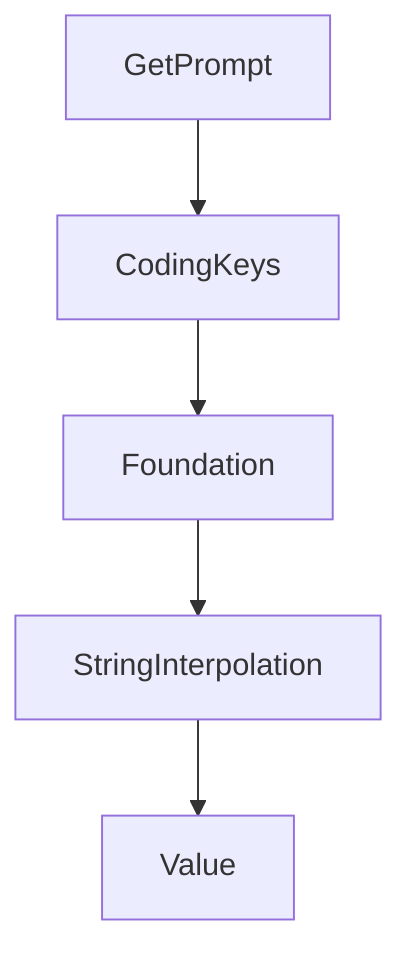

# Chapter 5: Server Setup, Hooks, and Primitive Authoring

Welcome to **Chapter 5: Server Setup, Hooks, and Primitive Authoring**. In this part of **MCP Swift SDK Tutorial: Building MCP Clients and Servers in Swift**, you will build an intuitive mental model first, then move into concrete implementation details and practical production tradeoffs.


This chapter covers core server composition for Swift MCP services.

## Learning Goals

- bootstrap a server with clear lifecycle boundaries
- implement tools/resources/prompts with consistent schemas and behavior
- use initialize hooks for startup-time policy/config checks
- avoid tight coupling between transport plumbing and domain logic

## Server Build Steps

1. initialize server with implementation metadata
2. register tools/resources/prompts in coherent domains
3. add initialize hook for capability and policy checks
4. test all primitive flows before exposing HTTP endpoints

## Source References

- [Swift SDK README - Server Usage](https://github.com/modelcontextprotocol/swift-sdk/blob/main/README.md#server-usage)
- [Swift SDK README - Initialize Hook](https://github.com/modelcontextprotocol/swift-sdk/blob/main/README.md#initialize-hook)

## Summary

You now have a structured foundation for implementing Swift MCP servers.

Next: [Chapter 6: Transports, Custom Implementations, and Shutdown](06-transports-custom-implementations-and-shutdown.md)

## Depth Expansion Playbook

## Source Code Walkthrough

### `Sources/MCP/Server/Prompts.swift`

The `GetPrompt` interface in [`Sources/MCP/Server/Prompts.swift`](https://github.com/modelcontextprotocol/swift-sdk/blob/HEAD/Sources/MCP/Server/Prompts.swift) handles a key part of this chapter's functionality:

```swift
/// Arguments may be auto-completed through the completion API.
/// - SeeAlso: https://modelcontextprotocol.io/specification/2025-11-25/server/prompts/#getting-a-prompt
public enum GetPrompt: Method {
    public static let name: String = "prompts/get"

    public struct Parameters: Hashable, Codable, Sendable {
        public let name: String
        public let arguments: [String: String]?

        public init(name: String, arguments: [String: String]? = nil) {
            self.name = name
            self.arguments = arguments
        }
    }

    public struct Result: Hashable, Codable, Sendable {
        public let description: String?
        public let messages: [Prompt.Message]
        /// Optional metadata about this result
        public var _meta: Metadata?

        public init(
            description: String? = nil,
            messages: [Prompt.Message],
            _meta: Metadata? = nil
        ) {
            self.description = description
            self.messages = messages
            self._meta = _meta
        }

        private enum CodingKeys: String, CodingKey, CaseIterable {
```

This interface is important because it defines how MCP Swift SDK Tutorial: Building MCP Clients and Servers in Swift implements the patterns covered in this chapter.

### `Sources/MCP/Server/Prompts.swift`

The `CodingKeys` interface in [`Sources/MCP/Server/Prompts.swift`](https://github.com/modelcontextprotocol/swift-sdk/blob/HEAD/Sources/MCP/Server/Prompts.swift) handles a key part of this chapter's functionality:

```swift
    }

    private enum CodingKeys: String, CodingKey {
        case name, title, description, arguments, icons, _meta
    }

    public func encode(to encoder: Encoder) throws {
        var container = encoder.container(keyedBy: CodingKeys.self)
        try container.encode(name, forKey: .name)
        try container.encodeIfPresent(title, forKey: .title)
        try container.encodeIfPresent(description, forKey: .description)
        try container.encodeIfPresent(arguments, forKey: .arguments)
        try container.encodeIfPresent(icons, forKey: .icons)
        try container.encodeIfPresent(_meta, forKey: ._meta)
    }

    public init(from decoder: Decoder) throws {
        let container = try decoder.container(keyedBy: CodingKeys.self)
        name = try container.decode(String.self, forKey: .name)
        title = try container.decodeIfPresent(String.self, forKey: .title)
        description = try container.decodeIfPresent(String.self, forKey: .description)
        arguments = try container.decodeIfPresent([Argument].self, forKey: .arguments)
        icons = try container.decodeIfPresent([Icon].self, forKey: .icons)
        _meta = try container.decodeIfPresent(Metadata.self, forKey: ._meta)
    }

    /// An argument for a prompt
    public struct Argument: Hashable, Codable, Sendable {
        /// The argument name
        public let name: String
        /// A human-readable argument title
        public let title: String?
```

This interface is important because it defines how MCP Swift SDK Tutorial: Building MCP Clients and Servers in Swift implements the patterns covered in this chapter.

### `Sources/MCP/Base/Value.swift`

The `Foundation` interface in [`Sources/MCP/Base/Value.swift`](https://github.com/modelcontextprotocol/swift-sdk/blob/HEAD/Sources/MCP/Base/Value.swift) handles a key part of this chapter's functionality:

```swift
import struct Foundation.Data
import class Foundation.JSONDecoder
import class Foundation.JSONEncoder

/// A codable value.
public enum Value: Hashable, Sendable {
    case null
    case bool(Bool)
    case int(Int)
    case double(Double)
    case string(String)
    case data(mimeType: String? = nil, Data)
    case array([Value])
    case object([String: Value])

    /// Create a `Value` from a `Codable` value.
    /// - Parameter value: The codable value
    /// - Returns: A value
    public init<T: Codable>(_ value: T) throws {
        if let valueAsValue = value as? Value {
            self = valueAsValue
        } else {
            let data = try JSONEncoder().encode(value)
            self = try JSONDecoder().decode(Value.self, from: data)
        }
    }

    /// Returns whether the value is `null`.
    public var isNull: Bool {
        return self == .null
```

This interface is important because it defines how MCP Swift SDK Tutorial: Building MCP Clients and Servers in Swift implements the patterns covered in this chapter.

### `Sources/MCP/Base/Value.swift`

The `StringInterpolation` interface in [`Sources/MCP/Base/Value.swift`](https://github.com/modelcontextprotocol/swift-sdk/blob/HEAD/Sources/MCP/Base/Value.swift) handles a key part of this chapter's functionality:

```swift
}

// MARK: - ExpressibleByStringInterpolation

extension Value: ExpressibleByStringInterpolation {
    public struct StringInterpolation: StringInterpolationProtocol {
        var stringValue: String

        public init(literalCapacity: Int, interpolationCount: Int) {
            self.stringValue = ""
            self.stringValue.reserveCapacity(literalCapacity + interpolationCount)
        }

        public mutating func appendLiteral(_ literal: String) {
            self.stringValue.append(literal)
        }

        public mutating func appendInterpolation<T: CustomStringConvertible>(_ value: T) {
            self.stringValue.append(value.description)
        }
    }

    public init(stringInterpolation: StringInterpolation) {
        self = .string(stringInterpolation.stringValue)
    }
}

// MARK: - Standard Library Type Extensions

extension Bool {
    /// Creates a boolean value from a `Value` instance.
    ///
```

This interface is important because it defines how MCP Swift SDK Tutorial: Building MCP Clients and Servers in Swift implements the patterns covered in this chapter.


## How These Components Connect


