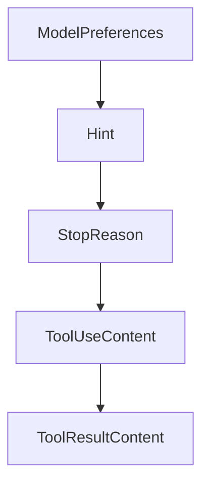

# Chapter 5: Server Setup, Hooks, and Primitive Authoring

Welcome to **Chapter 5: Server Setup, Hooks, and Primitive Authoring**. In this part of **MCP Swift SDK Tutorial: Building MCP Clients and Servers in Swift**, you will build an intuitive mental model first, then move into concrete implementation details and practical production tradeoffs.


This chapter covers core server composition for Swift MCP services.

## Learning Goals

- bootstrap a server with clear lifecycle boundaries
- implement tools/resources/prompts with consistent schemas and behavior
- use initialize hooks for startup-time policy/config checks
- avoid tight coupling between transport plumbing and domain logic

## Server Build Steps

1. initialize server with implementation metadata
2. register tools/resources/prompts in coherent domains
3. add initialize hook for capability and policy checks
4. test all primitive flows before exposing HTTP endpoints

## Source References

- [Swift SDK README - Server Usage](https://github.com/modelcontextprotocol/swift-sdk/blob/main/README.md#server-usage)
- [Swift SDK README - Initialize Hook](https://github.com/modelcontextprotocol/swift-sdk/blob/main/README.md#initialize-hook)

## Summary

You now have a structured foundation for implementing Swift MCP servers.

Next: [Chapter 6: Transports, Custom Implementations, and Shutdown](06-transports-custom-implementations-and-shutdown.md)

## Source Code Walkthrough

### `Sources/MCP/Client/Sampling.swift`

The `ModelPreferences` interface in [`Sources/MCP/Client/Sampling.swift`](https://github.com/modelcontextprotocol/swift-sdk/blob/HEAD/Sources/MCP/Client/Sampling.swift) handles a key part of this chapter's functionality:

```swift

    /// Model preferences for sampling requests
    public struct ModelPreferences: Hashable, Codable, Sendable {
        /// Model hints for selection
        public struct Hint: Hashable, Codable, Sendable {
            /// Suggested model name/family
            public let name: String?

            public init(name: String? = nil) {
                self.name = name
            }
        }

        /// Array of model name suggestions that clients can use to select an appropriate model
        public let hints: [Hint]?
        /// Importance of minimizing costs (0-1 normalized)
        public let costPriority: UnitInterval?
        /// Importance of low latency response (0-1 normalized)
        public let speedPriority: UnitInterval?
        /// Importance of advanced model capabilities (0-1 normalized)
        public let intelligencePriority: UnitInterval?

        public init(
            hints: [Hint]? = nil,
            costPriority: UnitInterval? = nil,
            speedPriority: UnitInterval? = nil,
            intelligencePriority: UnitInterval? = nil
        ) {
            self.hints = hints
            self.costPriority = costPriority
            self.speedPriority = speedPriority
            self.intelligencePriority = intelligencePriority
```

This interface is important because it defines how MCP Swift SDK Tutorial: Building MCP Clients and Servers in Swift implements the patterns covered in this chapter.

### `Sources/MCP/Client/Sampling.swift`

The `Hint` interface in [`Sources/MCP/Client/Sampling.swift`](https://github.com/modelcontextprotocol/swift-sdk/blob/HEAD/Sources/MCP/Client/Sampling.swift) handles a key part of this chapter's functionality:

```swift
    public struct ModelPreferences: Hashable, Codable, Sendable {
        /// Model hints for selection
        public struct Hint: Hashable, Codable, Sendable {
            /// Suggested model name/family
            public let name: String?

            public init(name: String? = nil) {
                self.name = name
            }
        }

        /// Array of model name suggestions that clients can use to select an appropriate model
        public let hints: [Hint]?
        /// Importance of minimizing costs (0-1 normalized)
        public let costPriority: UnitInterval?
        /// Importance of low latency response (0-1 normalized)
        public let speedPriority: UnitInterval?
        /// Importance of advanced model capabilities (0-1 normalized)
        public let intelligencePriority: UnitInterval?

        public init(
            hints: [Hint]? = nil,
            costPriority: UnitInterval? = nil,
            speedPriority: UnitInterval? = nil,
            intelligencePriority: UnitInterval? = nil
        ) {
            self.hints = hints
            self.costPriority = costPriority
            self.speedPriority = speedPriority
            self.intelligencePriority = intelligencePriority
        }
    }
```

This interface is important because it defines how MCP Swift SDK Tutorial: Building MCP Clients and Servers in Swift implements the patterns covered in this chapter.

### `Sources/MCP/Client/Sampling.swift`

The `StopReason` interface in [`Sources/MCP/Client/Sampling.swift`](https://github.com/modelcontextprotocol/swift-sdk/blob/HEAD/Sources/MCP/Client/Sampling.swift) handles a key part of this chapter's functionality:

```swift
    /// The spec defines this as an open string — any provider-specific value is valid.
    /// The well-known values are exposed as static constants.
    public struct StopReason: RawRepresentable, Hashable, Codable, Sendable,
        ExpressibleByStringLiteral
    {
        public let rawValue: String
        public init(rawValue: String) { self.rawValue = rawValue }
        public init(stringLiteral value: String) { self.rawValue = value }

        /// Natural end of turn
        public static let endTurn = StopReason(rawValue: "endTurn")
        /// Hit a stop sequence
        public static let stopSequence = StopReason(rawValue: "stopSequence")
        /// Reached maximum tokens
        public static let maxTokens = StopReason(rawValue: "maxTokens")
        /// Model wants to use a tool
        public static let toolUse = StopReason(rawValue: "toolUse")
    }

    /// Content representing a tool use request from the model
    public struct ToolUseContent: Hashable, Codable, Sendable {
        /// Unique identifier for this tool use
        public let id: String
        /// Name of the tool being invoked
        public let name: String
        /// Input parameters for the tool
        public let input: [String: Value]
        /// Optional metadata
        public var _meta: Metadata?

        public init(id: String, name: String, input: [String: Value], _meta: Metadata? = nil) {
            self.id = id
```

This interface is important because it defines how MCP Swift SDK Tutorial: Building MCP Clients and Servers in Swift implements the patterns covered in this chapter.

### `Sources/MCP/Client/Sampling.swift`

The `ToolUseContent` interface in [`Sources/MCP/Client/Sampling.swift`](https://github.com/modelcontextprotocol/swift-sdk/blob/HEAD/Sources/MCP/Client/Sampling.swift) handles a key part of this chapter's functionality:

```swift
                case audio(data: String, mimeType: String)
                /// Tool use content
                case toolUse(Sampling.ToolUseContent)
                /// Tool result content
                case toolResult(Sampling.ToolResultContent)
            }

            /// Returns true if this is a single content block
            public var isSingle: Bool {
                if case .single = self { return true }
                return false
            }

            /// Returns content as an array of blocks
            public var asArray: [ContentBlock] {
                switch self {
                case .single(let block):
                    return [block]
                case .multiple(let blocks):
                    return blocks
                }
            }

            /// Creates content from a text string (convenience)
            public static func text(_ text: String) -> Content {
                .single(.text(text))
            }

            /// Creates content from an image (convenience)
            public static func image(data: String, mimeType: String) -> Content {
                .single(.image(data: data, mimeType: mimeType))
            }
```

This interface is important because it defines how MCP Swift SDK Tutorial: Building MCP Clients and Servers in Swift implements the patterns covered in this chapter.


## How These Components Connect


