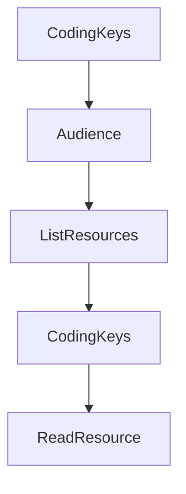

# Chapter 6: Transports, Custom Implementations, and Shutdown

Welcome to **Chapter 6: Transports, Custom Implementations, and Shutdown**. In this part of **MCP Swift SDK Tutorial: Building MCP Clients and Servers in Swift**, you will build an intuitive mental model first, then move into concrete implementation details and practical production tradeoffs.


Transport correctness and graceful shutdown determine production stability.

## Learning Goals

- understand built-in transport behavior and extension points
- implement custom transports without breaking protocol contracts
- apply graceful shutdown patterns for client/server processes
- prevent resource leaks and dangling connections

## Lifecycle Rules

- isolate transport implementation from business handlers
- support orderly termination before forceful cancellation
- set timeout-based shutdown fallbacks for hung operations
- validate signal handling behavior in local and CI environments

## Source References

- [Swift SDK README - Transports](https://github.com/modelcontextprotocol/swift-sdk/blob/main/README.md#transports)
- [Swift SDK README - Custom Transport Implementation](https://github.com/modelcontextprotocol/swift-sdk/blob/main/README.md#custom-transport-implementation)
- [Swift SDK README - Graceful Shutdown](https://github.com/modelcontextprotocol/swift-sdk/blob/main/README.md#graceful-shutdown)

## Summary

You now have runtime lifecycle controls for operating Swift MCP services more safely.

Next: [Chapter 7: Strict Mode, Batching, Logging, and Debugging](07-strict-mode-batching-logging-and-debugging.md)

## Depth Expansion Playbook

## Source Code Walkthrough

### `Sources/MCP/Server/Resources.swift`

The `CodingKeys` interface in [`Sources/MCP/Server/Resources.swift`](https://github.com/modelcontextprotocol/swift-sdk/blob/HEAD/Sources/MCP/Server/Resources.swift) handles a key part of this chapter's functionality:

```swift
    }

    private enum CodingKeys: String, CodingKey {
        case name
        case uri
        case title
        case description
        case mimeType
        case size
        case annotations
        case icons
        case _meta
    }

    public init(from decoder: Decoder) throws {
        let container = try decoder.container(keyedBy: CodingKeys.self)
        name = try container.decode(String.self, forKey: .name)
        uri = try container.decode(String.self, forKey: .uri)
        title = try container.decodeIfPresent(String.self, forKey: .title)
        description = try container.decodeIfPresent(String.self, forKey: .description)
        mimeType = try container.decodeIfPresent(String.self, forKey: .mimeType)
        size = try container.decodeIfPresent(Int.self, forKey: .size)
        annotations = try container.decodeIfPresent(Resource.Annotations.self, forKey: .annotations)
        icons = try container.decodeIfPresent([Icon].self, forKey: .icons)
        _meta = try container.decodeIfPresent(Metadata.self, forKey: ._meta)
    }

    public func encode(to encoder: Encoder) throws {
        var container = encoder.container(keyedBy: CodingKeys.self)
        try container.encode(name, forKey: .name)
        try container.encode(uri, forKey: .uri)
        try container.encodeIfPresent(title, forKey: .title)
```

This interface is important because it defines how MCP Swift SDK Tutorial: Building MCP Clients and Servers in Swift implements the patterns covered in this chapter.

### `Sources/MCP/Server/Resources.swift`

The `Audience` interface in [`Sources/MCP/Server/Resources.swift`](https://github.com/modelcontextprotocol/swift-sdk/blob/HEAD/Sources/MCP/Server/Resources.swift) handles a key part of this chapter's functionality:

```swift
    public struct Annotations: Hashable, Codable, Sendable {
        /// The intended audience for this resource.
        public enum Audience: String, Hashable, Codable, Sendable {
            /// Content intended for end users.
            case user = "user"
            /// Content intended for AI assistants.
            case assistant = "assistant"
        }

        /// An array indicating the intended audience(s) for this resource. For example, `[.user, .assistant]` indicates content useful for both.
        public let audience: [Audience]?
        /// A number from 0.0 to 1.0 indicating the importance of this resource. A value of 1 means "most important" (effectively required), while 0 means "least important".
        public let priority: Double?
        /// An ISO 8601 formatted timestamp indicating when the resource was last modified (e.g., "2025-01-12T15:00:58Z").
        public let lastModified: String?

        public init(
            audience: [Audience]? = nil,
            priority: Double? = nil,
            lastModified: String? = nil
        ) {
            self.audience = audience
            self.priority = priority
            self.lastModified = lastModified
        }
    }
}

// MARK: -

/// To discover available resources, clients send a `resources/list` request.
/// - SeeAlso: https://modelcontextprotocol.io/specification/2025-11-25/server/resources/#listing-resources
```

This interface is important because it defines how MCP Swift SDK Tutorial: Building MCP Clients and Servers in Swift implements the patterns covered in this chapter.

### `Sources/MCP/Server/Resources.swift`

The `ListResources` interface in [`Sources/MCP/Server/Resources.swift`](https://github.com/modelcontextprotocol/swift-sdk/blob/HEAD/Sources/MCP/Server/Resources.swift) handles a key part of this chapter's functionality:

```swift
/// To discover available resources, clients send a `resources/list` request.
/// - SeeAlso: https://modelcontextprotocol.io/specification/2025-11-25/server/resources/#listing-resources
public enum ListResources: Method {
    public static let name: String = "resources/list"

    public struct Parameters: NotRequired, Hashable, Codable, Sendable {
        public let cursor: String?

        public init() {
            self.cursor = nil
        }

        public init(cursor: String) {
            self.cursor = cursor
        }
    }

    public struct Result: Hashable, Codable, Sendable {
        public let resources: [Resource]
        public let nextCursor: String?
        public var _meta: Metadata?

        public init(
            resources: [Resource],
            nextCursor: String? = nil,
            _meta: Metadata? = nil
        ) {
            self.resources = resources
            self.nextCursor = nextCursor
            self._meta = _meta
        }

```

This interface is important because it defines how MCP Swift SDK Tutorial: Building MCP Clients and Servers in Swift implements the patterns covered in this chapter.

### `Sources/MCP/Server/Resources.swift`

The `CodingKeys` interface in [`Sources/MCP/Server/Resources.swift`](https://github.com/modelcontextprotocol/swift-sdk/blob/HEAD/Sources/MCP/Server/Resources.swift) handles a key part of this chapter's functionality:

```swift
    }

    private enum CodingKeys: String, CodingKey {
        case name
        case uri
        case title
        case description
        case mimeType
        case size
        case annotations
        case icons
        case _meta
    }

    public init(from decoder: Decoder) throws {
        let container = try decoder.container(keyedBy: CodingKeys.self)
        name = try container.decode(String.self, forKey: .name)
        uri = try container.decode(String.self, forKey: .uri)
        title = try container.decodeIfPresent(String.self, forKey: .title)
        description = try container.decodeIfPresent(String.self, forKey: .description)
        mimeType = try container.decodeIfPresent(String.self, forKey: .mimeType)
        size = try container.decodeIfPresent(Int.self, forKey: .size)
        annotations = try container.decodeIfPresent(Resource.Annotations.self, forKey: .annotations)
        icons = try container.decodeIfPresent([Icon].self, forKey: .icons)
        _meta = try container.decodeIfPresent(Metadata.self, forKey: ._meta)
    }

    public func encode(to encoder: Encoder) throws {
        var container = encoder.container(keyedBy: CodingKeys.self)
        try container.encode(name, forKey: .name)
        try container.encode(uri, forKey: .uri)
        try container.encodeIfPresent(title, forKey: .title)
```

This interface is important because it defines how MCP Swift SDK Tutorial: Building MCP Clients and Servers in Swift implements the patterns covered in this chapter.


## How These Components Connect


