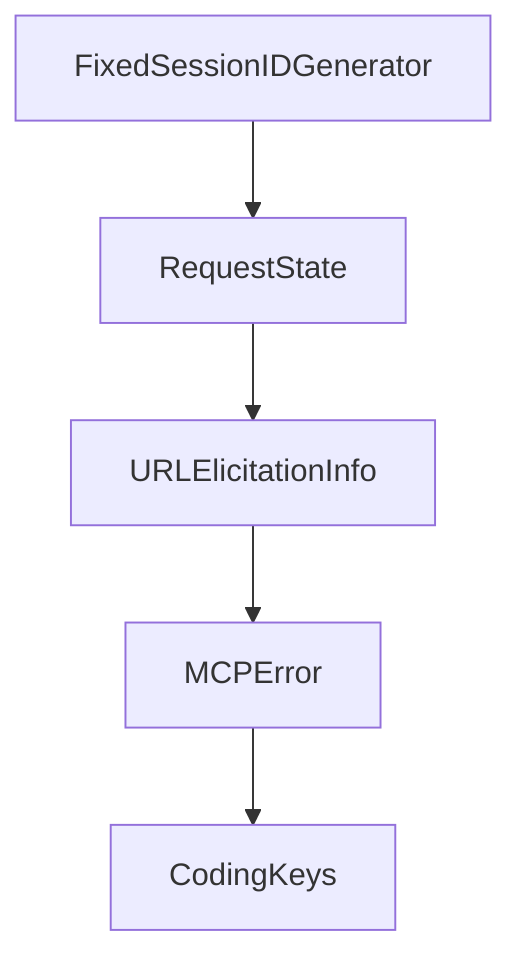

# Chapter 6: Transports, Custom Implementations, and Shutdown

Welcome to **Chapter 6: Transports, Custom Implementations, and Shutdown**. In this part of **MCP Swift SDK Tutorial: Building MCP Clients and Servers in Swift**, you will build an intuitive mental model first, then move into concrete implementation details and practical production tradeoffs.


Transport correctness and graceful shutdown determine production stability.

## Learning Goals

- understand built-in transport behavior and extension points
- implement custom transports without breaking protocol contracts
- apply graceful shutdown patterns for client/server processes
- prevent resource leaks and dangling connections

## Lifecycle Rules

- isolate transport implementation from business handlers
- support orderly termination before forceful cancellation
- set timeout-based shutdown fallbacks for hung operations
- validate signal handling behavior in local and CI environments

## Source References

- [Swift SDK README - Transports](https://github.com/modelcontextprotocol/swift-sdk/blob/main/README.md#transports)
- [Swift SDK README - Custom Transport Implementation](https://github.com/modelcontextprotocol/swift-sdk/blob/main/README.md#custom-transport-implementation)
- [Swift SDK README - Graceful Shutdown](https://github.com/modelcontextprotocol/swift-sdk/blob/main/README.md#graceful-shutdown)

## Summary

You now have runtime lifecycle controls for operating Swift MCP services more safely.

Next: [Chapter 7: Strict Mode, Batching, Logging, and Debugging](07-strict-mode-batching-logging-and-debugging.md)

## Source Code Walkthrough

### `Sources/MCPConformance/Server/HTTPApp.swift`

The `FixedSessionIDGenerator` interface in [`Sources/MCPConformance/Server/HTTPApp.swift`](https://github.com/modelcontextprotocol/swift-sdk/blob/HEAD/Sources/MCPConformance/Server/HTTPApp.swift) handles a key part of this chapter's functionality:

```swift
    // MARK: - Session Management

    private struct FixedSessionIDGenerator: SessionIDGenerator {
        let sessionID: String
        func generateSessionID() -> String { sessionID }
    }

    private func createSessionAndHandle(_ request: HTTPRequest) async -> HTTPResponse {
        let sessionID = UUID().uuidString

        let transport = StatefulHTTPServerTransport(
            sessionIDGenerator: FixedSessionIDGenerator(sessionID: sessionID),
            validationPipeline: validationPipeline,
            retryInterval: configuration.retryInterval,
            logger: logger
        )

        do {
            let server = try await serverFactory(sessionID, transport)
            try await server.start(transport: transport)

            sessions[sessionID] = SessionContext(
                server: server,
                transport: transport,
                createdAt: Date(),
                lastAccessedAt: Date()
            )

            let response = await transport.handleRequest(request)

            // If transport returned an error, clean up
            if case .error = response {
```

This interface is important because it defines how MCP Swift SDK Tutorial: Building MCP Clients and Servers in Swift implements the patterns covered in this chapter.

### `Sources/MCPConformance/Server/HTTPApp.swift`

The `RequestState` interface in [`Sources/MCPConformance/Server/HTTPApp.swift`](https://github.com/modelcontextprotocol/swift-sdk/blob/HEAD/Sources/MCPConformance/Server/HTTPApp.swift) handles a key part of this chapter's functionality:

```swift
    private let app: HTTPApp

    private struct RequestState {
        var head: HTTPRequestHead
        var bodyBuffer: ByteBuffer
    }

    private var requestState: RequestState?

    init(app: HTTPApp) {
        self.app = app
    }

    func channelRead(context: ChannelHandlerContext, data: NIOAny) {
        let part = unwrapInboundIn(data)

        switch part {
        case .head(let head):
            requestState = RequestState(
                head: head,
                bodyBuffer: context.channel.allocator.buffer(capacity: 0)
            )
        case .body(var buffer):
            requestState?.bodyBuffer.writeBuffer(&buffer)
        case .end:
            guard let state = requestState else { return }
            requestState = nil

            nonisolated(unsafe) let ctx = context
            Task { @MainActor in
                await self.handleRequest(state: state, context: ctx)
            }
```

This interface is important because it defines how MCP Swift SDK Tutorial: Building MCP Clients and Servers in Swift implements the patterns covered in this chapter.

### `Sources/MCP/Base/Error.swift`

The `URLElicitationInfo` interface in [`Sources/MCP/Base/Error.swift`](https://github.com/modelcontextprotocol/swift-sdk/blob/HEAD/Sources/MCP/Base/Error.swift) handles a key part of this chapter's functionality:

```swift

/// Information about a required URL elicitation
public struct URLElicitationInfo: Codable, Hashable, Sendable {
    /// Elicitation mode (must be "url")
    public var mode: String
    /// Unique identifier for this elicitation
    public var elicitationId: String
    /// URL for the user to visit
    public var url: String
    /// Message describing the elicitation
    public var message: String

    public init(mode: String = "url", elicitationId: String, url: String, message: String) {
        self.mode = mode
        self.elicitationId = elicitationId
        self.url = url
        self.message = message
    }
}

/// A model context protocol error.
public enum MCPError: Swift.Error, Sendable {
    // Standard JSON-RPC 2.0 errors (-32700 to -32603)
    case parseError(String?)  // -32700
    case invalidRequest(String?)  // -32600
    case methodNotFound(String?)  // -32601
    case invalidParams(String?)  // -32602
    case internalError(String?)  // -32603

    // Server errors (-32000 to -32099)
    case serverError(code: Int, message: String)

```

This interface is important because it defines how MCP Swift SDK Tutorial: Building MCP Clients and Servers in Swift implements the patterns covered in this chapter.

### `Sources/MCP/Base/Error.swift`

The `MCPError` interface in [`Sources/MCP/Base/Error.swift`](https://github.com/modelcontextprotocol/swift-sdk/blob/HEAD/Sources/MCP/Base/Error.swift) handles a key part of this chapter's functionality:

```swift

/// A model context protocol error.
public enum MCPError: Swift.Error, Sendable {
    // Standard JSON-RPC 2.0 errors (-32700 to -32603)
    case parseError(String?)  // -32700
    case invalidRequest(String?)  // -32600
    case methodNotFound(String?)  // -32601
    case invalidParams(String?)  // -32602
    case internalError(String?)  // -32603

    // Server errors (-32000 to -32099)
    case serverError(code: Int, message: String)

    // MCP specific errors
    case urlElicitationRequired(message: String, elicitations: [URLElicitationInfo])  // -32042

    // Transport specific errors
    case connectionClosed
    case transportError(Swift.Error)

    /// The JSON-RPC 2.0 error code
    public var code: Int {
        switch self {
        case .parseError: return -32700
        case .invalidRequest: return -32600
        case .methodNotFound: return -32601
        case .invalidParams: return -32602
        case .internalError: return -32603
        case .serverError(let code, _): return code
        case .urlElicitationRequired: return -32042
        case .connectionClosed: return -32000
        case .transportError: return -32001
```

This interface is important because it defines how MCP Swift SDK Tutorial: Building MCP Clients and Servers in Swift implements the patterns covered in this chapter.


## How These Components Connect


