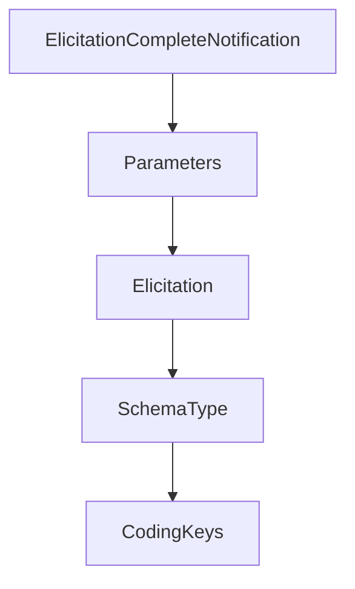

# Chapter 7: Strict Mode, Batching, Logging, and Debugging

Welcome to **Chapter 7: Strict Mode, Batching, Logging, and Debugging**. In this part of **MCP Swift SDK Tutorial: Building MCP Clients and Servers in Swift**, you will build an intuitive mental model first, then move into concrete implementation details and practical production tradeoffs.


Advanced client controls improve reliability when used intentionally.

## Learning Goals

- use strict vs default configuration modes based on risk posture
- apply request batching for throughput-sensitive paths
- instrument logging/debug flows for faster issue isolation
- avoid hiding capability mismatches behind permissive defaults

## Practical Guidance

- enable strict mode for environments with strong protocol guarantees
- keep batching isolated to idempotent or safe request clusters
- log capability negotiation and transport errors with correlation context
- validate non-strict fallback behavior explicitly in tests

## Source References

- [Swift SDK README - Strict vs Non-Strict Configuration](https://github.com/modelcontextprotocol/swift-sdk/blob/main/README.md#strict-vs-non-strict-configuration)
- [Swift SDK README - Request Batching](https://github.com/modelcontextprotocol/swift-sdk/blob/main/README.md#request-batching)
- [Swift SDK README - Debugging and Logging](https://github.com/modelcontextprotocol/swift-sdk/blob/main/README.md#debugging-and-logging)

## Summary

You now have a control model for balancing safety and performance in Swift MCP clients.

Next: [Chapter 8: Release, Versioning, and Production Guidelines](08-release-versioning-and-production-guidelines.md)

## Depth Expansion Playbook

## Source Code Walkthrough

### `Sources/MCP/Client/Elicitation.swift`

The `ElicitationCompleteNotification` interface in [`Sources/MCP/Client/Elicitation.swift`](https://github.com/modelcontextprotocol/swift-sdk/blob/HEAD/Sources/MCP/Client/Elicitation.swift) handles a key part of this chapter's functionality:

```swift

/// Notification sent when a URL-based elicitation is complete
public struct ElicitationCompleteNotification: Notification {
    public static let name = "notifications/elicitation/complete"

    public struct Parameters: Hashable, Codable, Sendable {
        /// The elicitation ID that was completed
        public var elicitationId: String

        public init(elicitationId: String) {
            self.elicitationId = elicitationId
        }
    }
}

```

This interface is important because it defines how MCP Swift SDK Tutorial: Building MCP Clients and Servers in Swift implements the patterns covered in this chapter.

### `Sources/MCP/Client/Elicitation.swift`

The `Parameters` interface in [`Sources/MCP/Client/Elicitation.swift`](https://github.com/modelcontextprotocol/swift-sdk/blob/HEAD/Sources/MCP/Client/Elicitation.swift) handles a key part of this chapter's functionality:

```swift
    public static let name = "elicitation/create"

    public enum Parameters: Hashable, Sendable {
        /// Form-based elicitation parameters
        case form(FormParameters)
        /// URL-based elicitation parameters
        case url(URLParameters)

        /// Parameters for form-based elicitation
        public struct FormParameters: Hashable, Codable, Sendable {
            /// Message displayed to the user describing the request
            public var message: String
            /// Elicitation mode (optional for backward compatibility, defaults to form)
            public var mode: Elicitation.Mode?
            /// Schema describing the expected response content (required per spec)
            public var requestedSchema: Elicitation.RequestSchema
            /// Optional metadata
            public var _meta: Metadata?

            public init(
                message: String,
                mode: Elicitation.Mode? = nil,
                requestedSchema: Elicitation.RequestSchema = .init(),
                _meta: Metadata? = nil
            ) {
                self.message = message
                self.mode = mode
                self.requestedSchema = requestedSchema
                self._meta = _meta
            }
        }

```

This interface is important because it defines how MCP Swift SDK Tutorial: Building MCP Clients and Servers in Swift implements the patterns covered in this chapter.

### `Sources/MCP/Client/Elicitation.swift`

The `Elicitation` interface in [`Sources/MCP/Client/Elicitation.swift`](https://github.com/modelcontextprotocol/swift-sdk/blob/HEAD/Sources/MCP/Client/Elicitation.swift) handles a key part of this chapter's functionality:

```swift
/// Servers use elicitation to collect structured input from users via the client.
/// The schema subset mirrors the 2025-11-25 revision of the specification.
public enum Elicitation {
    /// Schema describing the expected response content.
    public struct RequestSchema: Hashable, Codable, Sendable {
        /// Supported top-level types. Currently limited to objects.
        public enum SchemaType: String, Hashable, Codable, Sendable {
            case object
        }

        /// Schema title presented to users.
        public var title: String?
        /// Schema description providing additional guidance.
        public var description: String?
        /// Raw JSON Schema fragments describing the requested fields.
        public var properties: [String: Value]
        /// List of required field keys.
        public var required: [String]?
        /// Top-level schema type. Defaults to `object`.
        public var type: SchemaType

        public init(
            title: String? = nil,
            description: String? = nil,
            properties: [String: Value] = [:],
            required: [String]? = nil,
            type: SchemaType = .object
        ) {
            self.title = title
            self.description = description
            self.properties = properties
            self.required = required
```

This interface is important because it defines how MCP Swift SDK Tutorial: Building MCP Clients and Servers in Swift implements the patterns covered in this chapter.

### `Sources/MCP/Client/Elicitation.swift`

The `SchemaType` interface in [`Sources/MCP/Client/Elicitation.swift`](https://github.com/modelcontextprotocol/swift-sdk/blob/HEAD/Sources/MCP/Client/Elicitation.swift) handles a key part of this chapter's functionality:

```swift
    public struct RequestSchema: Hashable, Codable, Sendable {
        /// Supported top-level types. Currently limited to objects.
        public enum SchemaType: String, Hashable, Codable, Sendable {
            case object
        }

        /// Schema title presented to users.
        public var title: String?
        /// Schema description providing additional guidance.
        public var description: String?
        /// Raw JSON Schema fragments describing the requested fields.
        public var properties: [String: Value]
        /// List of required field keys.
        public var required: [String]?
        /// Top-level schema type. Defaults to `object`.
        public var type: SchemaType

        public init(
            title: String? = nil,
            description: String? = nil,
            properties: [String: Value] = [:],
            required: [String]? = nil,
            type: SchemaType = .object
        ) {
            self.title = title
            self.description = description
            self.properties = properties
            self.required = required
            self.type = type
        }

        private enum CodingKeys: String, CodingKey {
```

This interface is important because it defines how MCP Swift SDK Tutorial: Building MCP Clients and Servers in Swift implements the patterns covered in this chapter.


## How These Components Connect


