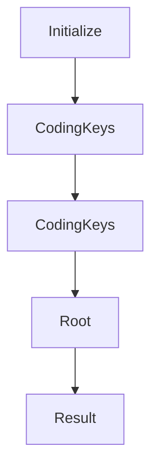

# Chapter 8: Release, Versioning, and Production Guidelines

Welcome to **Chapter 8: Release, Versioning, and Production Guidelines**. In this part of **MCP Swift SDK Tutorial: Building MCP Clients and Servers in Swift**, you will build an intuitive mental model first, then move into concrete implementation details and practical production tradeoffs.


Long-term stability comes from disciplined release and compatibility planning.

## Learning Goals

- track SDK release cadence and protocol revision drift
- validate compatibility assumptions before production upgrades
- define production readiness checks for Swift MCP services
- maintain contribution loops for upstream improvements

## Production Checklist

1. monitor SDK release changes and update windows
2. cross-check README protocol references against current MCP revision
3. run integration tests across client/server transport paths
4. document known incompatibilities and mitigation plans

## Source References

- [Swift SDK Releases](https://github.com/modelcontextprotocol/swift-sdk/releases)
- [Swift SDK README](https://github.com/modelcontextprotocol/swift-sdk/blob/main/README.md)
- [MCP Specification 2025-11-25](https://modelcontextprotocol.io/specification/2025-11-25)

## Summary

You now have a release-aware operating model for shipping Swift MCP systems with fewer surprises.

Next: Continue with [MCP Use Tutorial](../mcp-use-tutorial/)

## Source Code Walkthrough

### `Sources/MCP/Base/Lifecycle.swift`

The `Initialize` interface in [`Sources/MCP/Base/Lifecycle.swift`](https://github.com/modelcontextprotocol/swift-sdk/blob/HEAD/Sources/MCP/Base/Lifecycle.swift) handles a key part of this chapter's functionality:

```swift
///
/// - SeeAlso: https://spec.modelcontextprotocol.io/specification/2024-11-05/basic/lifecycle/#initialization
public enum Initialize: Method {
    public static let name: String = "initialize"

    public struct Parameters: Hashable, Codable, Sendable {
        public let protocolVersion: String
        public let capabilities: Client.Capabilities
        public let clientInfo: Client.Info

        public init(
            protocolVersion: String = Version.latest,
            capabilities: Client.Capabilities,
            clientInfo: Client.Info
        ) {
            self.protocolVersion = protocolVersion
            self.capabilities = capabilities
            self.clientInfo = clientInfo
        }

        private enum CodingKeys: String, CodingKey {
            case protocolVersion, capabilities, clientInfo
        }

        public init(from decoder: Decoder) throws {
            let container = try decoder.container(keyedBy: CodingKeys.self)
            protocolVersion =
                try container.decodeIfPresent(String.self, forKey: .protocolVersion)
                ?? Version.latest
            capabilities =
                try container.decodeIfPresent(Client.Capabilities.self, forKey: .capabilities)
                ?? .init()
```

This interface is important because it defines how MCP Swift SDK Tutorial: Building MCP Clients and Servers in Swift implements the patterns covered in this chapter.

### `Sources/MCP/Base/Lifecycle.swift`

The `CodingKeys` interface in [`Sources/MCP/Base/Lifecycle.swift`](https://github.com/modelcontextprotocol/swift-sdk/blob/HEAD/Sources/MCP/Base/Lifecycle.swift) handles a key part of this chapter's functionality:

```swift
        }

        private enum CodingKeys: String, CodingKey {
            case protocolVersion, capabilities, clientInfo
        }

        public init(from decoder: Decoder) throws {
            let container = try decoder.container(keyedBy: CodingKeys.self)
            protocolVersion =
                try container.decodeIfPresent(String.self, forKey: .protocolVersion)
                ?? Version.latest
            capabilities =
                try container.decodeIfPresent(Client.Capabilities.self, forKey: .capabilities)
                ?? .init()
            clientInfo =
                try container.decodeIfPresent(Client.Info.self, forKey: .clientInfo)
                ?? .init(name: "unknown", version: "0.0.0")
        }
    }

    public struct Result: Hashable, Codable, Sendable {
        public let protocolVersion: String
        public let capabilities: Server.Capabilities
        public let serverInfo: Server.Info
        public let instructions: String?
        public var _meta: Metadata?

        public init(
            protocolVersion: String,
            capabilities: Server.Capabilities,
            serverInfo: Server.Info,
            instructions: String? = nil,
```

This interface is important because it defines how MCP Swift SDK Tutorial: Building MCP Clients and Servers in Swift implements the patterns covered in this chapter.

### `Sources/MCP/Base/Lifecycle.swift`

The `CodingKeys` interface in [`Sources/MCP/Base/Lifecycle.swift`](https://github.com/modelcontextprotocol/swift-sdk/blob/HEAD/Sources/MCP/Base/Lifecycle.swift) handles a key part of this chapter's functionality:

```swift
        }

        private enum CodingKeys: String, CodingKey {
            case protocolVersion, capabilities, clientInfo
        }

        public init(from decoder: Decoder) throws {
            let container = try decoder.container(keyedBy: CodingKeys.self)
            protocolVersion =
                try container.decodeIfPresent(String.self, forKey: .protocolVersion)
                ?? Version.latest
            capabilities =
                try container.decodeIfPresent(Client.Capabilities.self, forKey: .capabilities)
                ?? .init()
            clientInfo =
                try container.decodeIfPresent(Client.Info.self, forKey: .clientInfo)
                ?? .init(name: "unknown", version: "0.0.0")
        }
    }

    public struct Result: Hashable, Codable, Sendable {
        public let protocolVersion: String
        public let capabilities: Server.Capabilities
        public let serverInfo: Server.Info
        public let instructions: String?
        public var _meta: Metadata?

        public init(
            protocolVersion: String,
            capabilities: Server.Capabilities,
            serverInfo: Server.Info,
            instructions: String? = nil,
```

This interface is important because it defines how MCP Swift SDK Tutorial: Building MCP Clients and Servers in Swift implements the patterns covered in this chapter.

### `Sources/MCP/Client/Roots.swift`

The `Root` interface in [`Sources/MCP/Client/Roots.swift`](https://github.com/modelcontextprotocol/swift-sdk/blob/HEAD/Sources/MCP/Client/Roots.swift) handles a key part of this chapter's functionality:

```swift

/// The Model Context Protocol (MCP) provides a mechanism for clients to expose
/// filesystem boundaries to servers through roots. Roots allow servers to understand
/// the scope of filesystem access they can request, enabling safe and controlled
/// file operations.
///
/// Unlike Resources/Tools/Prompts, Roots use bidirectional communication:
/// - Servers send `roots/list` requests TO clients
/// - Clients respond with available roots
/// - Clients send `notifications/roots/list_changed` when roots change
///
/// - SeeAlso: https://modelcontextprotocol.io/specification/2025-11-25/client/roots
public struct Root: Hashable, Codable, Sendable {
    /// The root URI (must use file:// scheme)
    public let uri: String
    /// Optional human-readable name for the root
    public let name: String?
    /// Optional metadata
    public var _meta: Metadata?

    public init(
        uri: String,
        name: String? = nil,
        _meta: Metadata? = nil
    ) {
        self.uri = uri
        self.name = name
        self._meta = _meta
    }

    private enum CodingKeys: String, CodingKey {
        case uri
```

This interface is important because it defines how MCP Swift SDK Tutorial: Building MCP Clients and Servers in Swift implements the patterns covered in this chapter.


## How These Components Connect


