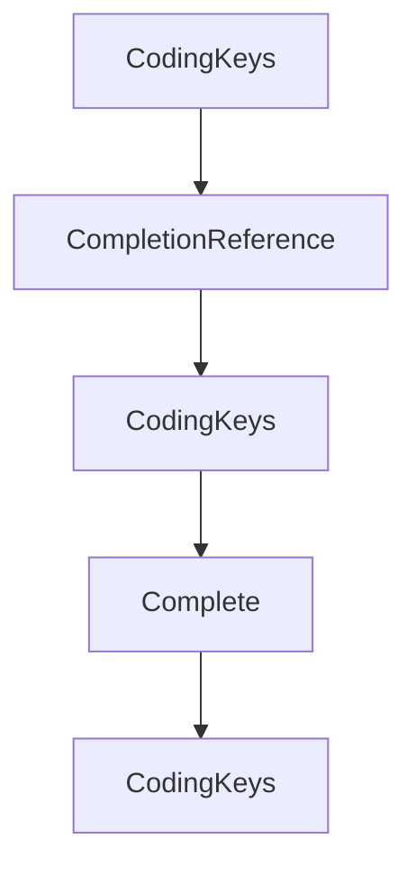

# Chapter 8: Release, Versioning, and Production Guidelines

Welcome to **Chapter 8: Release, Versioning, and Production Guidelines**. In this part of **MCP Swift SDK Tutorial: Building MCP Clients and Servers in Swift**, you will build an intuitive mental model first, then move into concrete implementation details and practical production tradeoffs.


Long-term stability comes from disciplined release and compatibility planning.

## Learning Goals

- track SDK release cadence and protocol revision drift
- validate compatibility assumptions before production upgrades
- define production readiness checks for Swift MCP services
- maintain contribution loops for upstream improvements

## Production Checklist

1. monitor SDK release changes and update windows
2. cross-check README protocol references against current MCP revision
3. run integration tests across client/server transport paths
4. document known incompatibilities and mitigation plans

## Source References

- [Swift SDK Releases](https://github.com/modelcontextprotocol/swift-sdk/releases)
- [Swift SDK README](https://github.com/modelcontextprotocol/swift-sdk/blob/main/README.md)
- [MCP Specification 2025-11-25](https://modelcontextprotocol.io/specification/2025-11-25)

## Summary

You now have a release-aware operating model for shipping Swift MCP systems with fewer surprises.

Next: Continue with [MCP Use Tutorial](../mcp-use-tutorial/)

## Depth Expansion Playbook

## Source Code Walkthrough

### `Sources/MCP/Server/Completion.swift`

The `CodingKeys` interface in [`Sources/MCP/Server/Completion.swift`](https://github.com/modelcontextprotocol/swift-sdk/blob/HEAD/Sources/MCP/Server/Completion.swift) handles a key part of this chapter's functionality:

```swift
    }

    private enum CodingKeys: String, CodingKey {
        case type, uri
    }

    public func encode(to encoder: Encoder) throws {
        var container = encoder.container(keyedBy: CodingKeys.self)
        try container.encode("ref/resource", forKey: .type)
        try container.encode(uri, forKey: .uri)
    }

    public init(from decoder: Decoder) throws {
        let container = try decoder.container(keyedBy: CodingKeys.self)
        let type = try container.decode(String.self, forKey: .type)
        guard type == "ref/resource" else {
            throw DecodingError.dataCorruptedError(
                forKey: .type,
                in: container,
                debugDescription: "Expected ref/resource type"
            )
        }
        uri = try container.decode(String.self, forKey: .uri)
    }
}

/// A reference type for completion requests (either prompt or resource)
public enum CompletionReference: Hashable, Codable, Sendable {
    /// References a prompt by name
    case prompt(PromptReference)
    /// References a resource URI
    case resource(ResourceReference)
```

This interface is important because it defines how MCP Swift SDK Tutorial: Building MCP Clients and Servers in Swift implements the patterns covered in this chapter.

### `Sources/MCP/Server/Completion.swift`

The `CompletionReference` interface in [`Sources/MCP/Server/Completion.swift`](https://github.com/modelcontextprotocol/swift-sdk/blob/HEAD/Sources/MCP/Server/Completion.swift) handles a key part of this chapter's functionality:

```swift

/// A reference type for completion requests (either prompt or resource)
public enum CompletionReference: Hashable, Codable, Sendable {
    /// References a prompt by name
    case prompt(PromptReference)
    /// References a resource URI
    case resource(ResourceReference)

    private enum CodingKeys: String, CodingKey {
        case type
    }

    public init(from decoder: Decoder) throws {
        let container = try decoder.container(keyedBy: CodingKeys.self)
        let type = try container.decode(String.self, forKey: .type)

        switch type {
        case "ref/prompt":
            self = .prompt(try PromptReference(from: decoder))
        case "ref/resource":
            self = .resource(try ResourceReference(from: decoder))
        default:
            throw DecodingError.dataCorruptedError(
                forKey: .type,
                in: container,
                debugDescription: "Unknown reference type: \(type)"
            )
        }
    }

    public func encode(to encoder: Encoder) throws {
        switch self {
```

This interface is important because it defines how MCP Swift SDK Tutorial: Building MCP Clients and Servers in Swift implements the patterns covered in this chapter.

### `Sources/MCP/Server/Completion.swift`

The `CodingKeys` interface in [`Sources/MCP/Server/Completion.swift`](https://github.com/modelcontextprotocol/swift-sdk/blob/HEAD/Sources/MCP/Server/Completion.swift) handles a key part of this chapter's functionality:

```swift
    }

    private enum CodingKeys: String, CodingKey {
        case type, uri
    }

    public func encode(to encoder: Encoder) throws {
        var container = encoder.container(keyedBy: CodingKeys.self)
        try container.encode("ref/resource", forKey: .type)
        try container.encode(uri, forKey: .uri)
    }

    public init(from decoder: Decoder) throws {
        let container = try decoder.container(keyedBy: CodingKeys.self)
        let type = try container.decode(String.self, forKey: .type)
        guard type == "ref/resource" else {
            throw DecodingError.dataCorruptedError(
                forKey: .type,
                in: container,
                debugDescription: "Expected ref/resource type"
            )
        }
        uri = try container.decode(String.self, forKey: .uri)
    }
}

/// A reference type for completion requests (either prompt or resource)
public enum CompletionReference: Hashable, Codable, Sendable {
    /// References a prompt by name
    case prompt(PromptReference)
    /// References a resource URI
    case resource(ResourceReference)
```

This interface is important because it defines how MCP Swift SDK Tutorial: Building MCP Clients and Servers in Swift implements the patterns covered in this chapter.

### `Sources/MCP/Server/Completion.swift`

The `Complete` interface in [`Sources/MCP/Server/Completion.swift`](https://github.com/modelcontextprotocol/swift-sdk/blob/HEAD/Sources/MCP/Server/Completion.swift) handles a key part of this chapter's functionality:

```swift
/// To get completion suggestions, clients send a `completion/complete` request.
/// - SeeAlso: https://modelcontextprotocol.io/specification/2025-11-25/server/utilities/completion/
public enum Complete: Method {
    public static let name = "completion/complete"

    public struct Parameters: Hashable, Codable, Sendable {
        /// The reference to what is being completed
        public let ref: CompletionReference
        /// The argument being completed
        public let argument: Argument
        /// Optional context with already-resolved arguments
        public let context: Context?

        public init(
            ref: CompletionReference,
            argument: Argument,
            context: Context? = nil
        ) {
            self.ref = ref
            self.argument = argument
            self.context = context
        }

        /// The argument being completed
        public struct Argument: Hashable, Codable, Sendable {
            /// The argument name
            public let name: String
            /// The current value (partial or complete)
            public let value: String

            public init(name: String, value: String) {
                self.name = name
```

This interface is important because it defines how MCP Swift SDK Tutorial: Building MCP Clients and Servers in Swift implements the patterns covered in this chapter.


## How These Components Connect


