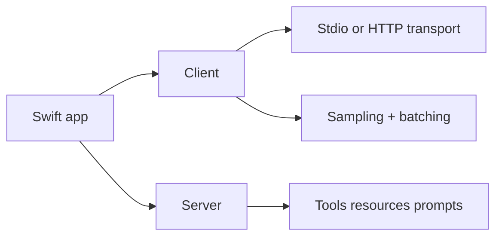

# MCP Swift SDK Tutorial: Building MCP Clients and Servers in Swift

> Learn how to implement MCP client and server workflows with `modelcontextprotocol/swift-sdk`, including transport options, sampling, batching, and graceful service lifecycle control.

## Why This Track Matters

Swift teams building local-first AI tooling and Apple-platform workflows need clear MCP integration guidance. The official Swift SDK provides both client and server surfaces with practical transport and lifecycle controls.

This track focuses on:

- choosing transport and capability strategies for Swift clients
- implementing server tools/resources/prompts with safer lifecycle handling
- using sampling and batching patterns without losing user control
- managing strict-mode behavior, debugging, and release drift

## Current Snapshot (auto-updated)

- repository: [`modelcontextprotocol/swift-sdk`](https://github.com/modelcontextprotocol/swift-sdk)
- stars: about **1.2k**
- latest release: [`0.10.2`](https://github.com/modelcontextprotocol/swift-sdk/releases/tag/0.10.2)
- recent activity: repository is actively maintained; verify latest commits before production rollout
- runtime baseline: Swift 6.0+ (Xcode 16+)
- docs note: README references MCP `2025-03-26` as latest, so verify against current protocol revisions before major rollouts

## Mental Model

## Chapter Guide

| Chapter | Key Question | Outcome |
|:--------|:-------------|:--------|
| [01 - Getting Started and Package Baseline](01-getting-started-and-package-baseline.md) | What is the minimal setup for Swift MCP projects? | Faster onboarding |
| [02 - Client Transport and Capability Negotiation](02-client-transport-and-capability-negotiation.md) | How do I configure Swift clients for local and remote servers? | Better client reliability |
| [03 - Tools, Resources, Prompts, and Request Patterns](03-tools-resources-prompts-and-request-patterns.md) | How should clients interact with server primitives cleanly? | Cleaner capability usage |
| [04 - Sampling, Human-in-the-Loop, and Error Handling](04-sampling-human-in-the-loop-and-error-handling.md) | How do I run sampling safely with user oversight? | Safer AI interaction |
| [05 - Server Setup, Hooks, and Primitive Authoring](05-server-setup-hooks-and-primitive-authoring.md) | How do I build robust Swift MCP servers? | Stronger server foundations |
| [06 - Transports, Custom Implementations, and Shutdown](06-transports-custom-implementations-and-shutdown.md) | How do I run transport and lifecycle controls in production? | Better runtime resilience |
| [07 - Strict Mode, Batching, Logging, and Debugging](07-strict-mode-batching-logging-and-debugging.md) | How do advanced client controls affect reliability and observability? | Improved operations |
| [08 - Release, Versioning, and Production Guidelines](08-release-versioning-and-production-guidelines.md) | How do teams maintain Swift MCP systems over time? | Long-term maintainability |

## What You Will Learn

- how to configure Swift MCP clients/servers across stdio and HTTP paths
- how to apply sampling and batching with stronger user-control boundaries
- how to use lifecycle hooks and shutdown behavior to reduce runtime issues
- how to plan upgrades with protocol-version awareness

## Source References

- [Swift SDK README](https://github.com/modelcontextprotocol/swift-sdk/blob/main/README.md)
- [Swift SDK Releases](https://github.com/modelcontextprotocol/swift-sdk/releases)
- [MCP Specification](https://modelcontextprotocol.io/specification/2025-11-25)

## Related Tutorials

- [MCP Specification Tutorial](../mcp-specification-tutorial/)
- [MCP Rust SDK Tutorial](../mcp-rust-sdk-tutorial/)
- [MCP Go SDK Tutorial](../mcp-go-sdk-tutorial/)
- [MCP Java SDK Tutorial](../mcp-java-sdk-tutorial/)

---

Start with [Chapter 1: Getting Started and Package Baseline](01-getting-started-and-package-baseline.md).

## Navigation & Backlinks

- [Start Here: Chapter 1: Getting Started and Package Baseline](01-getting-started-and-package-baseline.md)
- [Back to Main Catalog](../../README.md#-tutorial-catalog)
- [Browse A-Z Tutorial Directory](../../discoverability/tutorial-directory.md)
- [Search by Intent](../../discoverability/query-hub.md)
- [Explore Category Hubs](../../README.md#category-hubs)

## Full Chapter Map

1. [Chapter 1: Getting Started and Package Baseline](01-getting-started-and-package-baseline.md)
2. [Chapter 2: Client Transport and Capability Negotiation](02-client-transport-and-capability-negotiation.md)
3. [Chapter 3: Tools, Resources, Prompts, and Request Patterns](03-tools-resources-prompts-and-request-patterns.md)
4. [Chapter 4: Sampling, Human-in-the-Loop, and Error Handling](04-sampling-human-in-the-loop-and-error-handling.md)
5. [Chapter 5: Server Setup, Hooks, and Primitive Authoring](05-server-setup-hooks-and-primitive-authoring.md)
6. [Chapter 6: Transports, Custom Implementations, and Shutdown](06-transports-custom-implementations-and-shutdown.md)
7. [Chapter 7: Strict Mode, Batching, Logging, and Debugging](07-strict-mode-batching-logging-and-debugging.md)
8. [Chapter 8: Release, Versioning, and Production Guidelines](08-release-versioning-and-production-guidelines.md)

*Generated by [AI Codebase Knowledge Builder](https://github.com/The-Pocket/Tutorial-Codebase-Knowledge)*
