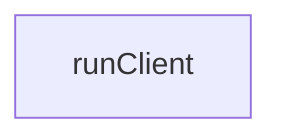

# Chapter 1: Getting Started and Package Model

Welcome to **Chapter 1: Getting Started and Package Model**. In this part of **MCP TypeScript SDK Tutorial: Building and Migrating MCP Clients and Servers in TypeScript**, you will build an intuitive mental model first, then move into concrete implementation details and practical production tradeoffs.


This chapter establishes a clean package baseline for MCP TypeScript development.

## Learning Goals

- distinguish v1 and v2 branch expectations before coding
- choose the right split packages for your use case
- run first client/server examples from the monorepo
- avoid dependency drift around `zod` and runtime versions

## First-Run Sequence

1. confirm Node.js 20+ for v2-oriented work
2. install only needed packages (`client`, `server`, optional adapters)
3. run example server and example client from repo docs
4. lock package versions in your project before scaling usage

## Package Baseline

```bash
# client-only usage
npm install @modelcontextprotocol/client zod

# server-only usage
npm install @modelcontextprotocol/server zod

# node HTTP transport adapter
npm install @modelcontextprotocol/node
```

## Source References

- [TypeScript SDK README](https://github.com/modelcontextprotocol/typescript-sdk/blob/main/README.md)
- [Documents Index](https://github.com/modelcontextprotocol/typescript-sdk/blob/main/docs/documents.md)
- [FAQ - Zod recursion issue](https://github.com/modelcontextprotocol/typescript-sdk/blob/main/docs/faq.md)

## Summary

You now have a stable package and runtime baseline for SDK work.

Next: [Chapter 2: Server Transports and Deployment Patterns](02-server-transports-and-deployment-patterns.md)

## Depth Expansion Playbook

## Source Code Walkthrough

### `scripts/cli.ts`

The `runClient` function in [`scripts/cli.ts`](https://github.com/modelcontextprotocol/typescript-sdk/blob/HEAD/scripts/cli.ts) handles a key part of this chapter's functionality:

```ts
import { ListResourcesResultSchema } from '../src/types.js';

async function runClient(url_or_command: string, args: string[]) {
    const client = new Client(
        {
            name: 'mcp-typescript test client',
            version: '0.1.0'
        },
        {
            capabilities: {
                sampling: {}
            }
        }
    );

    let clientTransport;

    let url: URL | undefined = undefined;
    try {
        url = new URL(url_or_command);
    } catch {
        // Ignore
    }

    if (url?.protocol === 'http:' || url?.protocol === 'https:') {
        clientTransport = new SSEClientTransport(new URL(url_or_command));
    } else if (url?.protocol === 'ws:' || url?.protocol === 'wss:') {
        clientTransport = new WebSocketClientTransport(new URL(url_or_command));
    } else {
        clientTransport = new StdioClientTransport({
            command: url_or_command,
            args
```

This function is important because it defines how MCP TypeScript SDK Tutorial: Building and Migrating MCP Clients and Servers in TypeScript implements the patterns covered in this chapter.


## How These Components Connect


