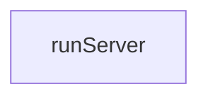

# Chapter 2: Server Transports and Deployment Patterns

Welcome to **Chapter 2: Server Transports and Deployment Patterns**. In this part of **MCP TypeScript SDK Tutorial: Building and Migrating MCP Clients and Servers in TypeScript**, you will build an intuitive mental model first, then move into concrete implementation details and practical production tradeoffs.


Server design starts with transport choice and state model, not with tool code.

## Learning Goals

- choose between stateless and stateful Streamable HTTP modes
- understand where deprecated SSE still matters
- map deployment pattern to session/event storage strategy
- pick framework adapter based on runtime constraints

## Deployment Pattern Matrix

| Pattern | Best For | Tradeoff |
|:--------|:---------|:---------|
| Stateless Streamable HTTP | simple API-style servers | no resumability/session continuity |
| Stateful + event store | richer interactions and resumability | external storage complexity |
| Local state + message routing | sticky-session architectures | highest operational complexity |

## Adapter Guidance

- `@modelcontextprotocol/node` for Node `http` integration
- `@modelcontextprotocol/express` for Express defaults + host validation helpers
- `@modelcontextprotocol/hono` for web-standard request handling

## Source References

- [Server Docs](https://github.com/modelcontextprotocol/typescript-sdk/blob/main/docs/server.md)
- [Server Examples Index](https://github.com/modelcontextprotocol/typescript-sdk/blob/main/examples/server/README.md)
- [Node Adapter README](https://github.com/modelcontextprotocol/typescript-sdk/blob/main/packages/middleware/node/README.md)

## Summary

You now have a transport-first architecture model for server implementation.

Next: [Chapter 3: Client Transports, OAuth, and Backwards Compatibility](03-client-transports-oauth-and-backwards-compatibility.md)

## Depth Expansion Playbook

## Source Code Walkthrough

### `scripts/cli.ts`

The `runServer` function in [`scripts/cli.ts`](https://github.com/modelcontextprotocol/typescript-sdk/blob/HEAD/scripts/cli.ts) handles a key part of this chapter's functionality:

```ts
}

async function runServer(port: number | null) {
    if (port !== null) {
        const app = express();

        let servers: Server[] = [];

        app.get('/sse', async (req, res) => {
            console.log('Got new SSE connection');

            const transport = new SSEServerTransport('/message', res);
            const server = new Server(
                {
                    name: 'mcp-typescript test server',
                    version: '0.1.0'
                },
                {
                    capabilities: {}
                }
            );

            servers.push(server);

            server.onclose = () => {
                console.log('SSE connection closed');
                servers = servers.filter(s => s !== server);
            };

            await server.connect(transport);
        });

```

This function is important because it defines how MCP TypeScript SDK Tutorial: Building and Migrating MCP Clients and Servers in TypeScript implements the patterns covered in this chapter.


## How These Components Connect


