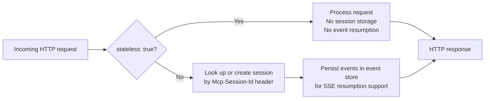
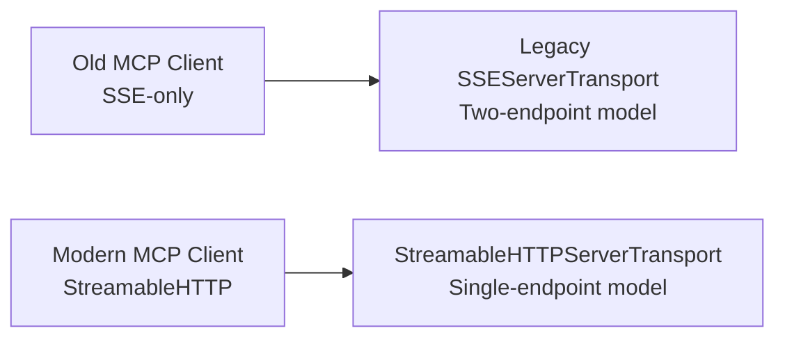

# Chapter 2: Server Transports and Deployment Patterns

Server architecture in the v2 TypeScript SDK begins with transport selection. The transport determines the deployment model, session management strategy, and which framework adapter (if any) you need. This chapter maps available transports to deployment scenarios.

## Learning Goals

- Choose between stateless and stateful StreamableHTTP modes
- Understand where the legacy SSE transport still matters
- Map deployment pattern to session and event storage strategy
- Pick the right framework adapter for your runtime

## Transport Options Overview

```mermaid
graph TD
    TRANSPORTS[Server Transports in v2]
    TRANSPORTS --> STDIO[StdioServerTransport\n@modelcontextprotocol/server\nLocal subprocess - desktop clients]
    TRANSPORTS --> WEB_STD[WebStandardStreamableHTTPServerTransport\n@modelcontextprotocol/server\nWeb-standard Request/Response APIs]
    TRANSPORTS --> NODE_HTTP[NodeStreamableHTTPServerTransport\n@modelcontextprotocol/node\nNode.js native http module]
    TRANSPORTS --> SSE_LEGACY[SSEServerTransport\n@modelcontextprotocol/server\nLegacy compatibility only]
```

## Stdio Transport

The simplest and most universal transport. Used by Claude Desktop, Cursor, Windsurf, and any MCP host that spawns servers as child processes.

```typescript
import { McpServer } from '@modelcontextprotocol/server';
import { StdioServerTransport } from '@modelcontextprotocol/server';

const server = new McpServer({ name: "my-server", version: "1.0.0" });
// ... register tools, resources, prompts ...
await server.connect(new StdioServerTransport());
```

No HTTP server, no port management, no sessions. The MCP protocol runs over stdin/stdout. All logging must go to `process.stderr` to avoid corrupting the JSON-RPC stream.

## Web-Standard StreamableHTTP Transport

`WebStandardStreamableHTTPServerTransport` uses Web API types (`Request`, `Response`, `ReadableStream`) — compatible with any runtime that implements the Web Platform APIs: Hono, Cloudflare Workers, Deno, Bun, and Node.js with `@modelcontextprotocol/hono`.

```typescript
import { McpServer } from '@modelcontextprotocol/server';
import { WebStandardStreamableHTTPServerTransport } from '@modelcontextprotocol/server';
import { Hono } from 'hono';
import { createHonoHandler } from '@modelcontextprotocol/hono';

const app = new Hono();
const server = new McpServer({ name: "my-server", version: "1.0.0" });

// Stateless mode — no session storage needed
app.all('/mcp', createHonoHandler({
  serverFactory: () => server,
  options: { stateless: true }
}));
```

### Stateless vs Stateful Mode



**Stateless mode** (`stateless: true`):
- Each request is independent — no session state
- No external storage needed
- Cannot resume interrupted SSE streams
- Ideal for simple request-response tool servers

**Stateful mode** (default):
- Each client gets a session ID in the `Mcp-Session-Id` header
- Server maintains session state (connection, pending requests)
- Requires an event store for SSE stream resumption
- Supports long-running tool executions and streaming results

## Node.js StreamableHTTP Transport

`NodeStreamableHTTPServerTransport` (from `@modelcontextprotocol/node`) wraps the Node.js `http.IncomingMessage`/`http.ServerResponse` types. Use this when you're running Node.js native `http` or Express.

```typescript
import { createServer } from 'node:http';
import { McpServer } from '@modelcontextprotocol/server';
import { NodeStreamableHTTPServerTransport } from '@modelcontextprotocol/node';
import { createNodeHandler } from '@modelcontextprotocol/node';

const server = new McpServer({ name: "my-server", version: "1.0.0" });
// register tools...

const httpServer = createServer(createNodeHandler({
  serverFactory: () => server,
  options: { stateless: true }
}));

httpServer.listen(3000);
```

## Express Adapter

```typescript
import express from 'express';
import { McpServer } from '@modelcontextprotocol/server';
import { createExpressHandler } from '@modelcontextprotocol/express';

const app = express();
const server = new McpServer({ name: "my-server", version: "1.0.0" });

app.all('/mcp', createExpressHandler({
  serverFactory: () => server
}));

app.listen(3000);
```

The Express adapter also provides host validation middleware (see Chapter 6).

## Deployment Pattern Matrix

| Pattern | Transport | State | Event Store | Use Case |
|:--------|:----------|:------|:-----------|:---------|
| Local desktop | Stdio | N/A | None | Claude Desktop, Cursor |
| Simple API server | Web-standard / Node, stateless | None | None | Read-only tools, fast responses |
| Streaming server | Node, stateful | Session map | InMemory or Redis | Long-running jobs, stream results |
| Edge/Serverless | Web-standard, stateless | None | None | Cloudflare Workers, Vercel Edge |
| Enterprise | Express/Hono, stateful | Session map | Persistent store | High availability, resumable sessions |

## Legacy SSE Transport

The `SSEServerTransport` is preserved for backward compatibility with clients that don't support StreamableHTTP. Do not use it for new deployments.

```typescript
// Legacy SSE — only for compatibility with old clients
import { SSEServerTransport } from '@modelcontextprotocol/server';

app.get('/sse', async (req, res) => {
  const transport = new SSEServerTransport('/messages', res);
  await server.connect(transport);
});

app.post('/messages', async (req, res) => {
  await transport.handlePostMessage(req, res);
});
```



## Source References

- [Server Docs](https://github.com/modelcontextprotocol/typescript-sdk/blob/main/docs/server.md)
- [Server package source: `streamableHttp.ts`](https://github.com/modelcontextprotocol/typescript-sdk/blob/main/packages/server/src/server/streamableHttp.ts)
- [Server package source: `stdio.ts`](https://github.com/modelcontextprotocol/typescript-sdk/blob/main/packages/server/src/server/stdio.ts)
- [Simple StreamableHTTP example](https://github.com/modelcontextprotocol/typescript-sdk/blob/main/examples/server/src/simpleStreamableHttp.ts)
- [Stateless StreamableHTTP example](https://github.com/modelcontextprotocol/typescript-sdk/blob/main/examples/server/src/simpleStatelessStreamableHttp.ts)

## Summary

Start with `StdioServerTransport` for local desktop clients — no HTTP layer needed. For remote/hosted servers, use `WebStandardStreamableHTTPServerTransport` (Hono/Workers/Bun) or `NodeStreamableHTTPServerTransport` (Node.js/Express). Stateless mode suits simple tool servers; stateful mode is needed for streaming, resumable connections, and multi-turn interactions. Avoid the legacy SSE transport for new work.

Next: [Chapter 3: Client Transports, OAuth, and Backwards Compatibility](03-client-transports-oauth-and-backwards-compatibility.md)
