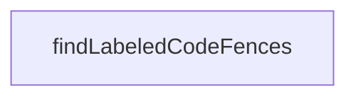

# Chapter 3: Client Transports, OAuth, and Backwards Compatibility

Welcome to **Chapter 3: Client Transports, OAuth, and Backwards Compatibility**. In this part of **MCP TypeScript SDK Tutorial: Building and Migrating MCP Clients and Servers in TypeScript**, you will build an intuitive mental model first, then move into concrete implementation details and practical production tradeoffs.


Client reliability depends on explicit transport behavior and robust auth handling.

## Learning Goals

- connect clients over stdio, Streamable HTTP, and legacy SSE pathways
- implement fallback flow from HTTP to SSE for older servers
- apply OAuth helpers for secure remote server access
- structure client operations for parallel and multi-server usage

## Practical Client Pattern

1. prefer Streamable HTTP client transport
2. detect known legacy cases and apply SSE fallback
3. use high-level methods (`listTools`, `callTool`, `listResources`)
4. persist auth/token context in tested provider implementations

## Source References

- [Client Docs](https://github.com/modelcontextprotocol/typescript-sdk/blob/main/docs/client.md)
- [Client Examples Index](https://github.com/modelcontextprotocol/typescript-sdk/blob/main/examples/client/README.md)
- [Streamable HTTP Fallback Example](https://github.com/modelcontextprotocol/typescript-sdk/blob/main/examples/client/src/streamableHttpWithSseFallbackClient.ts)

## Summary

You now have a stronger strategy for client transport and auth compatibility.

Next: [Chapter 4: Tool, Resource, Prompt Design and Completions](04-tool-resource-prompt-design-and-completions.md)

## Source Code Walkthrough

### `scripts/sync-snippets.ts`

The `findLabeledCodeFences` function in [`scripts/sync-snippets.ts`](https://github.com/modelcontextprotocol/typescript-sdk/blob/HEAD/scripts/sync-snippets.ts) handles a key part of this chapter's functionality:

```ts
 * @returns Array of labeled code fence references
 */
function findLabeledCodeFences(
  content: string,
  filePath: string,
  mode: FileMode,
): LabeledCodeFence[] {
  const results: LabeledCodeFence[] = [];
  const lines = content.split('\n');
  let charIndex = 0;

  // Select patterns based on mode
  const openPattern =
    mode === 'jsdoc'
      ? JSDOC_LABELED_FENCE_PATTERN
      : MARKDOWN_LABELED_FENCE_PATTERN;
  const closePattern =
    mode === 'jsdoc'
      ? JSDOC_CLOSING_FENCE_PATTERN
      : MARKDOWN_CLOSING_FENCE_PATTERN;

  for (let i = 0; i < lines.length; i++) {
    const line = lines[i];
    const openMatch = line.match(openPattern);

    if (openMatch) {
      let linePrefix: string;
      let language: string;
      let displayName: string | undefined;
      let examplePath: string;
      let regionName: string;

```

This function is important because it defines how MCP TypeScript SDK Tutorial: Building and Migrating MCP Clients and Servers in TypeScript implements the patterns covered in this chapter.


## How These Components Connect


