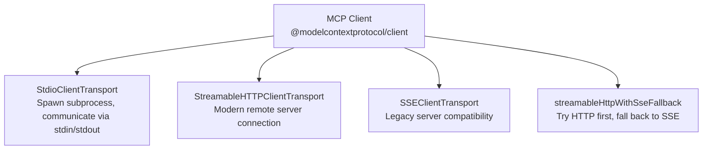
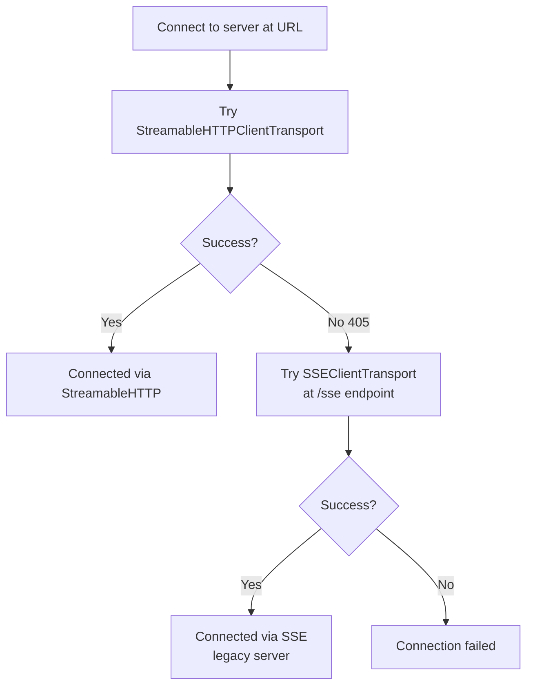

# Chapter 3: Client Transports, OAuth, and Backwards Compatibility

Client reliability depends on correct transport selection, robust auth handling, and a fallback strategy for connecting to older servers. This chapter covers the v2 client API, OAuth integration, and the StreamableHTTP-to-SSE fallback pattern.

## Learning Goals

- Connect clients over stdio, StreamableHTTP, and legacy SSE transports
- Implement the SSE fallback flow for servers that don't support StreamableHTTP
- Apply OAuth helpers for secure remote server access
- Structure client operations for parallel and multi-server usage

## Client Transport Options



## Stdio Client Transport

```typescript
import { Client } from '@modelcontextprotocol/client';
import { StdioClientTransport } from '@modelcontextprotocol/client';

const client = new Client(
  { name: "my-client", version: "1.0.0" },
  { capabilities: { sampling: {} } }
);

const transport = new StdioClientTransport({
  command: "node",
  args: ["path/to/server.js"],
  env: { MY_API_KEY: process.env.MY_API_KEY! }
});

await client.connect(transport);
```

The client spawns the server process and manages its lifecycle. When `client.close()` is called, the subprocess is terminated.

## StreamableHTTP Client Transport

```typescript
import { Client } from '@modelcontextprotocol/client';
import { StreamableHTTPClientTransport } from '@modelcontextprotocol/client';

const client = new Client({ name: "my-client", version: "1.0.0" });
const transport = new StreamableHTTPClientTransport(
  new URL("https://my-mcp-server.example.com/mcp")
);

await client.connect(transport);
const { tools } = await client.listTools();
```

The transport handles the `Mcp-Session-Id` header automatically for stateful servers. For stateless servers, each request is independent.

## SSE-to-StreamableHTTP Fallback

When building a client that needs to connect to both modern (StreamableHTTP) and legacy (SSE) servers, use the fallback pattern:

```typescript
// From examples/client/src/streamableHttpWithSseFallbackClient.ts
import { Client } from '@modelcontextprotocol/client';
import { StreamableHTTPClientTransport } from '@modelcontextprotocol/client';
import { SSEClientTransport } from '@modelcontextprotocol/client';

const url = new URL("https://mcp-server.example.com/mcp");

async function connectWithFallback(client: Client, url: URL) {
  try {
    // Try StreamableHTTP first
    const httpTransport = new StreamableHTTPClientTransport(url);
    await client.connect(httpTransport);
    console.log("Connected via StreamableHTTP");
  } catch (error) {
    if (error.code === "METHOD_NOT_ALLOWED" || error.status === 405) {
      // Fall back to SSE (legacy server)
      const sseUrl = new URL(url.toString().replace('/mcp', '/sse'));
      const sseTransport = new SSEClientTransport(sseUrl);
      await client.connect(sseTransport);
      console.log("Connected via SSE (legacy fallback)");
    } else {
      throw error;
    }
  }
}
```



## OAuth Authentication

The SDK includes a complete OAuth 2.0 client implementation for authenticating with servers that require it. The client supports the Authorization Code flow with PKCE.

```typescript
import { Client } from '@modelcontextprotocol/client';
import { StreamableHTTPClientTransport } from '@modelcontextprotocol/client';
import { OAuthClientProvider } from '@modelcontextprotocol/client';

// Implement OAuthClientProvider to handle token storage and refresh
class MyOAuthProvider implements OAuthClientProvider {
  get redirectUrl() { return "http://localhost:3000/callback"; }
  get clientMetadata() { return { client_name: "My App", redirect_uris: [this.redirectUrl] }; }

  async tokens() { return loadTokensFromStorage(); }
  async saveTokens(tokens) { saveTokensToStorage(tokens); }
  async redirectToAuthorization(url) { openBrowser(url); }
  async saveCodeVerifier(verifier) { saveToStorage("verifier", verifier); }
  async codeVerifier() { return loadFromStorage("verifier"); }
}

const transport = new StreamableHTTPClientTransport(
  new URL("https://secure-server.example.com/mcp"),
  { authProvider: new MyOAuthProvider() }
);

const client = new Client({ name: "my-client", version: "1.0.0" });
await client.connect(transport);  // triggers OAuth flow if not authenticated
```

## Token Provider (Simpler Auth)

For servers that use simple API tokens instead of full OAuth flows, use `TokenProvider`:

```typescript
import { TokenProvider } from '@modelcontextprotocol/client';

const transport = new StreamableHTTPClientTransport(
  new URL("https://my-server.example.com/mcp"),
  {
    authProvider: new TokenProvider({
      getToken: async () => process.env.MCP_API_TOKEN!
    })
  }
);
```

## Parallel Multi-Server Client

```typescript
// Connect to multiple servers in parallel
const servers = [
  { name: "filesystem", command: "npx", args: ["-y", "@modelcontextprotocol/server-filesystem", "/tmp"] },
  { name: "firecrawl", command: "npx", args: ["-y", "firecrawl-mcp"] },
];

const clients = await Promise.all(
  servers.map(async ({ name, command, args }) => {
    const client = new Client({ name: `client-${name}`, version: "1.0.0" });
    const transport = new StdioClientTransport({ command, args });
    await client.connect(transport);
    return { name, client };
  })
);

// List all tools from all servers
const allTools = (await Promise.all(
  clients.map(async ({ name, client }) => {
    const { tools } = await client.listTools();
    return tools.map(t => ({ server: name, ...t }));
  })
)).flat();
```

## Source References

- [Client Docs](https://github.com/modelcontextprotocol/typescript-sdk/blob/main/docs/client.md)
- [Client package source: `auth.ts`](https://github.com/modelcontextprotocol/typescript-sdk/blob/main/packages/client/src/client/auth.ts)
- [Client package source: `streamableHttp.ts`](https://github.com/modelcontextprotocol/typescript-sdk/blob/main/packages/client/src/client/streamableHttp.ts)
- [StreamableHTTP fallback example](https://github.com/modelcontextprotocol/typescript-sdk/blob/main/examples/client/src/streamableHttpWithSseFallbackClient.ts)
- [Simple OAuth client example](https://github.com/modelcontextprotocol/typescript-sdk/blob/main/examples/client/src/simpleOAuthClient.ts)

## Summary

The v2 client supports three transports: stdio (for subprocess servers), StreamableHTTP (for modern remote servers), and SSE (legacy compatibility). Implement the HTTP→SSE fallback pattern for universal server compatibility. OAuth and token-based auth are handled through the `authProvider` option on `StreamableHTTPClientTransport`. Connect multiple servers in parallel using `Promise.all` and merge their tool catalogs for multi-server agent architectures.

Next: [Chapter 4: Tool, Resource, Prompt Design and Completions](04-tool-resource-prompt-design-and-completions.md)
