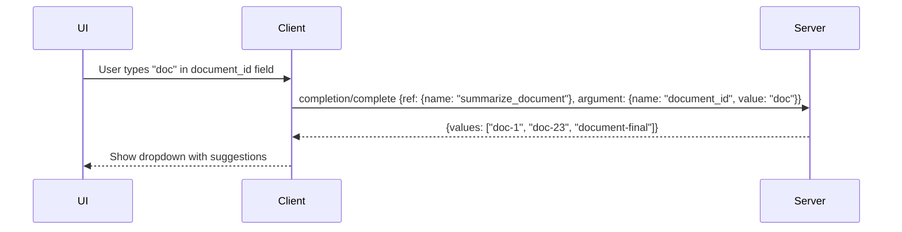

# Chapter 4: Tool, Resource, Prompt Design and Completions

The quality of an MCP server depends on well-structured tools, resources, and prompts. The v2 SDK provides `McpServer.registerTool()`, `registerResource()`, and `registerPrompt()` with explicit schema and handler patterns. This chapter covers each primitive's design model and the completions feature for better UX.

## Learning Goals

- Build tool handlers with explicit input and output schemas
- Expose resources with stable URI patterns and correct content types
- Design prompt templates for repeatable human/model workflows
- Use completions to assist selection in prompt and resource argument entry

## `McpServer` Registration Model

```mermaid
graph TD
    MCP[McpServer instance]
    MCP --> RT[registerTool\nname + schema + handler]
    MCP --> RR[registerResource\nuri template + handler]
    MCP --> RP[registerPrompt\nname + arguments + handler]
    MCP --> RC[setCompletionHandler\nfor prompt/resource arg completion]

    RT --> TOOL_RESP[Returns: {content: [...TextContent | ImageContent | EmbeddedResource]}]
    RR --> RES_RESP[Returns: {contents: [{uri, text/blob, mimeType}]}]
    RP --> PROMPT_RESP[Returns: {messages: [UserMessage | AssistantMessage]}]
```

## Tool Design

Tools are callable functions. The LLM decides when to invoke them based on names and descriptions. Side effects are acceptable.

```typescript
import { McpServer } from '@modelcontextprotocol/server';

const server = new McpServer({ name: "my-server", version: "1.0.0" });

server.registerTool("search_documents", {
  description: "Search the document store for relevant results. Returns up to 10 matches.",
  inputSchema: {
    type: "object",
    properties: {
      query: {
        type: "string",
        description: "Search query string"
      },
      limit: {
        type: "integer",
        minimum: 1,
        maximum: 50,
        default: 10,
        description: "Maximum number of results"
      }
    },
    required: ["query"]
  },
  // Output schema (v2 feature — describes structured output)
  outputSchema: {
    type: "object",
    properties: {
      results: {
        type: "array",
        items: { type: "object", properties: { title: { type: "string" }, score: { type: "number" } } }
      }
    }
  }
}, async ({ query, limit = 10 }) => {
  const results = await db.search(query, limit);
  return {
    content: [{ type: "text", text: JSON.stringify(results, null, 2) }],
    // Structured output (when outputSchema is provided)
    structuredContent: { results }
  };
});
```

### Tool Design Rules

| Rule | Rationale |
|:-----|:---------|
| Description is an instruction, not a label | LLM reads description to decide when to call |
| `required` fields should be minimal | Optional fields reduce required LLM precision |
| Validate inputs, return error text for bad inputs | Never throw — return error in `content` |
| Side-effectful tools need clear descriptions | Users need to understand what will happen |
| Output schemas improve structured result parsing | Client can validate and parse reliably |

## Resource Design

Resources are URI-addressed data blobs for read-oriented access. They do not execute side effects.

```typescript
// Static resource (fixed URI)
server.registerResource(
  "config",
  "config://app/settings",
  {
    name: "Application Settings",
    description: "Current application configuration",
    mimeType: "application/json"
  },
  async (uri) => ({
    contents: [{
      uri: uri.href,
      text: JSON.stringify(await loadConfig(), null, 2),
      mimeType: "application/json"
    }]
  })
);

// Dynamic resource with URI template
server.registerResource(
  "note",
  new ResourceTemplate("note://internal/{noteId}", { list: undefined }),
  {
    name: "Note",
    description: "A stored note by ID",
    mimeType: "text/plain"
  },
  async (uri, { noteId }) => {
    const note = await db.getNote(noteId);
    if (!note) throw new Error(`Note ${noteId} not found`);
    return {
      contents: [{ uri: uri.href, text: note.content, mimeType: "text/plain" }]
    };
  }
);
```

### Resource URI Conventions

| Scheme | Use Case | Example |
|:-------|:---------|:--------|
| `file://` | File system resources | `file:///home/user/docs/report.pdf` |
| Custom scheme | Application data | `note://internal/42`, `db://users/alice` |
| `https://` | Remote resources (proxied) | `https://api.example.com/data/1` |

## Prompt Design

Prompts are server-defined message templates. They return message arrays for the client to inject into conversation context.

```typescript
server.registerPrompt(
  "code_review",
  {
    description: "Generate a code review for a pull request",
    arguments: [
      {
        name: "diff",
        description: "The git diff to review",
        required: true
      },
      {
        name: "focus",
        description: "Review focus: 'security', 'performance', 'style'",
        required: false
      }
    ]
  },
  async ({ diff, focus = "general" }) => ({
    messages: [
      {
        role: "user",
        content: {
          type: "text",
          text: `Please review the following code diff with focus on ${focus}:\n\n${diff}`
        }
      }
    ]
  })
);
```

## Completions

Completions allow servers to provide autocomplete suggestions for prompt argument values and resource URI template parameters. This enables UIs to build contextual dropdown menus.

```typescript
import { Completable } from '@modelcontextprotocol/server';

server.registerPrompt(
  "summarize_document",
  {
    arguments: [
      {
        name: "document_id",
        description: "Document to summarize",
        required: true,
        // Mark as completable
        complete: true
      }
    ]
  },
  async ({ document_id }) => { /* ... */ }
);

// Register completion handler for the argument
server.setCompletionHandler(async ({ ref, argument }) => {
  if (ref.type === "ref/prompt" && ref.name === "summarize_document") {
    if (argument.name === "document_id") {
      const docs = await db.listDocuments(argument.value);
      return {
        completion: {
          values: docs.map(d => d.id),
          hasMore: docs.length === 10,
          total: docs.total
        }
      };
    }
  }
  return { completion: { values: [] } };
});
```



## Source References

- [Server Docs — Tools, Resources, Prompts](https://github.com/modelcontextprotocol/typescript-sdk/blob/main/docs/server.md)
- [McpServer source: `mcp.ts`](https://github.com/modelcontextprotocol/typescript-sdk/blob/main/packages/server/src/server/mcp.ts)
- [Completable source: `completable.ts`](https://github.com/modelcontextprotocol/typescript-sdk/blob/main/packages/server/src/server/completable.ts)
- [Simple StreamableHTTP example](https://github.com/modelcontextprotocol/typescript-sdk/blob/main/examples/server/src/simpleStreamableHttp.ts)

## Summary

Use `registerTool` for callable side-effectful operations, `registerResource` for URI-addressed reads, and `registerPrompt` for reusable message templates. Write tool descriptions as instructions for the LLM. Return error text in `content` rather than throwing. Use `outputSchema` for structured results. Completions (via `setCompletionHandler`) improve UX for argument entry in prompt and resource forms.

Next: [Chapter 5: Sampling, Elicitation, and Experimental Tasks](05-sampling-elicitation-and-experimental-tasks.md)
