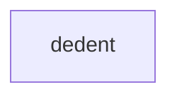

# Chapter 4: Tool, Resource, Prompt Design and Completions

Welcome to **Chapter 4: Tool, Resource, Prompt Design and Completions**. In this part of **MCP TypeScript SDK Tutorial: Building and Migrating MCP Clients and Servers in TypeScript**, you will build an intuitive mental model first, then move into concrete implementation details and practical production tradeoffs.


Core server interface quality depends on well-structured tools, resources, and prompts.

## Learning Goals

- build tool handlers with explicit input and output schemas
- expose resources for stable read-oriented access patterns
- design prompt templates for repeatable human/model workflows
- use completions for better UX in prompt/resource argument entry

## Design Rules

| Surface | Rule of Thumb |
|:--------|:--------------|
| Tools | side effects allowed, schemas should be strict |
| Resources | read-focused, low side effects |
| Prompts | reusable templates, minimal ambiguity |
| Completions | assist selection without hiding underlying model |

## Source References

- [Server Docs - Tools, Resources, Prompts](https://github.com/modelcontextprotocol/typescript-sdk/blob/main/docs/server.md)
- [Simple Streamable HTTP Example](https://github.com/modelcontextprotocol/typescript-sdk/blob/main/examples/server/src/simpleStreamableHttp.ts)

## Summary

You now have clearer interface design standards for MCP server surfaces.

Next: [Chapter 5: Sampling, Elicitation, and Experimental Tasks](05-sampling-elicitation-and-experimental-tasks.md)

## Depth Expansion Playbook

## Source Code Walkthrough

### `scripts/sync-snippets.ts`

The `dedent` function in [`scripts/sync-snippets.ts`](https://github.com/modelcontextprotocol/typescript-sdk/blob/HEAD/scripts/sync-snippets.ts) handles a key part of this chapter's functionality:

```ts
/**
 * Dedent content by removing a base indentation prefix from each line.
 * @param content The content to dedent
 * @param baseIndent The indentation to remove
 * @returns The dedented content
 */
function dedent(content: string, baseIndent: string): string {
  const lines = content.split('\n');
  const dedentedLines = lines.map((line) => {
    // Preserve empty lines as-is
    if (line.trim() === '') return '';
    // Remove the base indentation if present
    if (line.startsWith(baseIndent)) {
      return line.slice(baseIndent.length);
    }
    // Line has less indentation than base - keep as-is
    return line;
  });

  // Trim trailing empty lines
  while (
    dedentedLines.length > 0 &&
    dedentedLines[dedentedLines.length - 1] === ''
  ) {
    dedentedLines.pop();
  }

  return dedentedLines.join('\n');
}

/**
 * Extract a region from an example file.
```

This function is important because it defines how MCP TypeScript SDK Tutorial: Building and Migrating MCP Clients and Servers in TypeScript implements the patterns covered in this chapter.


## How These Components Connect


