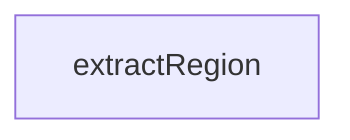

# Chapter 5: Sampling, Elicitation, and Experimental Tasks

Welcome to **Chapter 5: Sampling, Elicitation, and Experimental Tasks**. In this part of **MCP TypeScript SDK Tutorial: Building and Migrating MCP Clients and Servers in TypeScript**, you will build an intuitive mental model first, then move into concrete implementation details and practical production tradeoffs.


Advanced capabilities should be introduced intentionally, with clear user and security boundaries.

## Learning Goals

- add sampling for server-initiated model calls when appropriate
- choose form vs URL elicitation based on data sensitivity
- understand task-based execution lifecycle and experimental status
- avoid coupling experimental task APIs to critical production paths

## Capability Safety Guidance

- use form elicitation only for non-sensitive input
- use URL elicitation for sensitive/credential workflows
- treat experimental tasks API as opt-in with rollback plan

## Source References

- [Capabilities Docs](https://github.com/modelcontextprotocol/typescript-sdk/blob/main/docs/capabilities.md)
- [Elicitation Form Example](https://github.com/modelcontextprotocol/typescript-sdk/blob/main/examples/server/src/elicitationFormExample.ts)
- [Elicitation URL Example](https://github.com/modelcontextprotocol/typescript-sdk/blob/main/examples/server/src/elicitationUrlExample.ts)
- [Task + Sampling Example](https://github.com/modelcontextprotocol/typescript-sdk/blob/main/examples/server/src/toolWithSampleServer.ts)

## Summary

You now understand when and how to use advanced capability flows without overexposing risk.

Next: [Chapter 6: Middleware, Security, and Host Validation](06-middleware-security-and-host-validation.md)

## Depth Expansion Playbook

## Source Code Walkthrough

### `scripts/sync-snippets.ts`

The `extractRegion` function in [`scripts/sync-snippets.ts`](https://github.com/modelcontextprotocol/typescript-sdk/blob/HEAD/scripts/sync-snippets.ts) handles a key part of this chapter's functionality:

```ts
 * @returns The dedented region content
 */
function extractRegion(
  exampleContent: string,
  regionName: string,
  examplePath: string,
): string {
  // Region extraction only supported for .ts files (uses //#region syntax)
  if (!examplePath.endsWith('.ts')) {
    throw new Error(
      `Region extraction (#${regionName}) is only supported for .ts files. ` +
        `Use full-file inclusion (without #regionName) for: ${examplePath}`,
    );
  }

  const lineEnding = exampleContent.includes('\r\n') ? '\r\n' : '\n';
  const regionStart = `//#region ${regionName}${lineEnding}`;
  const regionEnd = `//#endregion ${regionName}${lineEnding}`;

  const startIndex = exampleContent.indexOf(regionStart);
  if (startIndex === -1) {
    throw new Error(`Region "${regionName}" not found in ${examplePath}`);
  }

  const endIndex = exampleContent.indexOf(regionEnd, startIndex);
  if (endIndex === -1) {
    throw new Error(
      `Region end marker for "${regionName}" not found in ${examplePath}`,
    );
  }

  // Get content after the region start line
```

This function is important because it defines how MCP TypeScript SDK Tutorial: Building and Migrating MCP Clients and Servers in TypeScript implements the patterns covered in this chapter.


## How These Components Connect


