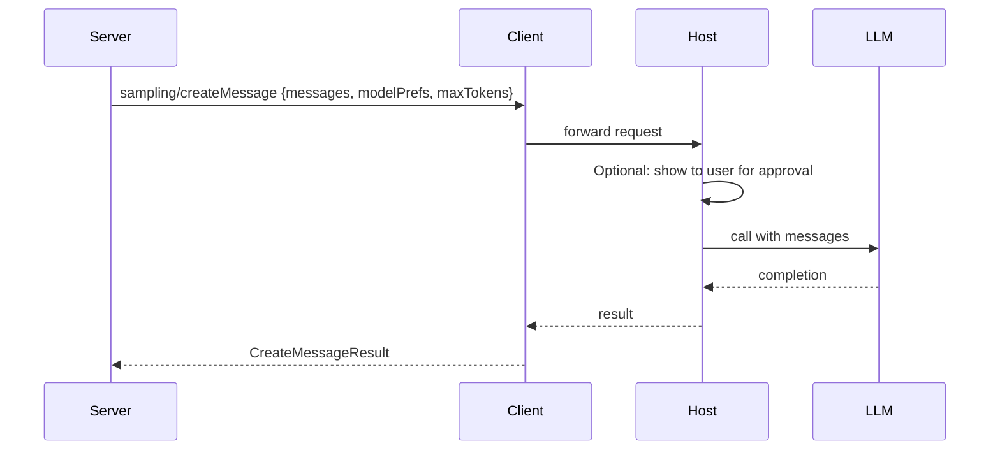
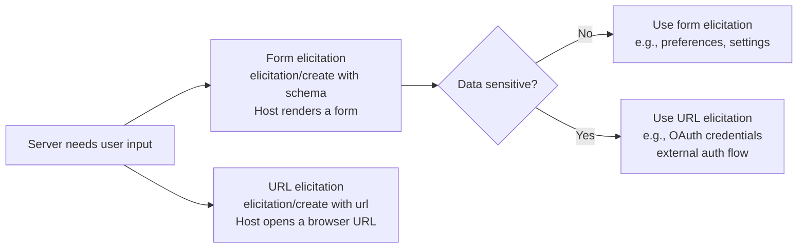
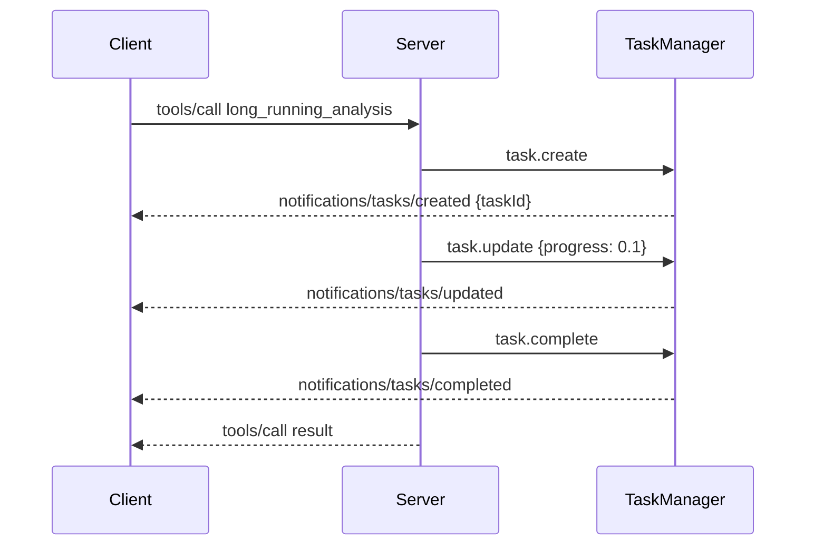

# Chapter 5: Sampling, Elicitation, and Experimental Tasks

Advanced capabilities in the v2 SDK allow servers to request LLM inference (sampling), ask clients for structured user input (elicitation), and manage long-running agentic workflows (experimental tasks). This chapter covers when and how to use each, with security boundaries clearly marked.

## Learning Goals

- Add sampling for server-initiated LLM inference when appropriate
- Choose form elicitation versus URL elicitation based on data sensitivity
- Understand the experimental task API lifecycle and its current status
- Avoid coupling experimental APIs to critical production paths

## Sampling: Server-Initiated LLM Calls

Sampling allows a server to request that the host perform LLM inference on its behalf. This is how servers implement agentic loop behavior without holding API keys.



### Capability Negotiation

Servers must check that the client supports sampling before calling it:

```typescript
import { Server } from '@modelcontextprotocol/server';

const server = new Server({ name: "sampling-server", version: "1.0.0" });

server.setRequestHandler(/* tool call */, async (request, context) => {
  // Check capability before using
  if (!context.clientCapabilities?.sampling) {
    return {
      content: [{ type: "text", text: "Error: client does not support sampling" }]
    };
  }

  const result = await server.createMessage({
    messages: [
      { role: "user", content: { type: "text", text: `Summarize: ${document}` } }
    ],
    maxTokens: 500,
    modelPreferences: {
      hints: [{ name: "claude-3-haiku" }],  // prefer fast/cheap model
      costPriority: 0.8,
      speedPriority: 0.5,
      intelligencePriority: 0.2
    }
  });

  return {
    content: [{ type: "text", text: result.content.text }]
  };
});
```

**Human-in-the-loop**: The host is responsible for applying safety policies and may show the sampling request to the user. The server cannot control whether the request is shown or modified.

## Elicitation: Requesting User Input

Elicitation allows a server to pause execution and ask the user for additional input through the host UI. The v2 SDK supports two elicitation modes.



### Form Elicitation

Use for non-sensitive structured input — preferences, filter criteria, configuration parameters:

```typescript
// From examples/server/src/elicitationFormExample.ts
const elicitResult = await server.elicitInput({
  message: "Please provide search parameters",
  requestedSchema: {
    type: "object",
    properties: {
      query: { type: "string", description: "Search query" },
      maxResults: { type: "integer", minimum: 1, maximum: 100, default: 10 },
      includeArchived: { type: "boolean", default: false }
    },
    required: ["query"]
  }
});

if (elicitResult.action === "accept") {
  const { query, maxResults, includeArchived } = elicitResult.content;
  // proceed with validated input
} else {
  // user declined
}
```

### URL Elicitation

Use for flows where sensitive credentials or external authorization are needed:

```typescript
// From examples/server/src/elicitationUrlExample.ts
const elicitResult = await server.elicitInput({
  message: "Please authorize access to your calendar",
  url: {
    href: "https://auth.example.com/oauth/authorize?client_id=my-app&scope=calendar",
    title: "Authorize Calendar Access"
  }
});

// After user completes the OAuth flow at the URL, the result contains
// the authorization code or callback data
```

## Experimental Tasks API

The tasks API provides a structured way to manage long-running agentic operations. It is marked **experimental** — available in `@modelcontextprotocol/server/experimental` — and should not be used on critical production paths.

```typescript
import { McpServer } from '@modelcontextprotocol/server';
import { withExperimentalTasks } from '@modelcontextprotocol/server/experimental';

const server = withExperimentalTasks(
  new McpServer({ name: "task-server", version: "1.0.0" }),
  {
    maxConcurrentTasks: 10,
    taskTimeoutMs: 60_000
  }
);

server.registerTool("long_running_analysis", {
  description: "Analyze a large dataset asynchronously",
  inputSchema: { type: "object", properties: { datasetId: { type: "string" } }, required: ["datasetId"] }
}, async ({ datasetId }, { task }) => {
  // Create a task for the long-running operation
  const taskId = await task.create({ title: `Analyzing dataset ${datasetId}` });

  // Report progress
  await task.update(taskId, { progress: 0.1, status: "Starting analysis..." });

  const results = await runAnalysis(datasetId, (progress) => {
    task.update(taskId, { progress, status: "Processing..." });
  });

  await task.complete(taskId, { results });
  return { content: [{ type: "text", text: `Task ${taskId} completed` }] };
});
```



### Task API Stability Warning

The tasks API is in `experimental/` for a reason:
- Interfaces may change in future minor versions without a major bump
- Not all clients support task notifications
- Use feature detection before relying on task notifications in client-facing workflows

For production use, implement task status as a regular resource (poll-based) rather than via task notifications until the API is stable.

## Source References

- [Elicitation form example](https://github.com/modelcontextprotocol/typescript-sdk/blob/main/examples/server/src/elicitationFormExample.ts)
- [Elicitation URL example](https://github.com/modelcontextprotocol/typescript-sdk/blob/main/examples/server/src/elicitationUrlExample.ts)
- [Tool with sampling example](https://github.com/modelcontextprotocol/typescript-sdk/blob/main/examples/server/src/toolWithSampleServer.ts)
- [Experimental tasks: `mcpServer.ts`](https://github.com/modelcontextprotocol/typescript-sdk/blob/main/packages/server/src/experimental/tasks/mcpServer.ts)

## Summary

Use sampling for server-initiated LLM calls, checking client capability first. Form elicitation handles non-sensitive structured user input; URL elicitation handles credential and external auth flows. The experimental tasks API provides structured async job management but is not stable — don't couple production-critical paths to it. For each advanced capability, implement a graceful degradation path when the capability is unavailable.

Next: [Chapter 6: Middleware, Security, and Host Validation](06-middleware-security-and-host-validation.md)
