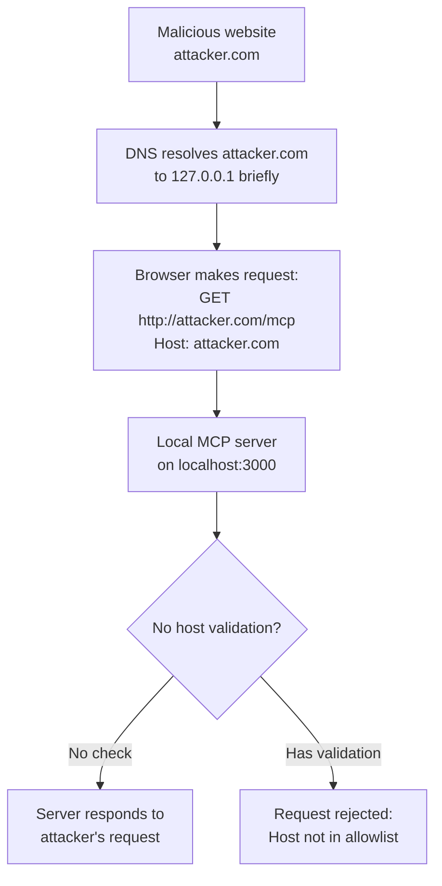
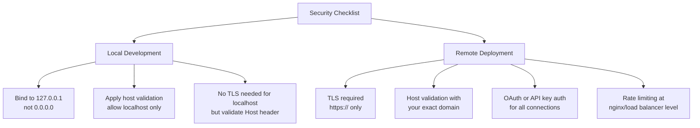

# Chapter 6: Middleware, Security, and Host Validation

Most MCP server security risk in local and deployed environments comes from weak host binding controls and missing DNS rebinding protection. The v2 SDK addresses this through built-in host header validation middleware available in the Express and Hono adapters.

## Learning Goals

- Apply framework adapter defaults that reduce attack surface
- Configure host header validation and allowed hostname lists
- Understand DNS rebinding attacks and why host validation prevents them
- Align localhost development and network-access behavior safely

## The DNS Rebinding Attack Vector

A DNS rebinding attack can allow a malicious website to reach a locally-running MCP server by manipulating DNS resolution to point the attacker's domain to `127.0.0.1`. The attacker's JavaScript code then makes requests with the `Host: attacker.com` header — but they're actually hitting `localhost`.



## Host Validation Middleware

The SDK provides `hostHeaderValidationMiddleware` for Express and an equivalent for Hono.

### Express Host Validation

```typescript
import express from 'express';
import { McpServer } from '@modelcontextprotocol/server';
import { createExpressHandler, hostHeaderValidationMiddleware } from '@modelcontextprotocol/express';

const app = express();

// Apply host validation before MCP routes
app.use(hostHeaderValidationMiddleware({
  allowedHosts: [
    "localhost",
    "127.0.0.1",
    "::1",
    // Add your production domain if externally accessible
    "mcp.yourcompany.com"
  ]
}));

const server = new McpServer({ name: "secure-server", version: "1.0.0" });
// register tools...

app.all('/mcp', createExpressHandler({ serverFactory: () => server }));
```

### Hono Host Validation

```typescript
import { Hono } from 'hono';
import { McpServer } from '@modelcontextprotocol/server';
import { createHonoHandler, hostHeaderValidationMiddleware } from '@modelcontextprotocol/hono';

const app = new Hono();
const server = new McpServer({ name: "secure-server", version: "1.0.0" });

app.use('/*', hostHeaderValidationMiddleware({
  allowedHosts: ["localhost", "mcp.yourcompany.com"]
}));

app.all('/mcp', createHonoHandler({ serverFactory: () => server }));
```

## Client-Side Auth Middleware

The SDK's `@modelcontextprotocol/client` also includes a middleware system for adding cross-cutting concerns to outgoing requests:

```typescript
import { Client } from '@modelcontextprotocol/client';
import { withMiddleware } from '@modelcontextprotocol/client';

// Add logging middleware to all client requests
const loggingMiddleware = {
  async before(request) {
    console.log(`→ ${request.method}`);
    return request;
  },
  async after(response) {
    console.log(`← ${response.id} done`);
    return response;
  }
};

const client = withMiddleware(
  new Client({ name: "my-client", version: "1.0.0" }),
  [loggingMiddleware]
);
```

## Deployment Security Checklist



| Scenario | Binding | Host Allowlist | Auth |
|:---------|:--------|:--------------|:-----|
| Local dev (stdio) | N/A | N/A | None |
| Local dev (HTTP) | 127.0.0.1 | `localhost`, `127.0.0.1` | None |
| Team/internal | Private network | Internal hostnames | Optional token |
| Public hosted | 0.0.0.0 with TLS | Your exact domain | OAuth or API key |

## Sensitive Tool Guards

For tools that perform destructive or sensitive operations, add explicit guards in the tool handler:

```typescript
server.registerTool("delete_all_records", {
  description: "Permanently delete all records from the database. IRREVERSIBLE.",
  inputSchema: {
    type: "object",
    properties: {
      confirm: {
        type: "string",
        description: "Type 'DELETE ALL' to confirm",
        enum: ["DELETE ALL"]
      }
    },
    required: ["confirm"]
  }
}, async ({ confirm }, context) => {
  // Double-check auth context if available
  if (!context.authInfo?.scopes?.includes("admin")) {
    return { content: [{ type: "text", text: "Error: admin scope required" }] };
  }

  await db.deleteAll();
  return { content: [{ type: "text", text: "All records deleted" }] };
});
```

## Rate Limiting for HTTP Transports

The SDK does not include built-in rate limiting. Apply it at the infrastructure layer:

```typescript
// Express rate limiting example using express-rate-limit
import rateLimit from 'express-rate-limit';

app.use('/mcp', rateLimit({
  windowMs: 60 * 1000,  // 1 minute
  max: 100,             // 100 requests per minute
  standardHeaders: true,
  legacyHeaders: false
}));
```

## Source References

- [Server Docs — DNS rebinding protection](https://github.com/modelcontextprotocol/typescript-sdk/blob/main/docs/server.md)
- [Host header validation source](https://github.com/modelcontextprotocol/typescript-sdk/blob/main/packages/server/src/server/middleware/hostHeaderValidation.ts)
- [Express adapter README](https://github.com/modelcontextprotocol/typescript-sdk/blob/main/packages/middleware/express/README.md)
- [Hono adapter README](https://github.com/modelcontextprotocol/typescript-sdk/blob/main/packages/middleware/hono/README.md)
- [Client middleware source](https://github.com/modelcontextprotocol/typescript-sdk/blob/main/packages/client/src/client/middleware.ts)

## Summary

DNS rebinding attacks are the primary security threat for locally-run HTTP MCP servers. The `hostHeaderValidationMiddleware` in `@modelcontextprotocol/express` and `@modelcontextprotocol/hono` blocks requests with unrecognized Host headers. Always bind local servers to `127.0.0.1`. For remote deployments, require TLS and use OAuth or API key authentication. Add sensitive-operation guards in tool handlers for destructive operations.

Next: [Chapter 7: v1 to v2 Migration Strategy](07-v1-to-v2-migration-strategy.md)
