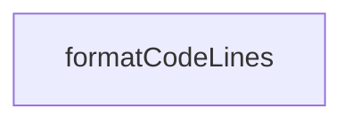

# Chapter 7: v1 to v2 Migration Strategy

Welcome to **Chapter 7: v1 to v2 Migration Strategy**. In this part of **MCP TypeScript SDK Tutorial: Building and Migrating MCP Clients and Servers in TypeScript**, you will build an intuitive mental model first, then move into concrete implementation details and practical production tradeoffs.


Migration success depends on sequencing: package split, imports, API updates, then behavior tests.

## Learning Goals

- map old monolithic package usage to v2 split packages
- plan Node/ESM/runtime prerequisites before refactoring
- update API usage (`registerTool`, method-string handlers, header model)
- manage mixed v1/v2 environments during migration windows

## Migration Order

1. align runtime and module format (Node 20+, ESM)
2. migrate dependencies/imports
3. update server/client API calls and schema shapes
4. run regression and conformance checks
5. roll out by service boundary, not by giant all-at-once PR

## Source References

- [Migration Guide](https://github.com/modelcontextprotocol/typescript-sdk/blob/main/docs/migration.md)
- [Migration Skill Guide](https://github.com/modelcontextprotocol/typescript-sdk/blob/main/docs/migration-SKILL.md)
- [FAQ - v1 branch guidance](https://github.com/modelcontextprotocol/typescript-sdk/blob/main/docs/faq.md)

## Summary

You now have a phased migration plan that reduces production breakage risk.

Next: [Chapter 8: Conformance Testing and Contribution Workflows](08-conformance-testing-and-contribution-workflows.md)

## Source Code Walkthrough

### `scripts/sync-snippets.ts`

The `formatCodeLines` function in [`scripts/sync-snippets.ts`](https://github.com/modelcontextprotocol/typescript-sdk/blob/HEAD/scripts/sync-snippets.ts) handles a key part of this chapter's functionality:

```ts
 * @returns The formatted code with JSDoc prefixes
 */
function formatCodeLines(code: string, linePrefix: string): string {
  const lines = code.split('\n');
  return lines
    .map((line) =>
      line === '' ? linePrefix.trimEnd() : `${linePrefix}${line}`,
    )
    .join('\n');
}

interface ProcessFileOptions {
  check?: boolean;
}

/**
 * Process a single source file to sync snippets.
 * @param filePath The source file path
 * @param cache The region cache
 * @param mode The processing mode (jsdoc or markdown)
 * @returns The processing result
 */
function processFile(
  filePath: string,
  cache: RegionCache,
  mode: FileMode,
  options?: ProcessFileOptions,
): FileProcessingResult {
  const result: FileProcessingResult = {
    filePath,
    modified: false,
    snippetsProcessed: 0,
```

This function is important because it defines how MCP TypeScript SDK Tutorial: Building and Migrating MCP Clients and Servers in TypeScript implements the patterns covered in this chapter.


## How These Components Connect


