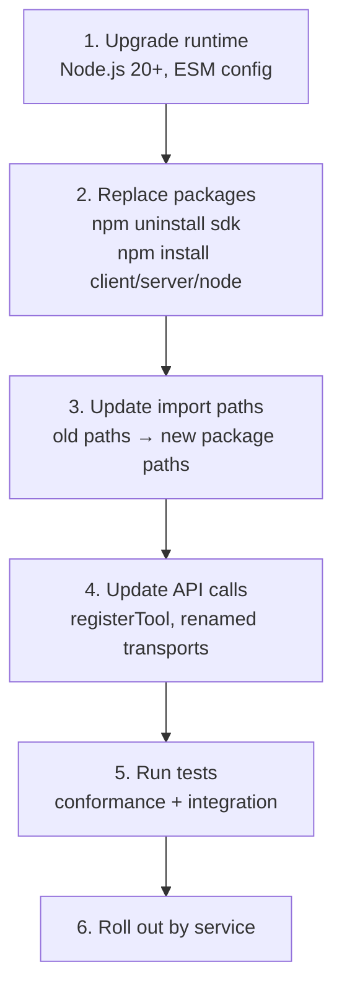
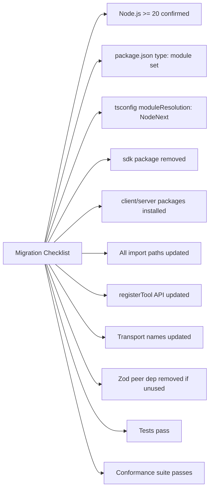
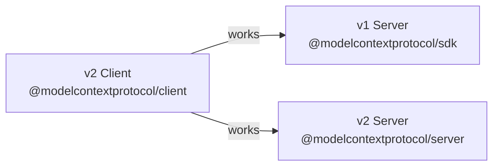

# Chapter 7: v1 to v2 Migration Strategy

Migrating from the monolithic `@modelcontextprotocol/sdk` v1 to the split-package v2 requires sequenced steps: runtime upgrade, package split, import updates, API changes, and regression testing. This chapter provides the complete migration map with before/after examples.

## Learning Goals

- Map old monolithic package usage to the v2 split packages
- Plan Node.js 20+ and ESM prerequisites before refactoring
- Update import paths, server API, and transport names
- Manage mixed v1/v2 environments during migration windows

## Migration Sequence



## Step 1: Runtime and Module Format

v2 requires Node.js 20+ and ESM. If your project currently uses CommonJS:

```json
// package.json — add this to enable ESM
{
  "type": "module"
}
```

```json
// tsconfig.json — update for ESM
{
  "compilerOptions": {
    "module": "NodeNext",
    "moduleResolution": "NodeNext",
    "target": "ES2022"
  }
}
```

If you cannot migrate to ESM, use dynamic imports as a bridge:
```typescript
// CommonJS wrapper for ESM SDK
const { Client } = await import('@modelcontextprotocol/client');
```

## Step 2: Package Replacement

```bash
# Remove v1
npm uninstall @modelcontextprotocol/sdk

# Install only what you need
# For a server:
npm install @modelcontextprotocol/server

# For a server using Node.js native http:
npm install @modelcontextprotocol/server @modelcontextprotocol/node

# For a client:
npm install @modelcontextprotocol/client

# For an Express server:
npm install @modelcontextprotocol/server @modelcontextprotocol/express
```

## Step 3: Import Path Updates

This is the most mechanical step. Replace every import.

### Server Imports

```typescript
// BEFORE (v1)
import { McpServer } from '@modelcontextprotocol/sdk/server/mcp.js';
import { StdioServerTransport } from '@modelcontextprotocol/sdk/server/stdio.js';
import { StreamableHTTPServerTransport } from '@modelcontextprotocol/sdk/server/streamableHttp.js';

// AFTER (v2)
import { McpServer } from '@modelcontextprotocol/server';
import { StdioServerTransport } from '@modelcontextprotocol/server';
// StreamableHTTPServerTransport is now NodeStreamableHTTPServerTransport in @modelcontextprotocol/node
import { NodeStreamableHTTPServerTransport } from '@modelcontextprotocol/node';
```

### Client Imports

```typescript
// BEFORE (v1)
import { Client } from '@modelcontextprotocol/sdk/client/index.js';
import { StdioClientTransport } from '@modelcontextprotocol/sdk/client/stdio.js';
import { StreamableHTTPClientTransport } from '@modelcontextprotocol/sdk/client/streamableHttp.js';
import { SSEClientTransport } from '@modelcontextprotocol/sdk/client/sse.js';

// AFTER (v2)
import { Client, StdioClientTransport, StreamableHTTPClientTransport, SSEClientTransport }
  from '@modelcontextprotocol/client';
```

### Type Imports

```typescript
// BEFORE (v1)
import type { CallToolResult } from '@modelcontextprotocol/sdk/types.js';
import { CallToolResultSchema } from '@modelcontextprotocol/sdk/types.js';

// AFTER (v2) — import from whichever package you already use
import type { CallToolResult } from '@modelcontextprotocol/server';
import { CallToolResultSchema } from '@modelcontextprotocol/client';
```

## Step 4: API Changes

### Server Registration API

```typescript
// BEFORE (v1) — method-string based registration
server.tool("search", { query: z.string() }, async ({ query }) => {
  return { content: [{ type: "text", text: await search(query) }] };
});

// AFTER (v2) — registerTool with JSON Schema
server.registerTool("search", {
  description: "Search documents",
  inputSchema: {
    type: "object",
    properties: { query: { type: "string" } },
    required: ["query"]
  }
}, async ({ query }) => {
  return { content: [{ type: "text", text: await search(query) }] };
});
```

### Transport Rename

| v1 Name | v2 Name | Package |
|:--------|:--------|:--------|
| `StreamableHTTPServerTransport` | `NodeStreamableHTTPServerTransport` | `@modelcontextprotocol/node` |
| `StreamableHTTPServerTransport` | `WebStandardStreamableHTTPServerTransport` | `@modelcontextprotocol/server` (web APIs) |

```typescript
// BEFORE (v1)
import { StreamableHTTPServerTransport } from '@modelcontextprotocol/sdk/server/streamableHttp.js';
const transport = new StreamableHTTPServerTransport({ sessionIdGenerator: () => randomUUID() });

// AFTER (v2) — Node.js HTTP
import { NodeStreamableHTTPServerTransport } from '@modelcontextprotocol/node';
const transport = new NodeStreamableHTTPServerTransport({ sessionIdGenerator: () => randomUUID() });
```

## Step 5: Zod Dependency

v1 required zod as a peer dependency. v2 does not. If you used zod only for SDK-required validation:

```bash
# Remove if no longer needed for your own code
npm uninstall zod
```

If you use zod in your own tool input validation, it remains valid — but is your project dependency, not the SDK's.

## Migration Checklist



## Mixed v1/v2 Environments

During migration windows, you may have some services on v1 and others on v2. v2 clients are backward-compatible with v1 servers (the protocol is the same). The packages differ; the wire format does not.



Migrate servers first, then clients — client behavior is more visible and easier to test incrementally.

## Source References

- [Migration Guide](https://github.com/modelcontextprotocol/typescript-sdk/blob/main/docs/migration.md)
- [Migration Skill Guide](https://github.com/modelcontextprotocol/typescript-sdk/blob/main/docs/migration-SKILL.md)
- [FAQ](https://github.com/modelcontextprotocol/typescript-sdk/blob/main/docs/faq.md)

## Summary

The v1→v2 migration requires five ordered steps: Node 20+ with ESM, package replacement, import path rewrites, API updates (`registerTool`, transport renames), and regression testing. The most error-prone step is the transport rename (`StreamableHTTPServerTransport` → `NodeStreamableHTTPServerTransport` in `@modelcontextprotocol/node`). Migrate one service at a time; v2 clients connect to v1 servers without issues during the transition.

Next: [Chapter 8: Conformance Testing and Contribution Workflows](08-conformance-testing-and-contribution-workflows.md)
