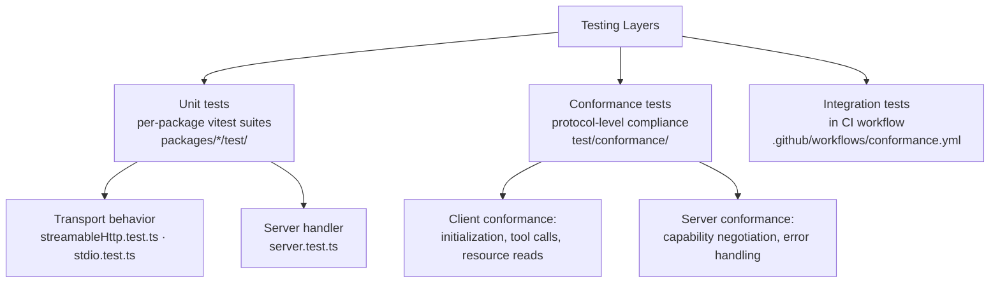
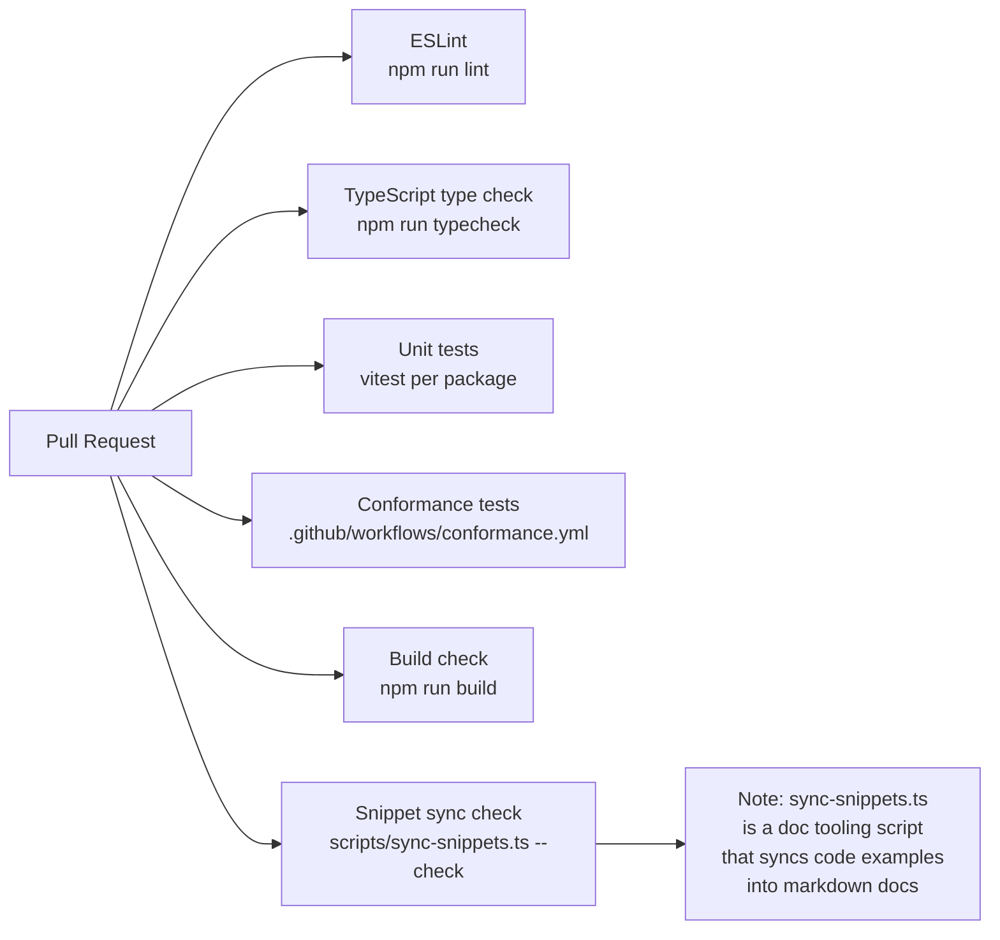
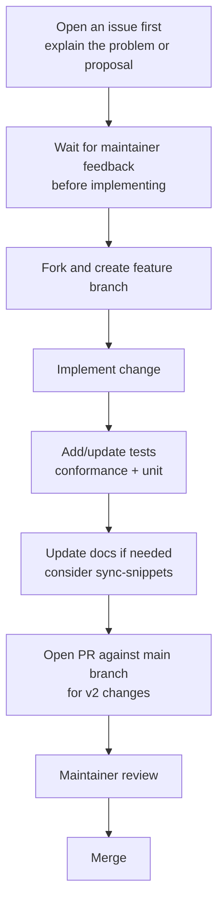

# Chapter 8: Conformance Testing and Contribution Workflows

Long-term SDK reliability comes from combining conformance testing with disciplined contribution practices. This chapter explains how to run the SDK's conformance suites, integrate them into your CI pipeline, and navigate the contribution workflow for the `modelcontextprotocol/typescript-sdk` repository.

## Learning Goals

- Run conformance suites for both client and server MCP behaviors
- Combine conformance checks with package-level integration tests
- Align PR scope and issue-first workflow with maintainer expectations
- Understand branch targeting for v1.x maintenance vs. v2 development

## Conformance Testing Overview

The SDK monorepo includes a conformance test suite that validates protocol compliance across client and server implementations. Tests live in the `test/conformance/` directory.



## Running Tests Locally

```bash
# Clone the repository
git clone https://github.com/modelcontextprotocol/typescript-sdk
cd typescript-sdk

# Install all workspace dependencies
npm install

# Run all tests across the monorepo
npm test

# Run tests for a specific package
cd packages/server
npm test

# Run conformance suite only
npm run test:conformance

# Run conformance in check mode (CI-style, no re-generation)
npm run test:conformance:check
```

## Package-Level Test Structure

Each package has its own test directory following the same structure:

```
packages/server/test/
├── server/
│   ├── server.test.ts          # Core server behavior
│   ├── stdio.test.ts           # Stdio transport tests
│   ├── streamableHttp.test.ts  # StreamableHTTP transport tests
│   └── completable.test.ts     # Completions behavior

packages/client/test/
├── client/
│   ├── auth.test.ts            # OAuth and auth provider tests
│   ├── middleware.test.ts      # Client middleware tests
│   ├── stdio.test.ts           # Stdio client transport
│   ├── streamableHttp.test.ts  # StreamableHTTP client transport
│   └── sse.test.ts             # Legacy SSE client
```

Run tests with coverage:
```bash
npm run test -- --coverage
```

## CI Workflow

The repository runs these CI checks on every PR:



The `sync-snippets` check ensures that code examples in `docs/*.md` files stay synchronized with the actual TypeScript example files in `examples/`. This is a documentation quality tool — it has no relation to protocol behavior.

## Contribution Workflow



### Branch Targeting

| Change Type | Target Branch |
|:------------|:-------------|
| Bug fixes for v2 | `main` |
| New features for v2 | `main` |
| v1.x maintenance fixes | `v1.x` branch |
| Breaking changes | `main` with migration guide update |

Always check the `CONTRIBUTING.md` for the current active branch policy before opening a PR.

### PR Scope Guidelines

- One logical change per PR
- Include tests that would have failed before the fix
- Update `docs/` if behavior or API surface changes
- Add a `.changeset/` entry for publishable changes (the repo uses changesets for versioning)

```bash
# Add a changeset entry for your change
npx changeset

# This creates a file in .changeset/ documenting your change
# Maintainers use these to generate changelogs and bump versions
```

## Writing Tests for New Features

When adding a new tool handler or transport behavior, follow the existing test patterns:

```typescript
// Example pattern from packages/server/test/server/server.test.ts
import { describe, test, expect } from 'vitest';
import { McpServer } from '../../src/index.js';
import { InMemoryTransport } from '@modelcontextprotocol/core';
import { Client } from '@modelcontextprotocol/client';

describe('tool registration', () => {
  test('registered tool appears in list', async () => {
    const server = new McpServer({ name: "test", version: "1.0.0" });
    server.registerTool("my-tool", {
      description: "Test tool",
      inputSchema: { type: "object", properties: { x: { type: "number" } }, required: ["x"] }
    }, async ({ x }) => ({
      content: [{ type: "text", text: `Result: ${x * 2}` }]
    }));

    const [clientTransport, serverTransport] = InMemoryTransport.createLinkedPair();
    const client = new Client({ name: "test-client", version: "1.0.0" });
    await Promise.all([server.connect(serverTransport), client.connect(clientTransport)]);

    const { tools } = await client.listTools();
    expect(tools).toHaveLength(1);
    expect(tools[0].name).toBe("my-tool");
  });
});
```

## Source References

- [Contributing Guide](https://github.com/modelcontextprotocol/typescript-sdk/blob/main/CONTRIBUTING.md)
- [Conformance test README](https://github.com/modelcontextprotocol/typescript-sdk/blob/main/test/conformance/README.md)
- [GitHub Actions conformance workflow](https://github.com/modelcontextprotocol/typescript-sdk/blob/main/.github/workflows/conformance.yml)
- [TypeScript SDK Releases](https://github.com/modelcontextprotocol/typescript-sdk/releases)

## Summary

Testing for MCP TypeScript SDK work runs at three levels: unit tests per package, conformance suite for protocol compliance, and CI integration tests. The `sync-snippets.ts` script is a documentation tooling utility, not a protocol concern. Contributions follow an issue-first workflow with PRs targeting `main` for v2 and `v1.x` for maintenance. Use `InMemoryTransport.createLinkedPair()` for fast unit testing of server and client handlers without a real network layer.

Return to the [MCP TypeScript SDK Tutorial index](README.md).
