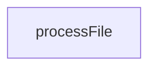

# Chapter 8: Conformance Testing and Contribution Workflows

Welcome to **Chapter 8: Conformance Testing and Contribution Workflows**. In this part of **MCP TypeScript SDK Tutorial: Building and Migrating MCP Clients and Servers in TypeScript**, you will build an intuitive mental model first, then move into concrete implementation details and practical production tradeoffs.


Long-term reliability comes from conformance + integration testing, then disciplined contribution boundaries.

## Learning Goals

- run conformance suites for both client and server behaviors
- combine conformance checks with repo-specific integration tests
- align PR scope and issue-first workflow with maintainer expectations
- support v1.x maintenance while adopting v2 paths deliberately

## Operational Testing Loop

- run `test:conformance:client` and `test:conformance:server`
- run package-level integration tests for your specific transports
- keep migration changes small and reviewable
- document branch targeting (`main` vs `v1.x`) in team workflow docs

## Source References

- [Conformance README](https://github.com/modelcontextprotocol/typescript-sdk/blob/main/test/conformance/README.md)
- [Contributing Guide](https://github.com/modelcontextprotocol/typescript-sdk/blob/main/CONTRIBUTING.md)
- [TypeScript SDK Releases](https://github.com/modelcontextprotocol/typescript-sdk/releases)

## Summary

You now have a production-aligned approach for maintaining and extending MCP TypeScript SDK usage over time.

Next: Continue with [MCP Use Tutorial](../mcp-use-tutorial/)

## Source Code Walkthrough

### `scripts/sync-snippets.ts`

The `processFile` function in [`scripts/sync-snippets.ts`](https://github.com/modelcontextprotocol/typescript-sdk/blob/HEAD/scripts/sync-snippets.ts) handles a key part of this chapter's functionality:

```ts
 * @returns The processing result
 */
function processFile(
  filePath: string,
  cache: RegionCache,
  mode: FileMode,
  options?: ProcessFileOptions,
): FileProcessingResult {
  const result: FileProcessingResult = {
    filePath,
    modified: false,
    snippetsProcessed: 0,
    errors: [],
  };

  let content: string;
  try {
    content = readFileSync(filePath, 'utf-8');
  } catch (err) {
    result.errors.push(`Failed to read file: ${err}`);
    return result;
  }

  let fences: LabeledCodeFence[];
  try {
    fences = findLabeledCodeFences(content, filePath, mode);
  } catch (err) {
    result.errors.push(err instanceof Error ? err.message : String(err));
    return result;
  }

  if (fences.length === 0) {
```

This function is important because it defines how MCP TypeScript SDK Tutorial: Building and Migrating MCP Clients and Servers in TypeScript implements the patterns covered in this chapter.


## How These Components Connect


