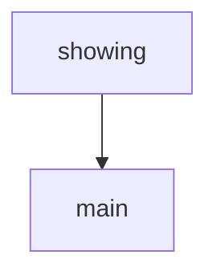

# Chapter 1: Getting Started and Stack Selection

Welcome to **Chapter 1: Getting Started and Stack Selection**. In this part of **MCP Use Tutorial: Full-Stack MCP Development Across Agents, Clients, Servers, and Inspector**, you will build an intuitive mental model first, then move into concrete implementation details and practical production tradeoffs.


This chapter helps you choose the right starting workflow between Python and TypeScript.

## Learning Goals

- understand mcp-use stack components (agent, client, server, inspector)
- choose initial language path by project constraints
- run the fastest first agent/client flow
- identify when to switch from local quickstart to production setup

## Start Decision Heuristic

| Team Profile | Best Starting Path |
|:-------------|:-------------------|
| Python-heavy ML/app team | Python quickstart + agent/client stack |
| TypeScript web/product team | TypeScript quickstart + server framework |
| Mixed-stack platform team | start with shared client config model, then split by runtime |

## Source References

- [Main README](https://github.com/mcp-use/mcp-use/blob/main/README.md)
- [TypeScript Quickstart](https://github.com/mcp-use/mcp-use/blob/main/docs/typescript/getting-started/quickstart.mdx)
- [Python Quickstart](https://github.com/mcp-use/mcp-use/blob/main/docs/python/getting-started/quickstart.mdx)

## Summary

You now have a clear stack-entry decision for mcp-use adoption.

Next: [Chapter 2: Client Configuration, Sessions, and Transport Choices](02-client-configuration-sessions-and-transport-choices.md)

## Depth Expansion Playbook

## Source Code Walkthrough

### `docs/docs.json`

The `showing` interface in [`docs/docs.json`](https://github.com/mcp-use/mcp-use/blob/HEAD/docs/docs.json) handles a key part of this chapter's functionality:

```json
      "twitter:description": "Open source library enabling developers to connect any LLM to any MCP server. Build custom AI agents with tool access without vendor lock-in.",
      "twitter:image": "https://raw.githubusercontent.com/mcp-use/mcp-use/refs/heads/main/static/og_image_docs.jpg",
      "twitter:image:alt": "mcp-use logo and interface showing LLM to MCP server connections",
      "article:published_time": "2024-12-01T00:00:00+00:00",
      "article:modified_time": "2025-06-16T00:00:00+00:00",
      "article:author": "mcp-use Team",
      "article:section": "Technology",
      "article:tag": "MCP, LLM, AI, open source, developers, API"
    }
  }
}

```

This interface is important because it defines how MCP Use Tutorial: Full-Stack MCP Development Across Agents, Clients, Servers, and Inspector implements the patterns covered in this chapter.

### `libraries/python/examples/google_integration_example.py`

The `main` function in [`libraries/python/examples/google_integration_example.py`](https://github.com/mcp-use/mcp-use/blob/HEAD/libraries/python/examples/google_integration_example.py) handles a key part of this chapter's functionality:

```py


async def main():
    config = {
        "mcpServers": {"playwright": {"command": "npx", "args": ["@playwright/mcp@latest"], "env": {"DISPLAY": ":1"}}}
    }

    try:
        client = MCPClient(config=config)

        # Creates the adapter for Google's format
        adapter = GoogleMCPAdapter()

        # Convert tools from active connectors to the Google's format
        await adapter.create_all(client)

        # List concatenation (if you loaded all tools)
        all_tools = adapter.tools + adapter.resources + adapter.prompts
        google_tools = [types.Tool(function_declarations=all_tools)]

        # If you don't want to create all tools, you can call single functions
        # await adapter.create_tools(client)
        # await adapter.create_resources(client)
        # await adapter.create_prompts(client)

        # Use tools with Google's SDK (not agent in this case)
        gemini = genai.Client()

        messages = [
            types.Content(
                role="user",
                parts=[
```

This function is important because it defines how MCP Use Tutorial: Full-Stack MCP Development Across Agents, Clients, Servers, and Inspector implements the patterns covered in this chapter.


## How These Components Connect


