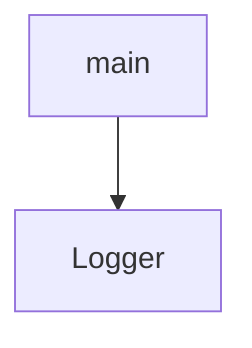

# Chapter 2: Client Configuration, Sessions, and Transport Choices

Welcome to **Chapter 2: Client Configuration, Sessions, and Transport Choices**. In this part of **MCP Use Tutorial: Full-Stack MCP Development Across Agents, Clients, Servers, and Inspector**, you will build an intuitive mental model first, then move into concrete implementation details and practical production tradeoffs.


Client configuration is where reliability is won or lost in multi-server MCP workflows.

## Learning Goals

- configure stdio and HTTP servers within one client profile
- manage session lifecycle and restart recovery expectations
- tune SSL, timeout, and header/auth options safely
- use allowed-server filtering and constructor variants for environment control

## Transport Choice Table

| Transport | Best For | Caveat |
|:----------|:---------|:-------|
| stdio | local process servers | process env/permissions drift |
| HTTP/Streamable HTTP | hosted services | auth/header/timeout correctness |
| SSE compatibility | legacy endpoints | migration needed over time |

## Source References

- [TypeScript Client Configuration](https://github.com/mcp-use/mcp-use/blob/main/docs/typescript/client/client-configuration.mdx)
- [Python Client Configuration](https://github.com/mcp-use/mcp-use/blob/main/docs/python/client/client-configuration.mdx)
- [TypeScript Client README](https://github.com/mcp-use/mcp-use/blob/main/libraries/typescript/packages/mcp-use/README.md)

## Summary

You now have a repeatable client configuration baseline for local and remote MCP servers.

Next: [Chapter 3: Agent Configuration, Tool Governance, and Memory](03-agent-configuration-tool-governance-and-memory.md)

## Source Code Walkthrough

### `libraries/python/examples/google_integration_example.py`

The `main` function in [`libraries/python/examples/google_integration_example.py`](https://github.com/mcp-use/mcp-use/blob/HEAD/libraries/python/examples/google_integration_example.py) handles a key part of this chapter's functionality:

```py


async def main():
    config = {
        "mcpServers": {"playwright": {"command": "npx", "args": ["@playwright/mcp@latest"], "env": {"DISPLAY": ":1"}}}
    }

    try:
        client = MCPClient(config=config)

        # Creates the adapter for Google's format
        adapter = GoogleMCPAdapter()

        # Convert tools from active connectors to the Google's format
        await adapter.create_all(client)

        # List concatenation (if you loaded all tools)
        all_tools = adapter.tools + adapter.resources + adapter.prompts
        google_tools = [types.Tool(function_declarations=all_tools)]

        # If you don't want to create all tools, you can call single functions
        # await adapter.create_tools(client)
        # await adapter.create_resources(client)
        # await adapter.create_prompts(client)

        # Use tools with Google's SDK (not agent in this case)
        gemini = genai.Client()

        messages = [
            types.Content(
                role="user",
                parts=[
```

This function is important because it defines how MCP Use Tutorial: Full-Stack MCP Development Across Agents, Clients, Servers, and Inspector implements the patterns covered in this chapter.

### `libraries/python/mcp_use/logging.py`

The `Logger` class in [`libraries/python/mcp_use/logging.py`](https://github.com/mcp-use/mcp-use/blob/HEAD/libraries/python/mcp_use/logging.py) handles a key part of this chapter's functionality:

```py
"""
Logger module for mcp_use.

This module provides a centralized logging configuration for the mcp_use library,
with customizable log levels and formatters.
"""

import logging
import os
import sys

from langchain_core.globals import set_debug as langchain_set_debug

# Global debug flag - can be set programmatically or from environment
MCP_USE_DEBUG = 1


class Logger:
    """Centralized logger for mcp_use.

    This class provides logging functionality with configurable levels,
    formatters, and handlers.
    """

    # Default log format
    DEFAULT_FORMAT = "%(asctime)s - %(name)s - %(levelname)s - %(message)s"

    # Module-specific loggers
    _loggers = {}

    @classmethod
```

This class is important because it defines how MCP Use Tutorial: Full-Stack MCP Development Across Agents, Clients, Servers, and Inspector implements the patterns covered in this chapter.


## How These Components Connect


