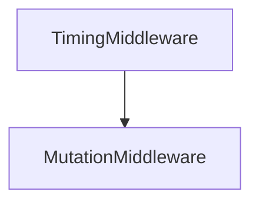

# Chapter 2: Client Configuration, Sessions, and Transport Choices

Welcome to **Chapter 2: Client Configuration, Sessions, and Transport Choices**. In this part of **MCP Use Tutorial: Full-Stack MCP Development Across Agents, Clients, Servers, and Inspector**, you will build an intuitive mental model first, then move into concrete implementation details and practical production tradeoffs.


Client configuration is where reliability is won or lost in multi-server MCP workflows.

## Learning Goals

- configure stdio and HTTP servers within one client profile
- manage session lifecycle and restart recovery expectations
- tune SSL, timeout, and header/auth options safely
- use allowed-server filtering and constructor variants for environment control

## Transport Choice Table

| Transport | Best For | Caveat |
|:----------|:---------|:-------|
| stdio | local process servers | process env/permissions drift |
| HTTP/Streamable HTTP | hosted services | auth/header/timeout correctness |
| SSE compatibility | legacy endpoints | migration needed over time |

## Source References

- [TypeScript Client Configuration](https://github.com/mcp-use/mcp-use/blob/main/docs/typescript/client/client-configuration.mdx)
- [Python Client Configuration](https://github.com/mcp-use/mcp-use/blob/main/docs/python/client/client-configuration.mdx)
- [TypeScript Client README](https://github.com/mcp-use/mcp-use/blob/main/libraries/typescript/packages/mcp-use/README.md)

## Summary

You now have a repeatable client configuration baseline for local and remote MCP servers.

Next: [Chapter 3: Agent Configuration, Tool Governance, and Memory](03-agent-configuration-tool-governance-and-memory.md)

## Depth Expansion Playbook

## Source Code Walkthrough

### `libraries/python/examples/example_middleware.py`

The `TimingMiddleware` class in [`libraries/python/examples/example_middleware.py`](https://github.com/mcp-use/mcp-use/blob/HEAD/libraries/python/examples/example_middleware.py) handles a key part of this chapter's functionality:

```py

    # Create custom middleware
    class TimingMiddleware(Middleware):
        async def on_request(self, context: MiddlewareContext[Any], call_next: NextFunctionT) -> Any:
            start = time.time()
            try:
                print("--------------------------------")
                print(f"{context.method} started")
                print("--------------------------------")
                print(f"{context.params}, {context.metadata}, {context.timestamp}, {context.connection_id}")
                print("--------------------------------")
                result = await call_next(context)
                return result
            finally:
                duration = time.time() - start
                print("--------------------------------")
                print(f"{context.method} took {int(1000 * duration)}ms")
                print("--------------------------------")

    # Middleware that demonstrates mutating params and adding headers-like metadata
    class MutationMiddleware(Middleware):
        async def on_call_tool(self, context: MiddlewareContext[Any], call_next: NextFunctionT) -> Any:
            # Defensive mutation of params: ensure `arguments` exists before writing
            try:
                print("[MutationMiddleware] context.params=", context.params)
                args = getattr(context.params, "arguments", None)
                if args is None:
                    args = {}

                # Inject a URL argument (example) and a trace id
                args["url"] = "https://github.com"
                meta = args.setdefault("meta", {})
```

This class is important because it defines how MCP Use Tutorial: Full-Stack MCP Development Across Agents, Clients, Servers, and Inspector implements the patterns covered in this chapter.

### `libraries/python/examples/example_middleware.py`

The `MutationMiddleware` class in [`libraries/python/examples/example_middleware.py`](https://github.com/mcp-use/mcp-use/blob/HEAD/libraries/python/examples/example_middleware.py) handles a key part of this chapter's functionality:

```py

    # Middleware that demonstrates mutating params and adding headers-like metadata
    class MutationMiddleware(Middleware):
        async def on_call_tool(self, context: MiddlewareContext[Any], call_next: NextFunctionT) -> Any:
            # Defensive mutation of params: ensure `arguments` exists before writing
            try:
                print("[MutationMiddleware] context.params=", context.params)
                args = getattr(context.params, "arguments", None)
                if args is None:
                    args = {}

                # Inject a URL argument (example) and a trace id
                args["url"] = "https://github.com"
                meta = args.setdefault("meta", {})
                meta["trace_id"] = "trace-123"

                # Write back the mutated arguments to the params object
                context.params.arguments = args

                # Also demonstrate carrying header-like info via metadata
                context.metadata.setdefault("headers", {})["X-Trace-Id"] = "trace-123"
                # Debug: show the mutated params/metadata immediately
                print("[AddTraceMiddleware] after mutation:", context.params, context.metadata)

            except Exception as e:
                # Don't break the request flow in an example
                print(f"[AddTraceMiddleware] failed to mutate params: {e}")

            return await call_next(context)

    config = {
        "mcpServers": {"playwright": {"command": "npx", "args": ["@playwright/mcp@latest"], "env": {"DISPLAY": ":1"}}}
```

This class is important because it defines how MCP Use Tutorial: Full-Stack MCP Development Across Agents, Clients, Servers, and Inspector implements the patterns covered in this chapter.


## How These Components Connect


