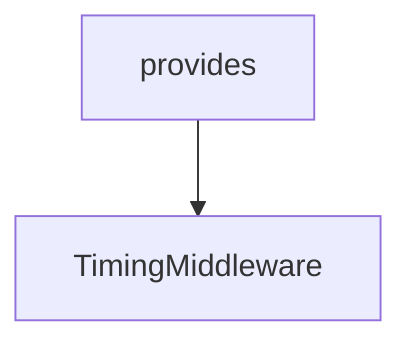

# Chapter 3: Agent Configuration, Tool Governance, and Memory

Welcome to **Chapter 3: Agent Configuration, Tool Governance, and Memory**. In this part of **MCP Use Tutorial: Full-Stack MCP Development Across Agents, Clients, Servers, and Inspector**, you will build an intuitive mental model first, then move into concrete implementation details and practical production tradeoffs.


Agent reliability depends on explicit control of tools, memory, and step budgets.

## Learning Goals

- configure `MCPAgent` with practical limits (`maxSteps`, memory)
- apply `disallowedTools` to reduce unsafe or irrelevant tool use
- use server-manager patterns for multi-server environments
- align LLM selection with tool-calling support expectations

## Governance Pattern

1. start with minimal tool surface
2. explicitly block dangerous categories unless needed
3. set conservative step limits first
4. monitor behavior before widening capability scope

## Source References

- [TypeScript Agent Configuration](https://github.com/mcp-use/mcp-use/blob/main/docs/typescript/agent/agent-configuration.mdx)
- [Python Agent Configuration](https://github.com/mcp-use/mcp-use/blob/main/docs/python/agent/agent-configuration.mdx)
- [Python README - Agent examples](https://github.com/mcp-use/mcp-use/blob/main/libraries/python/README.md)

## Summary

You now have agent-level guardrails for safer, more predictable tool execution.

Next: [Chapter 4: TypeScript Server Framework and UI Widgets](04-typescript-server-framework-and-ui-widgets.md)

## Source Code Walkthrough

### `libraries/python/mcp_use/logging.py`

The `provides` class in [`libraries/python/mcp_use/logging.py`](https://github.com/mcp-use/mcp-use/blob/HEAD/libraries/python/mcp_use/logging.py) handles a key part of this chapter's functionality:

```py
Logger module for mcp_use.

This module provides a centralized logging configuration for the mcp_use library,
with customizable log levels and formatters.
"""

import logging
import os
import sys

from langchain_core.globals import set_debug as langchain_set_debug

# Global debug flag - can be set programmatically or from environment
MCP_USE_DEBUG = 1


class Logger:
    """Centralized logger for mcp_use.

    This class provides logging functionality with configurable levels,
    formatters, and handlers.
    """

    # Default log format
    DEFAULT_FORMAT = "%(asctime)s - %(name)s - %(levelname)s - %(message)s"

    # Module-specific loggers
    _loggers = {}

    @classmethod
    def get_logger(cls, name: str = "mcp_use") -> logging.Logger:
        """Get a logger instance for the specified name.
```

This class is important because it defines how MCP Use Tutorial: Full-Stack MCP Development Across Agents, Clients, Servers, and Inspector implements the patterns covered in this chapter.

### `libraries/python/examples/example_middleware.py`

The `TimingMiddleware` class in [`libraries/python/examples/example_middleware.py`](https://github.com/mcp-use/mcp-use/blob/HEAD/libraries/python/examples/example_middleware.py) handles a key part of this chapter's functionality:

```py

    # Create custom middleware
    class TimingMiddleware(Middleware):
        async def on_request(self, context: MiddlewareContext[Any], call_next: NextFunctionT) -> Any:
            start = time.time()
            try:
                print("--------------------------------")
                print(f"{context.method} started")
                print("--------------------------------")
                print(f"{context.params}, {context.metadata}, {context.timestamp}, {context.connection_id}")
                print("--------------------------------")
                result = await call_next(context)
                return result
            finally:
                duration = time.time() - start
                print("--------------------------------")
                print(f"{context.method} took {int(1000 * duration)}ms")
                print("--------------------------------")

    # Middleware that demonstrates mutating params and adding headers-like metadata
    class MutationMiddleware(Middleware):
        async def on_call_tool(self, context: MiddlewareContext[Any], call_next: NextFunctionT) -> Any:
            # Defensive mutation of params: ensure `arguments` exists before writing
            try:
                print("[MutationMiddleware] context.params=", context.params)
                args = getattr(context.params, "arguments", None)
                if args is None:
                    args = {}

                # Inject a URL argument (example) and a trace id
                args["url"] = "https://github.com"
                meta = args.setdefault("meta", {})
```

This class is important because it defines how MCP Use Tutorial: Full-Stack MCP Development Across Agents, Clients, Servers, and Inspector implements the patterns covered in this chapter.


## How These Components Connect


