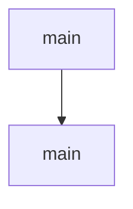

# Chapter 3: Agent Configuration, Tool Governance, and Memory

Welcome to **Chapter 3: Agent Configuration, Tool Governance, and Memory**. In this part of **MCP Use Tutorial: Full-Stack MCP Development Across Agents, Clients, Servers, and Inspector**, you will build an intuitive mental model first, then move into concrete implementation details and practical production tradeoffs.


Agent reliability depends on explicit control of tools, memory, and step budgets.

## Learning Goals

- configure `MCPAgent` with practical limits (`maxSteps`, memory)
- apply `disallowedTools` to reduce unsafe or irrelevant tool use
- use server-manager patterns for multi-server environments
- align LLM selection with tool-calling support expectations

## Governance Pattern

1. start with minimal tool surface
2. explicitly block dangerous categories unless needed
3. set conservative step limits first
4. monitor behavior before widening capability scope

## Source References

- [TypeScript Agent Configuration](https://github.com/mcp-use/mcp-use/blob/main/docs/typescript/agent/agent-configuration.mdx)
- [Python Agent Configuration](https://github.com/mcp-use/mcp-use/blob/main/docs/python/agent/agent-configuration.mdx)
- [Python README - Agent examples](https://github.com/mcp-use/mcp-use/blob/main/libraries/python/README.md)

## Summary

You now have agent-level guardrails for safer, more predictable tool execution.

Next: [Chapter 4: TypeScript Server Framework and UI Widgets](04-typescript-server-framework-and-ui-widgets.md)

## Depth Expansion Playbook

## Source Code Walkthrough

### `libraries/python/examples/example_middleware.py`

The `main` function in [`libraries/python/examples/example_middleware.py`](https://github.com/mcp-use/mcp-use/blob/HEAD/libraries/python/examples/example_middleware.py) handles a key part of this chapter's functionality:

```py


async def main():
    """Run the example with default logging and optional custom middleware."""
    # Load environment variables
    load_dotenv()

    # Create custom middleware
    class TimingMiddleware(Middleware):
        async def on_request(self, context: MiddlewareContext[Any], call_next: NextFunctionT) -> Any:
            start = time.time()
            try:
                print("--------------------------------")
                print(f"{context.method} started")
                print("--------------------------------")
                print(f"{context.params}, {context.metadata}, {context.timestamp}, {context.connection_id}")
                print("--------------------------------")
                result = await call_next(context)
                return result
            finally:
                duration = time.time() - start
                print("--------------------------------")
                print(f"{context.method} took {int(1000 * duration)}ms")
                print("--------------------------------")

    # Middleware that demonstrates mutating params and adding headers-like metadata
    class MutationMiddleware(Middleware):
        async def on_call_tool(self, context: MiddlewareContext[Any], call_next: NextFunctionT) -> Any:
            # Defensive mutation of params: ensure `arguments` exists before writing
            try:
                print("[MutationMiddleware] context.params=", context.params)
                args = getattr(context.params, "arguments", None)
```

This function is important because it defines how MCP Use Tutorial: Full-Stack MCP Development Across Agents, Clients, Servers, and Inspector implements the patterns covered in this chapter.

### `libraries/python/examples/openai_integration_example.py`

The `main` function in [`libraries/python/examples/openai_integration_example.py`](https://github.com/mcp-use/mcp-use/blob/HEAD/libraries/python/examples/openai_integration_example.py) handles a key part of this chapter's functionality:

```py


async def main():
    config = {
        "mcpServers": {
            "airbnb": {"command": "npx", "args": ["-y", "@openbnb/mcp-server-airbnb", "--ignore-robots-txt"]},
        }
    }

    try:
        client = MCPClient(config=config)

        # Creates the adapter for OpenAI's format
        adapter = OpenAIMCPAdapter()

        # Convert tools from active connectors to the OpenAI's format
        # this will populates the list of tools, resources and prompts
        await adapter.create_all(client)

        # If you don't want to create all tools, you can call single functions
        # await adapter.create_tools(client)
        # await adapter.create_resources(client)
        # await adapter.create_prompts(client)

        # If you decided to create all tools (list concatenation)
        openai_tools = adapter.tools + adapter.resources + adapter.prompts

        # Use tools with OpenAI's SDK (not agent in this case)
        openai = OpenAI()
        messages = [{"role": "user", "content": "Please tell me the cheapest hotel for two people in Trapani."}]
        response = openai.chat.completions.create(model="gpt-4o", messages=messages, tools=openai_tools)

```

This function is important because it defines how MCP Use Tutorial: Full-Stack MCP Development Across Agents, Clients, Servers, and Inspector implements the patterns covered in this chapter.


## How These Components Connect


